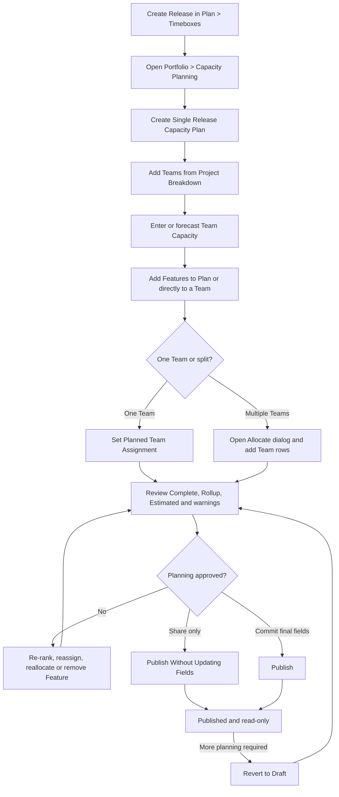
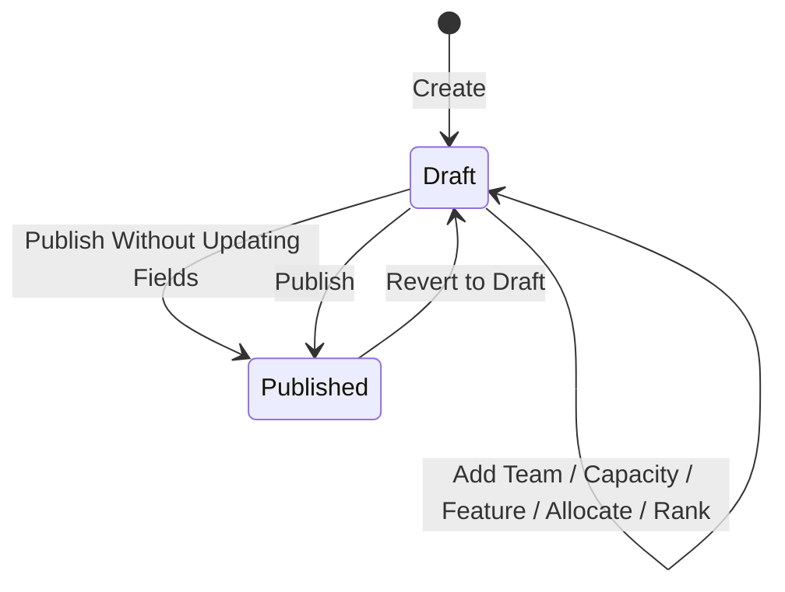

# P5.2 Capacity Planning - Business Flow and UI Action Catalog

## 1. Document Control

| Attribute | Value |
|---|---|
| Phase | Phase 5 - Portfolio Module |
| Sub-phase | P5.2 Capacity Planning |
| Status | BA accepted and feature closed on 2026-07-28 |
| Applies to | Mini Rally BA rules, frontend mockup, QA and future developer handoff |
| Primary specification | `SRS.md` in this folder |
| Verification | `07_Testing Plan/02_test_phase_5_6/PHASE5_TEST_SCENARIOS.md`, scenarios `P5-CP-*` |
| Production boundary | Session-level frontend state only; API, persistence and server-side authorization are not implemented |

This document is the screen-by-screen operating specification for Capacity
Planning. `SRS.md` remains the normative source for calculations, scope and
acceptance criteria. If the two documents conflict, reconcile them before
implementation.

## 2. Purpose and Business Outcome

Capacity Planning lets an authorized Planner:

1. select an existing Release;
2. create one planning sandbox for that Project and Release;
3. choose Teams that participate in the plan;
4. add Portfolio Features;
5. assign or split Feature demand across Teams;
6. compare demand and execution against manually supplied Team capacity;
7. share the plan without changing Feature fields, or publish the final plan
   and write the selected Release and planned dates to allocated Features.

The Mini Rally hierarchy is:

```text
Workspace
  -> Project
       -> Team
```

Rally child Project/Scrum Team rows are represented by Mini Rally Team rows.
The Capacity Plan's Project is the storage and access scope. It does not
automatically add every Team in that Project.

## 3. Actors and Access

| Actor | Read behavior | Manage behavior |
|---|---|---|
| Workspace Admin | Sees all Draft and Published plans | Full create, edit, allocate, publish and revert access |
| Admin | Sees Draft and Published plans in assigned Projects | Full planning access inside assigned Projects |
| Viewer | Sees Draft and Published plans in assigned Projects | Read-only |
| Editor / No Access | Capacity Planning hidden | No access |

The current Project Access rule is fixed:

```text
capacity_planning:manage = Enabled  -> Full
capacity_planning:manage = Read-only -> View
```

There is no temporary per-role Full/View override. Project scope and Access Level are evaluated together.

## 4. End-to-End Business Flow



### 4.1 Preconditions

- The Release already exists in `Plan > Timeboxes > Releases`.
- The user is in the correct Workspace and Project context.
- The user has Capacity Planning View or Full access.
- Features already exist under `Portfolio > Portfolio Items`.
- Preliminary and/or Refined estimates should be present when possible.

### 4.2 Create the Plan

1. Open `Portfolio > Capacity Planning`.
2. Select `Add New`.
3. Enter Name.
4. Select an existing Release.
5. Choose Points or Count.
6. Select `Create`.

Result:

- a Draft plan is created;
- Plan Type is fixed to Single Release;
- Portfolio Item Type is fixed to Feature;
- unit mode is fixed after creation;
- no Team and no Feature are added automatically;
- another plan for the same Project and Release is rejected.

### 4.3 Add Teams and Capacity

1. Open the Draft plan.
2. Select `Add Team`.
3. Choose leaf Team records from Project Breakdown.
4. Select `Apply`.
5. Enter Capacity on each Team row, or use `Calculate Capacity Forecast`.
6. Review and edit forecast results before applying.

Capacity is a Plan-specific manual baseline. A value of `0` means the Team
should not receive committed demand for this timebox.

### 4.4 Add Features

There are two valid entry points.

#### Plan-level Add Feature

- Entry: `Features` tab -> `Add Feature`.
- Result: adds an eligible Feature to the Plan as Unassigned.
- Next action: choose one Team in `Planned Team Assignment`, or use `Allocate`
  for a multi-Team split.

Eligibility:

- same Project as the Plan;
- not Archived;
- State is not Cancelled;
- Release is Unscheduled or equals the Plan Release;
- not already present in the Plan.

#### Team-level Add Features

- Entry: `Teams by Total` -> expand a Team -> `Add Features`.
- Result: adds or moves the Feature directly into that Team.
- Scope: all active, non-Cancelled Features in the Plan Project; Release is not
  used as a filter.
- Features already added to that Team stay visible as disabled `Added` rows.

This wider Team picker is intentional: a Planner may pull work from another
Release into a Team planning discussion. Archived and Cancelled records are
excluded because they are not actionable planning demand.

### 4.5 Assign or Split a Feature

#### Zero or one Team

Use `Planned Team Assignment` in the Features tab:

- `Not assigned` is a yellow selector;
- selecting a Team updates the shared allocation ledger;
- changing the Team moves the single allocation row;
- `Unassign` clears the Team but keeps the Feature and its value in the Plan.

#### Multiple Teams

Use the shared `Allocate` dialog:

1. open the Feature settings menu;
2. select `Allocate`;
3. add one or more Team rows;
4. enter an Estimate for each Team;
5. review `Total allocated`;
6. select `Allocate`.

Applying the dialog replaces the Feature's Team allocation rows in this Plan.
It never changes Feature Project, Feature Team ownership or child Work Items.

### 4.6 Replan

While Draft, a Planner may:

- edit Team Capacity;
- move a Feature up or down;
- assign or unassign a single-Team Feature;
- re-open Allocate and change split rows;
- remove all Plan allocations with `Remove from Plan`;
- add or remove Teams;
- apply a new capacity forecast.

There is no `Remove from Team` action. Use Allocate to revise a split. Use
`Remove from Plan` to delete every allocation for the Feature across all Teams.

### 4.7 Publish

Publish actions are in the white square, blue vertical-dots menu beside Back.

| Action | Status effect | Feature field effect |
|---|---|---|
| Publish Without Updating Fields | Draft -> Published | No Feature field is written |
| Publish | Draft -> Published | Writes Planned Start Date and Planned End Date to allocated Features; writes Release only when Plan dates match the selected Release dates |
| Revert to Draft | Published -> Draft | Unlocks planning; does not roll back values already written to Features |

Neither Publish action overwrites Feature Project or Team. Publish does not
cascade field changes to child Story/Defect records. If Plan dates do not match
the selected Release dates, the Feature Release is not silently overwritten and
the publish result shows an advisory message.

## 5. State Model



| State | Visibility | Editing |
|---|---|---|
| Draft | Workspace Admin/Admin/Viewer in allowed Project scope | Workspace Admin/Admin only |
| Published | All authorized viewers in Project/Team scope | Locked |

Published is a lock on Plan editing, not a historical rollback mechanism.

## 6. Capacity Plan List

### 6.1 Columns

| Column | Description |
|---|---|
| ID | Capacity Plan identifier; opens Plan Detail |
| Name | Required Plan name |
| Release | Existing Release referenced by the Plan |
| Status | Draft or Published |
| Last Updated | Last session-level change timestamp |
| Teams in Plan | Count of Team rows in the Plan |

### 6.2 Controls

| Control | Availability | Behavior |
|---|---|---|
| Project/Release selector | All viewers | Filters the list to the current Project and selected Release |
| Search plans | All viewers | Matches ID, Name and Release |
| Add New | Capacity Planning Full | Opens New Capacity Plan |
| Show Filters | Visible mockup affordance | Reserved for advanced filtering; no additional filter panel is implemented in this slice |
| Show Fields | Visible mockup affordance | Reserved for column configuration; no persisted field configuration is implemented |
| Plan ID / row | Authorized viewer | Opens Plan Detail |

## 7. New Capacity Plan Dialog

### 7.1 Fields

| Field | Required | Editability | Rule |
|---|---:|---|---|
| Project | Auto | Read-only | Current Project; storage/access scope only |
| Name | Yes | Editable | Trimmed; cannot be blank |
| Plan Type | Auto | Read-only | Single Release |
| Release | Yes | Editable | Existing Release under current Project |
| Portfolio Item Type | Auto | Read-only | Feature |
| View Work Items By | Yes | Editable before Create | Points or Count; immutable after Create |

### 7.2 Buttons

| Button | Behavior |
|---|---|
| Close `X` | Closes without creating |
| Cancel | Closes without creating |
| Create | Creates and opens the Draft plan; disabled until Name and Release are valid |

Validation:

- Name is required.
- Release is required.
- Project + Release must be unique.
- No Release is created from this dialog.

## 8. Plan Detail Header

| Control / element | Behavior |
|---|---|
| Back | Returns to Capacity Plan list |
| White vertical-dots menu | Opens Publish actions |
| Plan ID / Name | Read-only identity |
| Draft / Published badge | Shows lifecycle state |
| Release badge | Shows referenced Release |
| Portfolio Item Type | Fixed Feature |
| Assigned / Unassigned | Counts unique Features assigned to at least one Team and Features still unassigned |
| Plan progress bar | Composite Complete, Rollup, Estimated and Capacity view |
| Summary metrics | Numeric plan totals; Complete/Rollup/Estimated include percent against total Capacity |
| Breakdown | Opens read-only `By Points` or `By Count` panel with aligned metric bars |
| Teams by Total | Opens Team-centric allocation view |
| Features | Opens Feature-centric plan view |

The Breakdown panel uses one shared baseline for Complete, Rollup, Estimated and
Capacity so their bar lengths can be compared directly.

## 9. Teams by Total

### 9.1 Page Actions

| Action | Availability | Behavior |
|---|---|---|
| Add Team | Draft + Full | Opens Project Breakdown Team picker |
| Calculate Capacity Forecast | Draft + Full | Proposes Team Capacity from entered historical velocity |
| Column sort icons | All viewers | Sort ascending/descending by the selected Team column |
| Team chevron | All viewers | Expands/collapses the Team's Feature list |
| Capacity input | Draft + Full | Sets manual Capacity for that Team |

### 9.2 Team Columns

| Column | Rule |
|---|---|
| Team Name | Team included in the Plan |
| Features | Count of allocated Features; attention badge counts Features where Rollup exceeds Estimated |
| Progress bar | Complete, Rollup and Estimated rendered against Capacity |
| Complete | Team child completion total plus percent of Capacity |
| Rollup | Team child estimate total plus percent of Capacity |
| Estimated | Sum of allocation values committed to Team plus percent of Capacity |
| Capacity | Manual Plan-specific Team Capacity |

### 9.3 Expanded Feature Row

| Column | Rule |
|---|---|
| Settings | Draft menu for Move up, Move down, Allocate and Remove from Plan |
| Rank | Dense order within the expanded Team list |
| ID / Name / State | Feature identity and lifecycle |
| Allocation | `From {origin Team}` only when the allocation Team differs from Feature ownership Team |
| Dependencies | Placeholder `—`; dependency data is not implemented |
| Progress bar | Complete, Rollup and Estimated for this Team slice |
| Rollup / Estimated / Complete | Numbers only; no percentages; displayed in this order after Dependencies |

`Add Features` is positioned below the Team's Feature list and adds Features
directly to that Team.

## 10. Features Tab

### 10.1 Grid

| Column | Rule |
|---|---|
| Settings | Draft Feature action menu |
| Rank | Dense Plan order `1..N`; Move actions update this order |
| ID | Feature ID only; no type badge |
| Name | Feature name |
| Planned Team Assignment | Yellow Not assigned selector, one-Team selector or `N teams` for split |
| Team | Portfolio ownership Team; not overwritten by Capacity allocation |
| Dependencies | Placeholder `0` until dependency modeling exists |
| Rollup | Whole-Feature child total; number only |
| Estimated | Allocated/Refined/Preliminary result; number and source indicator |
| Complete | Whole-Feature completed child total; number only |

Split Feature subrows show the Team-specific slice while the parent row shows
the whole-Feature totals.

### 10.2 Actions

| Action | Behavior |
|---|---|
| Add Feature | Adds an eligible Feature as Unassigned |
| Move up / Move down | Reorders the Feature in the Plan |
| Allocate | Opens the shared multi-Team allocation dialog |
| Remove from Plan | Removes every allocation row for the Feature from the Plan |
| Planned Team Assignment selector | Assigns, changes or unassigns zero/one-Team Features |

### 10.3 Team Capacity Rail

The right rail lists each Plan Team as `Estimated / Capacity`. It repeats the
same Team-level exceed warnings used in `Teams by Total`.

## 11. Modal and Dialog Catalog

### 11.1 Add Team from Project Breakdown

| Control | Behavior |
|---|---|
| Team checkbox | Adds/removes a Team from the pending selection |
| Cancel / Close | Discards pending selection |
| Apply | Replaces the Plan Team selection with checked Teams |

Removing a Team does not delete the Feature. Its allocation rows become
unassigned so the demand can be reassigned.

### 11.2 Add Features to Plan / Team

| Control | Behavior |
|---|---|
| Search Work Items | Matches Feature ID, Name and Team where available |
| Show Filters / Show Fields | Visual reserved controls in this mockup slice |
| Row checkbox | Selects an available Feature |
| Added state | Shows Feature already in acting Team; selection disabled |
| Cancel / Close | Discards pending selections |
| Add to Plan / Add to Team | Applies selected additions |

### 11.3 Allocate to Teams

| Control | Behavior |
|---|---|
| Feature summary | Read-only ID, Name, Preliminary and Refined values |
| Team selector | Chooses a Plan Team |
| Estimate input | Fixed value for that Feature/Team allocation |
| Row remove | Removes that Team from the pending allocation draft |
| Add Team | Adds another split row |
| Total allocated | Live sum of valid Team rows |
| Cancel / Close | Discards pending changes |
| Allocate | Replaces the Feature's allocation rows; disabled without a valid Team |

If Estimate is blank, the dialog snapshots the top-down default:

```text
Refined Estimate > Preliminary Estimate
```

It deliberately does not use existing Total Allocated, avoiding a circular
default.

### 11.4 Calculate Capacity Forecast

| Control | Behavior |
|---|---|
| Historic velocity input | User-supplied source value per Team |
| Proposed Capacity | Editable forecast result |
| Cancel / Close | Discards forecast |
| Apply forecast | Copies proposed values into Team Capacity |

The forecast is a one-time Draft planning aid. It does not continue updating
Capacity automatically.

## 12. Calculation Rules

### 12.1 Feature Estimate Precedence

For the Feature parent row and Capacity Cutline:

```text
1. Total Allocated = SUM(allocation.value for Team-assigned rows), when > 0
2. Refined Estimate, when > 0
3. Preliminary Estimate size mapping
4. 0 and warning "Point Estimated missing"
```

Unassigned allocation rows do not count toward Total Allocated.

Temporary mockup mapping:

| Size | Points | Count |
|---|---:|---:|
| No Entry | 0 | 0 |
| XS | 1 | 1 |
| S | 3 | 2 |
| M | 5 | 3 |
| L | 8 | 5 |
| XL | 13 | 8 |

This mapping is temporary. The future configuration location is
`Settings > Workspace > Project Management`.

### 12.2 Complete and Rollup

Points mode:

```text
Feature Rollup   = SUM(planEstimate of all linked Story/Defect children)
Feature Complete = SUM(planEstimate of linked children whose state is
                       Completed, Accepted or Release)
```

Count mode:

```text
Feature Rollup   = COUNT(all linked Story/Defect children)
Feature Complete = COUNT(linked children whose state is
                          Completed, Accepted or Release)
```

The values are live. Moving a child back to In-Progress removes it from
Complete but not from Rollup.

### 12.3 Team and Plan Totals

```text
Team Estimated = SUM(allocation.value assigned to Team)
Team Rollup    = SUM(Feature/Team Rollup)
Team Complete  = SUM(Feature/Team Complete)
Team Capacity  = manual Plan input

Plan metric    = SUM(metric across Teams)
Percentage     = metric / Capacity * 100
```

Feature rows show numbers only. Team and Plan summaries show numbers and
percentages.

## 13. Warnings and Validation

Warnings are advisory; they do not block planning.

| Level | Rule | Message |
|---|---|---|
| Feature | Rollup > Estimated | Rollup exceeds Estimated |
| Feature | No Allocated, Refined or Preliminary estimate | Point Estimated missing |
| Team / Plan | Rollup > Estimated | Rollup exceeds Estimated |
| Team / Plan | Rollup > Capacity | Rollup exceeds Capacity |
| Team / Plan | Estimated > Capacity | Estimated exceeds Capacity |

The red warning triangle appears on the relevant bar/cell. Hover or keyboard
focus opens an overlay tooltip that is not clipped by the grid.

## 14. Invariants

1. Capacity Planning never creates a Release.
2. Capacity allocation never overwrites Feature Project or ownership Team.
3. Publish never changes child Story/Defect fields.
4. A Feature may be in only one allocation ledger per Plan, represented by one
   or many Team rows.
5. Remove from Plan removes all rows for that Feature in the current Plan only.
6. Allocation values are fixed snapshots until a Planner replans.
7. Execution Rollup remains live and independent from fixed allocation demand.
8. Published Plans are read-only until Revert to Draft.
9. Unit mode cannot change after Plan creation.
10. Features pulled from outside the Plan Release must still render and count
    correctly in all Plan views.

## 15. Empty, Read-only and Error States

| State | Required behavior |
|---|---|
| No plans | Show guidance to create a Single Release Plan |
| No Teams | Show guidance to use Add Team |
| No Features | Show guidance to use Add Feature |
| Feature unassigned | Yellow Not assigned selector in Features tab |
| Published | Show published banner; hide or disable all mutation controls |
| Editor/No Access | Capacity Planning hidden and direct access rejected |
| Duplicate Project + Release | Create disabled/rejected |
| Missing estimate | Estimated `0` plus red warning tooltip |
| Exceeded baseline | Red advisory warning; actions remain available in Draft |

## 16. Traceability and Closure

| Requirement area | SRS | Test evidence |
|---|---|---|
| Create/list/detail | Sections 4-6 | `P5-CP-001..005`, `P5-CP-012` |
| Add Team/Feature | Sections 7-10 | `P5-CP-006`, `P5-CP-017`, `P5-CP-020`, `P5-CP-032` |
| Allocation/split/rank | Sections 8-11 | `P5-CP-007`, `P5-CP-021..025`, `P5-CP-027`, `P5-CP-031..034` |
| Metrics/warnings | Section 11 | `P5-CP-008`, `P5-CP-023`, `P5-CP-029..030`, `P5-CP-033` |
| Publish/revert | Sections 6 and 12 | `P5-CP-010`, `P5-CP-DEF-001` |
| RBAC/read-only | Section 12 | `P5-CP-011`, `P5-CP-019`, `P5-CP-026` |

P5.2 is closed for BA/mockup scope on 2026-07-28. Phase 5 was subsequently
closed after BA removed Release Tracking from the active scope and P5.4
published `../PHASE5_DEV_HANDOFF.md`. This catalog does not authorize or claim
production API/database implementation.
