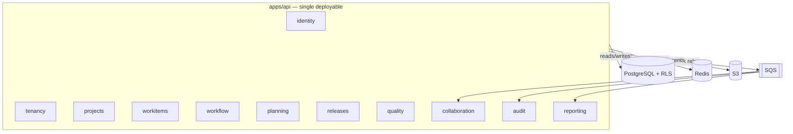
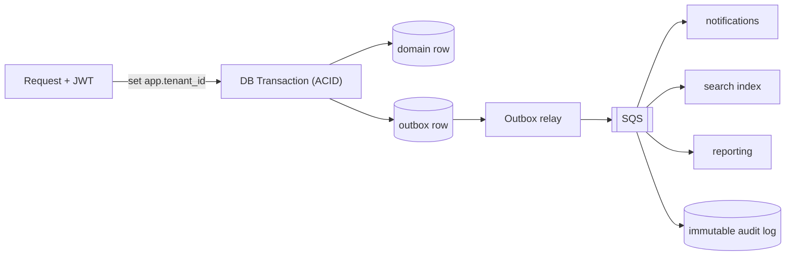
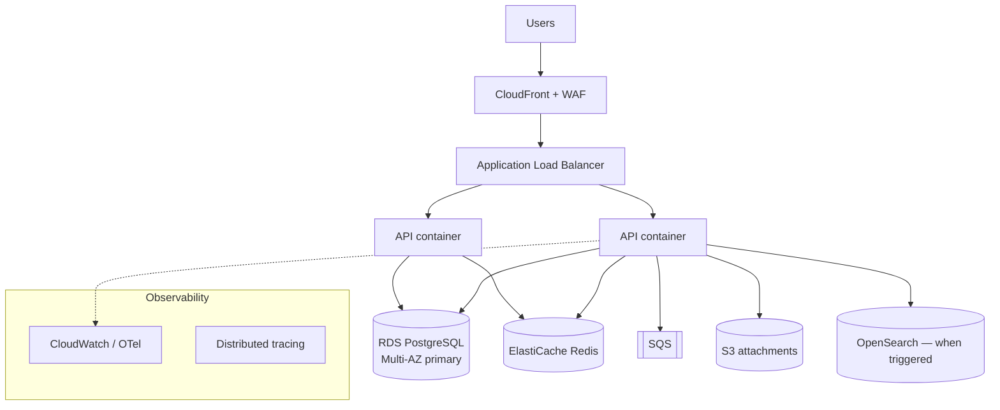
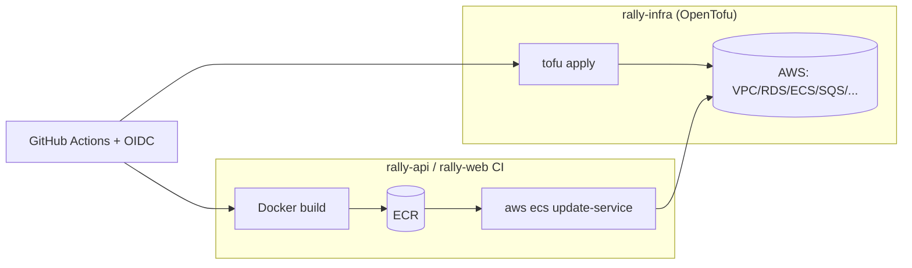

# Rally-Clone SaaS — Current Architecture (Phase 1 Foundation)

> **Status:** Proposed baseline for first build (VN-first, global-ready).
> **Target now:** ~800 CCU. **Designed headroom:** 5k–20k CCU with config-only scaling.
> **Guiding principle:** Enterprise-grade *foundations*, monolith-first *deployment*, service-extraction-*ready* boundaries. Standardized from day 1, complexity added only on measured triggers.
>
> **Companion docs:** first-phase task plan → `FOUNDATION_PHASE.md`; full launch/GA/scale capability checklist → `PRODUCTION_READINESS.md`; evolution triggers → `ARCHITECTURE_FUTURE_SCALE.md`.
> **Note:** the existing `04_Developement_tracking/Phase 0` (1.5-day single-company prototype) is **superseded** by `FOUNDATION_PHASE.md` — *single-tenant behaviour on a multi-tenant foundation*.

---

## 1. Scope & Goals

- Build a Broadcom Rally–equivalent Agile work-management SaaS.
- Multi-tenant from day 1 (VN companies first → global later).
- Standardized, compliant, auditable foundation (SOC 2 + GDPR readiness designed in).
- Optimize for **development velocity now** + **clean scaling path later**, without re-platform debt.

### Explicit non-goals (deliberately deferred — see `ARCHITECTURE_FUTURE_SCALE.md`)
- ❌ Microservices on day 1
- ❌ ScyllaDB / wide-column store
- ❌ Kafka cluster (start with outbox → SQS)
- ❌ ClickHouse (Postgres handles early reporting)
- ❌ SAGA orchestration (monolith uses ACID transactions)
- ❌ Multi-region active-active

These are **earned through real triggers**, not bought upfront.

---

## 2. Architecture Style — Modular Monolith

A single deployable application composed of strongly-bounded modules. Not "just a monolith" — disciplined internal boundaries make any module extractable into a service later with minimal rework.

### Module map

```
apps/api  (single deployable unit)
└── modules/
    ├── identity/        # auth, session, SSO (OIDC/SAML), SCIM, users, profile
    ├── tenancy/         # workspace/org, RLS tenant context, membership
    ├── projects/        # project, team, project-team (M:N), roles
    ├── workitems/       # feature / story / task / defect, parent-child graph, rollups
    ├── workflow/        # states, transitions, WIP limits, board
    ├── planning/        # backlog ranking, sprint, capacity, iteration status
    ├── releases/        # release lifecycle, readiness
    ├── quality/         # defect lifecycle, verify/reopen
    ├── collaboration/   # comments, mentions, watchers, notifications
    ├── audit/           # immutable activity log (via outbox)
    └── reporting/       # burndown, velocity, dashboards
```

### Boundary rules (what makes it extraction-ready)
1. Modules communicate **only** through explicit interfaces/contracts or domain events — never direct SQL into another module's tables.
2. Each module owns its tables in a **namespaced schema** (one physical DB now, logically separable later).
3. Cross-module side effects go through the **outbox/event** mechanism, not synchronous reach-in.
4. A module gains a public contract (commands/queries) + emits/consumes events. The seam is real from day 1.



---

## 3. Tech Stack

| Layer | Choice | Rationale |
|---|---|---|
| **Backend (primary)** | **NestJS + TypeScript** *(LOCKED)* — alt: **Go** for hot paths | Enterprise structure out-of-box (modules, DI, guards=RBAC, interceptors=audit, **OpenAPI generation**). The OpenAPI spec is the typed **contract** consumed by the FE repo via codegen → no contract drift across repos. 800 CCU trivial for Node. *(Bun is a viable faster runtime once proven; Node default for enterprise stability.)* **— see §11** |
| **Hot-path runtime (later)** | Go (or Rust if proven hotspot) | Surgical use for realtime fanout / CPU-bound jobs only |
| **Frontend** | **React 19 SPA** (+ **React Compiler**) + Vite + TanStack Query/Router + shadcn/ui *(not Next.js — see §3.1)* | Behind-login app, no SEO need; static-hosted (S3+CloudFront), pairs with dedicated API. React Compiler auto-memoizes (no manual `useMemo`). Reuses existing `03_Mockup Design` mockups; **typed via OpenAPI-generated client** (separate repo — see §3.2) |
| **Primary DB** | **PostgreSQL 17+** (18 adds native `uuidv7()`) | ACID, relational rich domain, Row-Level Security multi-tenancy, JSONB for flexible fields |
| **ORM / data access** | **Drizzle** (SQL-shaped, you own the `pg` connection) *(alt: MikroORM for batteries-included UoW; **not** Prisma — RLS friction)* | Transaction-scoped `SET LOCAL app.tenant_id` for RLS is trivial; SQL-first suits outbox, advisory locks, LexoRank, BFF aggregation. See §3.7 |
| **Migrations** | `drizzle-kit` generates SQL → hand-extended for **RLS policies, partial indexes, partitioning, expand-contract** | RLS/policies are SQL no ORM abstracts — a SQL-first migrator is the right tool |
| **Validation** | **Zod** via `nestjs-zod` + `drizzle-zod` *(alt: class-validator + DTO)* | One schema → TS type + runtime validation + OpenAPI; derives from Drizzle tables. API DTOs composed separately (never expose DB shape raw). See §3.8 |
| **Primary keys** | **UUIDv7 / ULID** (time-ordered, globally unique) | **Day-1 decision** — enables future tenant/region sharding with zero ID migration. Time-ordered keeps index locality (unlike random UUIDv4). Never auto-increment integers |
| **Cache / realtime** | **Valkey** (Redis-compatible; AWS ElastiCache-native) | Session, cache, rate-limit, WIP counters, board pub/sub. Valkey (Linux Foundation fork) avoids Redis source-available licensing; drop-in API-compatible |
| **Async / events** | Outbox table → AWS SQS | Event-driven + audit with single-DB ACID safety; no Kafka cluster cost yet |
| **Search** | OpenSearch *(add on trigger)* | Only when Postgres FTS on work items slows |
| **Object storage** | AWS S3 *(now)* → Cloudflare R2 on egress-cost trigger | Native IAM + region/residency control now; R2 (zero egress) only when attachment egress bill grows or serving large files globally |
| **Runtime adapter** | NestJS on **Fastify** adapter *(fallback: Express if a must-have plugin is Express-only)* | Lower latency tail + schema-based serialization (pairs with OpenAPI); greenfield = cheapest time to adopt. See §3.3 |
| **API style** | **REST + OpenAPI** contract; purpose-built **BFF aggregation** endpoints for board/backlog/dashboard. **GraphQL & gRPC deferred** | Resource-clean, cacheable, codegen-friendly; aggregation only where the UI needs it. See §3.4 |
| **Realtime transport** | WebSocket (Valkey pub/sub backplane) | Live board drag, notifications |
| **Concurrency control** | **Optimistic** (`version`) default; **Postgres advisory / `FOR UPDATE`** at named hotspots; **LexoRank** for ordering; **idempotency keys**; heavy work → **SQS workers** | Match the tool to the contention point. See §3.5 |
| **AuthN** | OIDC / SAML SSO, SCIM provisioning; **short-lived access JWT + server-stored rotating refresh (session whitelist)** + emergency denylist | Enterprise table-stakes + real revocation. See §3.6 |
| **AuthZ** | RBAC + ABAC, permission codes, resolved-perm cache | Workspace + project scoped roles |
| **Tenant addressing** | **Authoritative = verified JWT `tenant` claim** (sets RLS `app.tenant_id`); **subdomain** (`acme.rally.com`) for web UX/branding (fast-follow). Never trust host alone | Token decides tenant; host is spoofable. See §3.9 |
| **IaC** | **OpenTofu** *(single tool; HCL/Terraform language)* in its own **`rally-infra`** repo | All infra reproducible. **No Terraform-CLI alongside** (Tofu is the choice, not both). **No Ansible** (immutable Fargate containers — no servers to config-manage). **No Helm/ArgoCD** (ECS, not Kubernetes; adopt only on EKS trigger, Stage 5) |
| **CI/CD** | GitHub Actions, trunk-based, ephemeral preview envs | **Provision** (`rally-infra`, OpenTofu) is decoupled from **deploy** (app repos: Docker build → ECR → `aws ecs update-service`). Code deploy never runs `tofu apply`. GitOps/ArgoCD only when k8s |
| **Observability** | **OpenTelemetry** (day 1) → managed backend (**Grafana Cloud** LGTM or **CloudWatch/X-Ray**) → self-hosted **Prometheus/Loki/Tempo/Grafana + Alloy** on trigger | Instrument once (vendor-neutral); avoid running 5 stateful telemetry systems early; backend swap is config, not re-instrumentation |
| **Cloud** | AWS (region: `ap-southeast-1` Singapore for VN) | Single region now, region-ready design |

> **Tech-currency principle:** "best & latest 2026" = **latest *stable, proven* releases**, not bleeding-edge. We track current majors (PostgreSQL 17+, React 19 + Compiler, Valkey, OTel) but adopt new tech only when stable + justified by a real need — same triggered discipline as the scaling plan. Revisit versions each major release.

### 3.1 Frontend decision — React SPA, not Next.js full-stack

- **Product app = React SPA.** It lives behind login → no SEO/SSR benefit. Static-hosted on S3+CloudFront (no Node SSR server to run/scale/pay for). Realtime (board drag, notifications) is natural in an SPA.
- **Dedicated API backend is NOT optional.** "Next.js means no backend" holds only for content/thin-CRUD apps. This product needs **WebSocket realtime, background workers + scheduler, outbox/event consumers, RLS tenant-context pooling, and a stable public API** (integrations, webhooks, mobile, Jira import) — all of which a Next.js serverless/RSC layer hosts poorly. Even with Next you'd still run separate realtime + worker services, splitting the backend awkwardly and welding domain logic to the UI deploy.
- **Next.js / Astro is reserved for the public marketing/docs site** (`www.` / `docs.`) where SEO/SSG/content actually matter — a separate app, not the product.
- **Pattern:** `React SPA (app) ─REST/WS─► dedicated API backend (NestJS/Go)` with realtime, workers, scheduler, outbox, and public API behind that one backend.

### 3.2 Repository & team topology — two repos, OpenAPI contract as the hard boundary

- **Two separate repos** (separate team ownership): **`rally-api`** (backend — NestJS, DB, RLS, outbox, workers; owned by backend) and **`rally-web`** (React SPA; owned by FE partner). Team ownership + independent CI/release cadence is the split trigger.
- **Trade-off accepted:** two repos lose the free end-to-end TS types a monorepo would give. We replace that with an explicit, machine-checked contract — not tribal knowledge.
- **Contract = OpenAPI-first.** NestJS auto-generates the OpenAPI spec; `rally-api` publishes it on every merge. `rally-web` runs codegen (`openapi-typescript` / Orval) in its CI → a typed API client + types. **A breaking API change becomes a FE build failure, not a production surprise.**
- **Shared enums/constants** (item types, priorities, error codes, permission codes) ship *inside* the generated client — never hand-copied.
- **Guardrails:** versioned API + **contract tests** (or Pact) so the backend cannot silently break the FE; explicit CORS + auth across origins (`app.rally.com` ↔ `api.rally.com`); FE pins a spec version.
- **Alternatives considered:** monorepo + `packages/shared` (rejected — separate owners), published `@rally/contracts` npm package (viable if shared runtime validation needed later), tRPC (rejected — requires both ends in one TS monorepo).
- **Marketing/docs site** remains its own separate repo/app (Next.js/Astro).

### 3.3 NestJS runtime — Fastify adapter

- **Run NestJS on the Fastify adapter** (`@nestjs/platform-fastify`), not the default Express.
- **Why:** ~2× throughput / lower p99 latency, less GC pressure, and **schema-based JSON serialization** that aligns with the OpenAPI-first contract. Greenfield is the cheapest moment to choose it; switching later is disruptive.
- **Not a perf necessity at 800 CCU** — it's free headroom + lower tail latency, taken now because the cost is ~zero.
- **Compatibility checklist (all have Fastify equivalents today):** `@fastify/helmet`, `@fastify/cors`, `@fastify/rate-limit`, `@fastify/multipart` (uploads), `@fastify/cookie` (refresh cookie), WebSocket gateway, Nest Swagger module.
- **Fallback rule:** if a must-have integration is genuinely Express-only, drop to Express — the perf delta is never worth a blocked dependency.

### 3.4 API style — REST + BFF (GraphQL / gRPC deferred)

- **REST + OpenAPI is the primary, FE-facing style** — resource-clean, cacheable, easy auth/versioning, and already the locked FE contract.
- **BFF aggregation endpoints** for the heavy screens (board, backlog, dashboard): purpose-built read models that return shaped data in one call (work items + status + assignee + rollups), so the FE never does 5 round-trips. These are the **CQRS-lite read side**, not generic query endpoints.
- **GraphQL — deferred (maybe never).** We own both ends and the query shapes are known, so GraphQL's flexibility doesn't pay for its costs (N+1 resolvers, depth/complexity attack surface, caching pain, per-field auth, harder RLS mapping). Revisit only if the FE needs many divergent ad-hoc views **or** a public partner-query API emerges.
- **gRPC — reserved for internal service-to-service** once services are extracted (Stage 5). Not browser-native (needs grpc-web proxy), zero payoff for the SPA.
- **API versioning:** URI-prefixed (`/v1`) with a documented deprecation/sunset policy for the public surface.

### 3.5 Concurrency & parallelism — match the tool to the contention point

| Contention point | Approach |
|---|---|
| Work-item edits (same row, two users) | **Optimistic concurrency** (`version`) → `409` on conflict, FE refetches. Conflicts are rare; locking would cost more than it saves |
| Backlog / board reorder | **LexoRank** `rank` string — move = single-row update, no neighbor locks, no renumber |
| Per-project `item_no` / `item_key` sequence | Atomic counter via **Postgres sequence** or **advisory lock** / `UPDATE counters … RETURNING` |
| Narrow hot critical sections (rank rebalance, counters) | Short **`SELECT … FOR UPDATE`** or **Postgres advisory lock** — preferred over Redis distributed locks (ACID, no Redlock pitfalls) |
| Duplicate / retried requests | **Idempotency keys** → exactly-once effect on at-least-once clients |
| CPU-bound / heavy work (reports, imports, fanout) | **Offload to SQS workers** — never block the single-threaded Node event loop |
| App-level parallelism | **Horizontal scale** (many stateless ECS tasks); state lives in Postgres/Valkey, not instance memory |
| Realtime board fanout | Optimistic DB write → **Valkey pub/sub** broadcast (serialize correctness at DB, fan out async) |
| Singleton jobs (scheduler) | **Distributed lock** (Postgres advisory or Valkey) so only one runner fires |

> Default mental model: **optimistic + idempotent + queue-the-heavy-stuff.** Reach for locks only at named hotspots, and prefer **Postgres advisory locks** over Redis locks until a single DB is outgrown.

### 3.6 Auth tokens — session whitelist + short access JWT + emergency denylist

Pure stateless JWT can't be revoked (logout / ban / compromise stay valid until expiry); pure per-request DB lookup throws away JWT's statelessness. We use a **hybrid**:

| Layer | Choice |
|---|---|
| **Access token** | Short-lived JWT (~5–15 min), stateless, carries `sub`, `tenant`, `jti`, `session_id`. Verified by signature — no DB hit on the hot path |
| **Refresh token** | Long-lived, **stored server-side** (`auth_sessions.token_hash`) = the **whitelist**. Refresh **rotates** (one-time-use; reuse detected → kill the session family as a breach) |
| **Logout / revoke session** | Delete the session row → refresh dies; access token lapses within minutes |
| **Instant access revoke** (security event, ban) | Small **denylist in Valkey** keyed by `jti` / `session_id`, TTL = access-token remaining life. Checked only for hard immediate kill, not every request |
| **Mass invalidate** (“log out everywhere”, password change) | Bump `session_version` on the user; older tokens rejected |

**SPA token placement (separate origin `app.` ↔ `api.`):**
- **Refresh token = httpOnly + Secure + SameSite cookie** (XSS cannot read it), paired with a **CSRF token** (double-submit) since it crosses origins.
- **Access token = in memory** (JS variable). **Never `localStorage`** (XSS exfiltration).
- CORS allowlist + `credentials: include`.

> Answer to “blacklist?”: **whitelist the refresh sessions as the primary control, plus a tiny short-TTL denylist for emergency access-token kill.** Fast hot path, real revocation.

### 3.7 ORM / data access — Drizzle (RLS is the decider)

The highest technical risk is **RLS multi-tenancy**, and ORMs differ sharply in how cleanly they let you set transaction-scoped session variables. That requirement dominates this choice.

- **Drizzle (primary).** You own the raw `pg` / postgres-js connection, so wrapping each request in a transaction that runs `SET LOCAL app.tenant_id = $1` (then RLS enforces isolation) is clean and provable. Best-in-class TS type-safety, SQL-shaped — which suits the **outbox, advisory locks, LexoRank, and BFF aggregation** queries that all want explicit SQL.
- **Unit of Work** is provided by our architecture, **not** the ORM: hexagonal + *one DB transaction per command* **is** the UoW. `Repository` ports live in the domain; a thin Drizzle adapter implements them. The ORM staying out of the way is intentional.
- **Migrations:** `drizzle-kit` generates SQL we commit and **hand-extend** with RLS policies, partial indexes, partitioning, and expand-contract steps. RLS policies are SQL no ORM abstracts anyway.
- **Alternative:** **MikroORM** — choose only if the team wants a native UoW + identity-map + optimistic/pessimistic-locking framework and will manage its behaviour under multi-tenant RLS.
- **Rejected as primary:** **Prisma** — its query-engine connection model fights per-transaction `SET LOCAL` (constant drops to `$executeRaw`), and it doesn't model RLS/advisory locks. Great for simpler apps, wrong for a heavy-RLS system. **TypeORM** — workable via `QueryRunner` `SET LOCAL` but type-weak and stagnating; fallback only.
- **Pooling nuance:** use a **transaction-pinned connection per request** for RLS. With PgBouncer in *transaction* pooling mode, `SET LOCAL` **inside an explicit transaction** is safe; session-level `SET` is not.

### 3.8 Validation — Zod (single source of truth)

- **Zod via `nestjs-zod` + `drizzle-zod`** is the validation layer, chosen to complete one chain with our Drizzle + OpenAPI-first decisions.
- **Flow:** Drizzle table → `drizzle-zod` base schema → **refine into an API DTO** → `nestjs-zod` produces both the `ZodValidationPipe` **and** the OpenAPI spec the FE codegens from. One definition yields the TS type, the runtime validator, and the contract — no decorator/type duplication.
- **Boundary rule (critical):** never expose a DB schema as an API schema. `drizzle-zod` gives a *base*; compose API DTOs separately — `.omit()` internal columns (`tenant_id`, `version`, soft-delete/audit fields) and add API-only rules. DB shape ≠ API contract.
- **Alternative:** class-validator + class-transformer + DTO classes (Nest default, decorator-based) — acceptable fallback if the team prefers decorators, but it duplicates types and fights the single-source goal; `class-transformer` implicit coercion is a known footgun.

### 3.9 Tenant addressing & RLS context

How a request declares *which tenant* it is, so the server can set `app.tenant_id` for RLS.

- **Authoritative source = the verified JWT `tenant` claim.** The server derives `app.tenant_id` from the **signed token**, never from the host (hosts are spoofable; trust only signed claims). Multi-workspace users switch tenant → a new token with the new claim is issued.
- **Subdomain (`acme.rally.com`) for the web app** — UX, branding, cookie scoping, enterprise SSO / vanity domains. It only *suggests* the tenant; the token still decides.
- **Mechanisms weighed:** subdomain (clean isolation/branding, but wildcard DNS + `*.rally.com` TLS), path prefix (single cert, weaker cookie isolation), header/claim (authoritative, API-clean).
- **Phasing:** Foundation ships **token-claim addressing** (+ optional `X-Tenant-Id` for pre-auth flows like SSO discovery). **Subdomain is fast-follow** — avoids wildcard-TLS complexity on day 1 while keeping the model correct from the start.

---

## 4. Multi-Tenancy & Data Architecture

- **Model:** **Pool** — shared schema, every tenant row carries `tenant_id`, isolated by **PostgreSQL Row-Level Security (RLS)**.
- **Isolation:** RLS policies enforce `tenant_id = current_setting('app.tenant_id')` on every query; tenant context set per request from JWT. Isolation is **provable + testable** (required for SOC 2).
- **Shard key ready:** `tenant_id` doubles as the future shard/region key — scaling out or moving EU tenants to an EU DB requires no schema rework.
- **Sharding-safe IDs:** all primary keys are **UUIDv7/ULID** (time-ordered, globally unique) from day 1 — sharding/region-split later needs no ID remap. Auto-increment integers are forbidden (they break sharding and leak counts).
- **Enterprise tier upsell:** large customers can later be moved to a **silo** (dedicated DB) using the same code path.
- **Audit:** every mutation writes a domain row **and** an outbox event in one transaction → immutable activity log + downstream consumers (notifications, search index, reporting).

### 4.1 RLS rationale & operational rules (non-negotiable)

RLS is the **DB-enforced safety net** for the pool model — it turns "every developer must never forget a `WHERE tenant_id`" into "the database guarantees it." It is correct **only** with these rules; RLS without them is a false sense of security:

- **Dedicated app role with `NOBYPASSRLS`.** The runtime connects as a non-superuser role that *cannot* bypass policies. Migrations/admin use a **separate** role. (Superusers and `BYPASSRLS` roles silently ignore RLS.)
- **Fail-closed tenant context.** One middleware sets `app.tenant_id` per request inside the transaction (`SET LOCAL`). No context → **deny**, never default-allow.
- **`WITH CHECK` on writes.** Policies cover INSERT/UPDATE (`WITH CHECK`), not just SELECT (`USING`) — so a write can't land in the wrong tenant.
- **Belt-and-suspenders.** Repositories still scope by `tenant_id` in app code; RLS is the *safety net*, not the primary access path. A bug in either layer is caught by the other.
- **Explicit, audited system context.** Legit cross-tenant work (platform reporting, support tooling) uses a deliberate elevated path — never the default request flow.
- **Pooling:** `SET LOCAL` inside an explicit transaction (PgBouncer transaction-mode safe); never session-level `SET`.
- **Tested isolation.** Automated tests assert tenant A cannot read/write tenant B across every table.

> Considered & rejected: app-layer filtering *only* (one missed filter = breach), schema-per-tenant (thousands of schemas = migration/connection hell), DB-per-tenant (deferred to enterprise-tier silo). Pool + RLS is the cost-efficient, compliance-grade choice for many small tenants.



---

## 5. Design Patterns

| Pattern | Where / Why |
|---|---|
| **Modular Monolith** | Top-level architecture; extraction-ready boundaries |
| **Hexagonal / Ports & Adapters** | Domain logic isolated from DB/transport; swappable infra |
| **Transactional Outbox** | Atomic domain-write + event-emit; replaces SAGA at monolith stage |
| **CQRS-lite** | Separate read models (board, backlog, dashboards) from write models; no separate DBs yet |
| **Repository + Unit of Work** | Persistence abstraction, testability |
| **Domain Events** | Cross-module decoupling (e.g. `WorkItemStatusChanged` → notify + audit) |
| **Specification / Policy** | RBAC+ABAC permission evaluation |
| **Strategy** | Pluggable workflow transition rules, notification channels |
| **Idempotency keys** | Safe retries on mutating endpoints + event consumers |
| **Optimistic concurrency** (`version` column) | Concurrent edits on work items / board |
| **Backpressure / rate-limit** | Redis token bucket per tenant + per user |

---

## 5b. Resilience & Reliability Patterns (day-1 — cheap now, brutal to retrofit)

Even at monolith stage, these are **built in from the start** because they're conventions, not infrastructure. They cost almost nothing now and prevent whole classes of production incidents.

| Pattern | How we apply it day-1 |
|---|---|
| **Timeouts everywhere** | Hard timeouts on every I/O call (DB, cache, HTTP, queue). No unbounded waits. Sensible defaults + per-call override |
| **Retry w/ exponential backoff + jitter** | Only on **idempotent** ops (reads, idempotent writes, event consumers). Jitter to avoid thundering herd. Capped attempts |
| **Idempotency keys** | Mutating endpoints + event consumers carry idempotency keys (`idempotency_keys` table) → safe retries, no double-effect |
| **Message deduplication** | Transactional outbox (at-least-once) + **consumer-side idempotency** = effectively-once processing. No exactly-once illusion |
| **Dead-letter queue (DLQ)** | SQS DLQ for poison messages after N failed deliveries; alarmed + manually replayable |
| **Graceful shutdown + draining** | SIGTERM → stop accepting, drain in-flight, close pools, ack/nack outstanding messages before exit (ECS-safe) |
| **Health / readiness / liveness probes** | Readiness gates traffic until DB/cache reachable + migrations applied; liveness restarts wedged instances |
| **Connection-pool caps** | Bounded Postgres pool per instance (PgBouncer added on trigger). Prevents connection exhaustion under spikes |
| **Rate limiting + load shedding** | Per-tenant + per-user token bucket (Valkey). Shed/queue excess instead of collapsing |
| **Graceful degradation / fallback** | Non-critical dependency down → degrade, don't fail: search-down → fall back to Postgres filter; cache-miss → source DB; notifications async-best-effort |
| **Optimistic concurrency** | `version` column → detect concurrent edits, return conflict instead of silent overwrite |
| **Outbox relay safety** | Relay is idempotent + resumable; crash mid-publish → re-publishes pending, consumer dedupes |

> **Deferred to scale stage** (see `ARCHITECTURE_FUTURE_SCALE.md` §6b): circuit breakers, bulkheads, retry budgets, hedged requests, regional failover, chaos testing — these matter once there are external service dependencies and extracted services to protect.

---

## 6. DSA Hotspots (where algorithms matter more than infra)

| Hotspot | Solution | Why |
|---|---|---|
| **Backlog / board ranking** | **LexoRank** (fractional lexicographic ordering, like Jira) | A reorder = single-row update of one rank string, not renumber-all. O(1) move |
| **Permission resolution** | Resolve role→permission set once, cache in Redis keyed by (user, tenant, project) | Avoids per-request recompute; invalidate on role change |
| **Work-item graph & rollups** (story points, estimate/remaining/actual) | Batched aggregation + materialized rollup columns, recomputed on event | Prevents N+1; rollups read in O(1) |
| **N+1 on detail/list views** | DataLoader-style batching | Collapse fan-out queries |
| **Board hot tenant** | Cache board projection in Redis; debounce realtime broadcasts | Absorbs read storms + drag spam |
| **Search / filter** | Postgres GIN/trigram FTS now → OpenSearch on trigger | Right tool per scale |

---

## 7. Security & Compliance Baseline (designed in, not retrofitted)

- **Tenant isolation:** Postgres RLS, proven by automated isolation tests.
- **AuthN:** OIDC/SAML SSO, SCIM user provisioning/deprovisioning, short-lived JWT + rotating refresh tokens.
- **MFA:** TOTP/WebAuthn (seam day 1, enforced fast-follow).
- **Account protection:** brute-force lockout, generic auth errors, session revoke, breach-password check.
- **AuthZ:** RBAC (workspace + project roles) + ABAC (attribute conditions), least-privilege, field-level permissions.
- **Audit:** immutable, append-only activity log (who/what/when/before/after) via outbox — SOC 2 evidence.
- **Encryption:** TLS in transit; at-rest encryption (RDS/S3 KMS); secrets in AWS Secrets Manager with rotation policy.
- **Attachment safety:** AV/malware scan on upload before serving.
- **GDPR:** PII inventory, data export (portability), right-to-erasure flows, region-ready storage.
- **App security:** input validation at boundary, parameterized queries, OWASP Top 10 controls, dependency scanning, SAST/DAST in CI.
- **Network:** private subnets for DB/cache, security groups least-open, WAF on edge.
- **Deferred until needed:** HIPAA / FedRAMP (only if pursuing health/gov segments).

---

## 8. Infrastructure Topology (AWS, single-region)



- **Compute:** ECS Fargate (or EKS) — stateless API containers, autoscaled.
- **DB:** RDS PostgreSQL Multi-AZ (HA failover).
- **Cache:** ElastiCache Redis.
- **Async:** SQS (+ DLQ).
- **Storage:** S3 (versioned, encrypted).
- **Edge:** CloudFront + WAF + ACM TLS.
- **Data safety / DR:** automated backups + **PITR**, tested **restore drill**, documented **RTO/RPO**; KMS encryption; secrets rotation.
- **SaaS / ops planes (foundation skeleton):** transactional **email** (SES/Postmark via outbox), **background job/scheduler** worker, **billing-ready** tenant schema (plan/seat fields) — see `PRODUCTION_READINESS.md` for full launch/GA/scale classification.
- **IaC:** **OpenTofu only**, in a dedicated **`rally-infra`** repo (`modules/` blueprints + `live/{dev,staging,prod}/` env compositions). **No Helm/ArgoCD/Ansible** — ECS Fargate, not Kubernetes; immutable containers, nothing to config-manage. **CI/CD:** GitHub Actions, trunk-based, ephemeral PR preview envs.
- **Observability:** **OpenTelemetry** instrumentation day 1 → ship to **managed Grafana Cloud (LGTM)** or **CloudWatch/X-Ray**; structured logs + correlation IDs; metrics + traces + alerts. Self-host Prometheus/Loki/Tempo/Grafana + **Alloy** collector only on cost/control/volume trigger.

### 8.1 Repo Topology & Provision-vs-Deploy

**Three repos**, split by what changes at what speed:

| Repo | Owns | Tooling | Cadence |
|---|---|---|---|
| **`rally-api`** | NestJS backend (this team) | Docker, GitHub Actions | many deploys/day |
| **`rally-web`** | React SPA (FE partner) | Docker/static build, GitHub Actions | many deploys/day |
| **`rally-infra`** | All AWS provisioning | **OpenTofu** | infra changes (slow, gated) |

```
rally-infra/
  modules/        # reusable blueprints: network, rds, ecs-service, messaging, observability, edge
  live/
    dev/  staging/  prod/   # env compositions: backend.tf + main.tf + *.tfvars
  global/         # ecr, route53, github-oidc roles, tf-state backend
```

- **One `rally-infra` repo day-1** (`modules/` + `live/` as folders). Split modules into their own versioned repo **only on trigger** (multiple products reuse them / separate approval gates).
- **Two motions, never coupled:**
  - **Provision** (`rally-infra`, OpenTofu) — VPC, RDS, ECS cluster + service shell, ALB, SNS/SQS, Valkey, IAM, secrets scaffolding. ECS task-def **`ignore_changes` on image tag**.
  - **Deploy** (app repos) — build image → push **ECR** → `aws ecs update-service` / new task-def revision. **Code deploy must not run `tofu apply`.**
- **DB migrations = third motion:** Drizzle migrations run as a **gated CI run-task** against RDS *before* the new app version flips. Terraform/Tofu does **not** run migrations.
- **State:** remote (S3 + lock), per-env key. **Auth:** GitHub **OIDC → AWS**, separate role per env; prod role assumeable only from `main` + manual approval. **Gates (fast-follow):** plan-on-PR (Atlantis/TF-Cloud-style) + policy check (OPA/Conftest) + scheduled **drift detection**.



---

## 9. Capacity — CCU, Traffic, Cost (current design)

**CCU ≠ RPS.** ~800 CCU × ~0.3 req/s/active-user ≈ **~240 RPS typical, ~800 RPS burst.**

| Config | Safe CCU | ~RPS | ~Cost/mo (AWS) | Note |
|---|---|---|---|---|
| 2 API + 1 Postgres (Multi-AZ) + Redis | **~5,000** | ~1,500 | **$300–700** | Your 800 target ≈ 16% load. Idle headroom |
| 4 API + Postgres + 2 read replicas + Redis | ~20,000 | ~6,000 | $1.5k–3k | One-line Terraform scale-out |

- **Entry config alone clears the 800-CCU target ~6×.**
- App tier scales horizontally near-linearly; **single Postgres writer** is the eventual ceiling (~tens of thousands of write-heavy CCU) — addressed by levers in the future-scale doc.
- First real bottlenecks are **code, not infra**: N+1 queries, backlog rank strategy, permission caching, board hot tenants (all handled in §6).

---

## 10. What We Deliberately Defer (and the trigger to add it)

> **Canonical trigger registry: `ARCHITECTURE_FUTURE_SCALE.md §2`** (trigger → action map, with signals + cost). This is the quick list only — do not duplicate the trigger detail here.

Deferred until triggered: **read replicas** · **OpenSearch** (search) · **ClickHouse** (OLAP/reporting) · **Kafka** (replace SQS) · **tenant table-partitioning → tenant/region DB sharding** (writer ceiling **or** EU data residency) · **service extraction** · **SAGA** (only a flow spanning multiple service DBs).

---

## 11. Locked Decisions

> **This section is the canonical Locked-Decisions registry for the whole project.** `FOUNDATION_PHASE.md §7` and `DATABASE_SCHEMA.md §1` hold only their *scoped* decisions and defer here for the master list.

**Primary backend language: NestJS/TypeScript — LOCKED (tech-lead sign-off 2026-06-20).**

| | NestJS/TS | Go |
|---|---|---|
| Domain plumbing | Provided (modules, DI, guards, OpenAPI) | Hand-rolled |
| Frontend type sharing | ✅ end-to-end TS | ❌ separate |
| Ops simplicity / single binary | Good | ✅ Best |
| Raw perf headroom | Plenty for 800 CCU | Higher (not needed yet) |
| Hiring pool | Largest | Strong |

**Decision:** **NestJS/TS** primary for the core monolith. **Go reserved** for future extracted hot-path services (triggered only).

**Compliance baseline: SOC 2 + GDPR — LOCKED.** Designed in from day 1 (audit log, encryption, data-subject ops, access controls); region residency / SOC 2 Type II cadence added on trigger (see FUTURE_SCALE §6).

**Phase 0 status: SUPERSEDED — LOCKED.** The 1.5-day single-company prototype in `04_Developement_tracking/Phase 0/` is replaced by `FOUNDATION_PHASE.md` ("single-tenant behaviour, multi-tenant foundation").

---

*Companion docs:* `FOUNDATION_PHASE.md` (first-phase task plan) · `PRODUCTION_READINESS.md` (launch / fast-follow / triggered checklist) · `ARCHITECTURE_FUTURE_SCALE.md` (triggered evolution path to global scale) · `BACKEND_STRUCTURE.md` (`rally-api` module/folder layout) · `FRONTEND_STRUCTURE.md` (`rally-web` SPA architecture).
