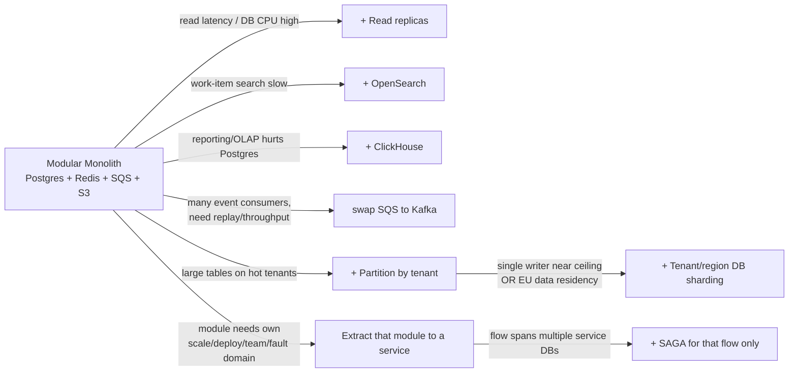
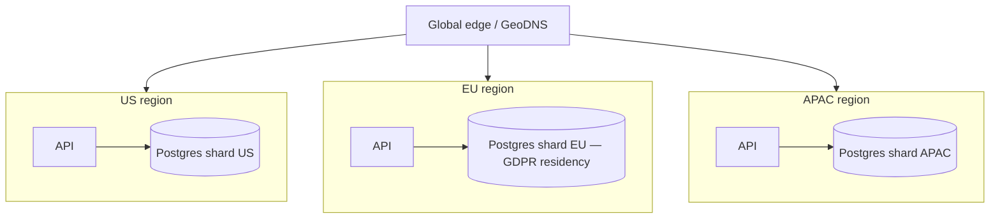
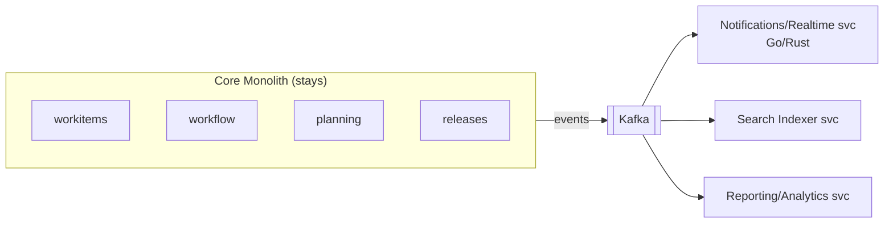

# Rally-Clone SaaS — Future Scale Architecture

> **Status:** Evolution roadmap. Nothing here is built upfront.
> **Principle:** Every step is unlocked by a **measured trigger**, not a guess. The Phase-1 modular monolith (see `ARCHITECTURE_CURRENT.md`) was designed so each step below is **config or extraction**, never a re-platform.
> **Why this works:** real enterprises (Atlassian/Jira, GitHub, Shopify) scaled monoliths to far past this size before selectively extracting services. We follow the same proven path.

---

## 1. Scaling Philosophy

- **Traffic scale** = more stateless replicas + read replicas + cache. The monolith already does this.
- **Org scale** = independent deploy/ownership → *this* is what justifies microservices, not raw RPS.
- **Data scale** = partition then shard by `tenant_id` (already the shard key in the pool model).
- **Never** split on guessed seams. Extract only modules with a real, observed need.

---

## 2. Trigger → Action Map

| Trigger (observed signal) | Action | Cost added |
|---|---|---|
| DB read CPU sustained >60–70%, read latency rising | Add **Postgres read replicas**; route reads | Low |
| Work-item search/filter latency high on Postgres FTS | Add **OpenSearch**, index via existing outbox events | Medium |
| Burndown/velocity/dashboard queries strain Postgres | Add **ClickHouse**, feed via outbox/CDC; move OLAP off OLTP | Medium |
| Event consumers multiply, need replay / ordering / high throughput | Replace **SQS → Kafka**; outbox contract unchanged | Medium–High |
| Hot-tenant tables large, vacuum/index pain | **Partition** big tables by `tenant_id` | Low (schema op) |
| Single Postgres **writer** approaching ceiling, OR GDPR EU residency | **Shard by tenant/region** (US-DB, EU-DB, APAC-DB) | High |
| A module spikes independently (e.g. notifications/realtime 100× core) | **Extract** it into its own service + runtime (Go/Rust) | High |
| Extracted flow now spans two service DBs | Introduce **SAGA** (orchestrated or choreographed) for that flow only | High |
| Attachment **egress bill** grows / serve large files globally | Migrate object storage **S3 → Cloudflare R2** (zero egress) | Low |
| Telemetry managed-bill grows / need residency / high volume | Self-host **LGTM (Prometheus/Loki/Tempo/Grafana) + Alloy**; OTel backend swap is config-only | Medium |
| Adopt Kubernetes (EKS) | Add **ArgoCD** GitOps deploy | Medium |
| Outbox-polling strains DB / need reliable OLAP+search feed | Replace outbox relay with **CDC (Debezium)** | Medium |
| One noisy/large tenant risks others; blast-radius too wide | **Cell-based architecture** (tenants grouped into isolated cells/pods) | High |
| Residency change / hot-shard rebalance | **Tenant relocation + shard rebalancing tooling** | High |
| Deploy risk at scale | **Progressive delivery** (canary / blue-green) | Medium |
| Many services need secure/observable mesh | **Service mesh + mTLS** (Istio/Linkerd), zero-trust internal | Medium |
| Public API abuse / per-tenant quotas | **API gateway** + global rate-limit/quota tiers | Medium |
| Multi-user **live co-editing / presence** required (SSE no longer enough) | **WebSocket gateway + presence service** (extract realtime module) | Medium–High |
| Audit/activity tables grow unbounded | **Time-partitioning + cold-storage archival** (WORM for compliance) | High |

### Frontend scaling (triggered) — React SPA stays the core

React is the durable core; it is **never rewritten** to scale. Capabilities bolt on, mirroring the backend philosophy.

| Trigger (observed signal) | Action | Note |
|---|---|---|
| Bundle grows, slow first load | **Code-splitting + lazy routes** | Built into Vite/TanStack Router |
| Huge boards/backlogs (1000s rows) | **Virtualization** (TanStack Virtual) | Render only visible rows — FE DSA |
| Heavy client-side compute | **Web Workers** | Offload main thread |
| Many FE teams (org scale) | **Micro-frontends / Module Federation** or monorepo packages | Org-scale only, not traffic — same logic as service extraction |
| Shared UI across teams | **Design-system package** (shadcn → versioned lib) | |
| Public, indexable pages (marketing, shared roadmaps) | **Next.js / Astro for those pages only** | Additive, separate app — not the core SPA |
| Native mobile needed | **React Native** (reuses React skills) or PWA first | |
| Production FE health | **RUM + error tracking** (Sentry), Core Web Vitals | FE observability |
| Global users | **i18n/l10n, WCAG a11y, CDN edge** | |

---

## 3. Evolution Stages

### Stage 1 — Vertical + read scale (≤ ~20k CCU)
- Scale API replicas (stateless, autoscaling).
- Add read replicas; route read-heavy queries (board, backlog, reports).
- Push hot reads into Redis (board projections, resolved permissions, project metadata).
- **No architecture change. Pure config / Terraform.**

### Stage 2 — Offload specialized workloads (≤ ~50k CCU)
- **OpenSearch** for search/filter; **ClickHouse** for analytics/reporting.
- Both fed by the **existing outbox event stream** — no new write paths in the domain.
- Add **PgBouncer** connection pooling; **partition** large tables by `tenant_id`.
- Monolith still single deployable.

### Stage 3 — Event backbone upgrade
- Replace SQS with **Kafka** when consumers/throughput/replay justify.
- Outbox publishes to Kafka topics; consumers: notifications, search-index, analytics ETL, audit.
- Enables future inter-service eventing without redesign.

### Stage 4 — Data sharding & multi-region (global, GDPR)
- Shard tenants across regional DB clusters using `tenant_id` shard key.
- **EU tenants → EU region DB** (data residency / GDPR), US/APAC likewise.
- Routing layer resolves tenant → region → DB.
- Single Postgres-writer ceiling dissolved; near-linear capacity by adding shards.

### Stage 5 — Selective service extraction (org scale)
- Extract only modules with a **proven** independent need. Likely first candidates:
  - **collaboration/notifications + realtime** (spiky, fan-out heavy, Go/Rust runtime).
  - **search-indexer** (decouple from request path).
  - **reporting/analytics** (different scaling + storage).
- Core domain (workitems, workflow, planning) **stays a monolith** as long as it serves well.
- Each extracted service: own deploy cadence, own scaling, own on-call; communicates via Kafka events + well-defined contracts (gRPC internal).

### Stage 6 — Distributed transactions (only where unavoidable)
- When an extracted flow spans multiple service-owned DBs, introduce **SAGA** for *that flow only* (orchestrated for complex, choreographed for simple).
- Everything still inside a single service continues to use **ACID transactions** — never SAGA by default.

---

## 4. When the Originally-Proposed Heavy Stack Becomes Right

The earlier hypothesis (ScyllaDB + ClickHouse + Kafka + SAGA + Go/Rust) is not wrong — it's **early**. Each earns its place on a trigger:

| Component | Becomes justified when |
|---|---|
| **Kafka** | Stage 3 — many consumers, replay, high event throughput |
| **ClickHouse** | Stage 2 — OLAP/reporting outgrows Postgres |
| **Go / Rust services** | Stage 5 — extracted hot-path service with CPU/concurrency need |
| **SAGA** | Stage 6 — cross-service distributed transaction |
| **ScyllaDB** | Only if a genuinely write-massive, key-access, non-relational workload appears (e.g. very high-volume activity/event firehose at huge scale). Core relational domain stays on Postgres regardless |

---

## 5. Capacity & Cost by Stage

| Stage | Architecture | Safe CCU | ~RPS | ~Cost/mo (AWS) |
|---|---|---|---|---|
| Phase 1 (entry) | 2 API + Postgres + Redis | ~5,000 | ~1,500 | $300–700 |
| Stage 1 | + replicas, more API | ~20,000 | ~6,000 | $1.5k–3k |
| Stage 2 | + PgBouncer, partition, OpenSearch, ClickHouse | ~50,000 | ~15,000 | $4k–8k |
| Stage 4 | Sharded multi-region | 100k–500k+ | 30k–150k+ | $15k–60k+ (scales w/ tenants) |
| Stage 5 | + extracted services + Kafka | 500k+ | 150k+ | Scales per service; pay-per-need |

> Cost grows **with realized scale/revenue**, not upfront. This is the inverse of buying a microservices+Scylla+Kafka platform on day 1 to serve 800 CCU.

---

## 6. Cross-Cutting Concerns That Scale With You

| Concern | Evolution |
|---|---|
| **Observability** | OTel from day 1 → per-service tracing, SLOs, error budgets at Stage 5 |
| **Compliance** | SOC 2 + GDPR baseline → add region residency (Stage 4), SOC 2 Type II audit cadence, optional HIPAA/FedRAMP per market |
| **Tenant isolation** | RLS (pool) → silo DB option for enterprise tier → regional shards |
| **CI/CD** | Trunk-based monorepo → per-service pipelines as modules extract |
| **Resilience** | Multi-AZ → multi-region failover, circuit breakers, bulkheads at service stage |
| **Data residency** | Region-ready design → enforced EU/US/APAC shards (Stage 4) |
| **SaaS business plane** | Billing skeleton → metered usage, multi-currency, tax/VAT, marketplace billing as markets expand |
| **Integrations** | Outbound webhooks → GitHub/Slack/CI connectors → integration marketplace (fast-follow / triggered) |
| **Frontend** | React SPA → code-splitting + virtualization → micro-frontends (org scale) + RUM; optional SSR (Next/Astro) for public pages; React Native for mobile |

---

## 6b. Resilience Patterns (advanced — added when dependencies & services appear)

The **day-1 resilience set** (timeouts, retries+backoff+jitter, idempotency, dedup, DLQ, graceful shutdown, health probes, pool caps, rate-limit, graceful degradation) lives in `ARCHITECTURE_CURRENT.md` §5b. The patterns below are **triggered** — they protect *external dependencies* and *extracted services*, which a single monolith doesn't yet have.

| Pattern | What / why | Trigger |
|---|---|---|
| **Circuit breakers** | Stop hammering a failing dependency (external API, extracted service); fail-fast + auto half-open recovery. Prevents cascading failure | First real external dep or service extraction (Stage 3+) |
| **Bulkheads / resource isolation** | Separate connection pools / thread pools / queues **per dependency and per tenant-tier** so one slow dependency or noisy tenant can't drain shared capacity | Multiple external deps OR enterprise tenant tiers (Stage 3–4) |
| **Retry budgets** | Cap aggregate retries (e.g. ≤10% of traffic) to prevent **retry storms** amplifying an outage | When retries span service hops (Stage 4–5) |
| **Load shedding tiers** | Drop low-priority work (background, non-critical reads) first to protect critical paths under overload | Sustained overload events (Stage 3+) |
| **Hedged requests** | Issue duplicate request to a second replica after a latency threshold; take first response. Tames p99 tail latency | Read-replica fan-out, latency-SLO pressure (Stage 4+) |
| **Backpressure across hops** | Propagate pressure upstream (bounded queues, `429`/`503` + `Retry-After`) instead of unbounded buffering | Multi-service async pipelines (Stage 4+) |
| **Poison-message quarantine** | Beyond DLQ: classify & quarantine repeat offenders, auto-replay transient ones | High event volume (Stage 3+) |
| **Regional failover (tested)** | Automated cross-region failover with documented per-shard RTO/RPO — see §7 DR automation | Multi-region (Stage 4–5) |
| **Chaos engineering** | Game-days, fault injection, dependency-kill drills to *prove* the above actually work | Stage 4–5 |

---

## 7. Additional Scale Concerns (advanced stages)

Beyond the core data/service evolution, these become relevant at large/global scale. Each is **triggered**, not pre-built.

| Concern | What it is / why | Stage |
|---|---|---|
| **Cell-based architecture** | Group tenants into independent **cells/pods** (own DB/cache/compute slice) so one tenant's load or failure can't take down others. Blast-radius isolation + noisy-neighbor control (Slack/AWS model). The real answer to "one tenant breaks everything" | 4–5 |
| **CDC (Debezium)** | At scale, replace outbox-polling with **Change Data Capture** streaming the DB WAL → reliable, low-lag feed for OpenSearch/ClickHouse/Kafka | 2–3 |
| **Tenant relocation / shard rebalancing** | Tooling to move a tenant between shards/regions (US→EU residency, hot-shard rebalance) with minimal downtime. Sharding-safe **UUIDv7/ULID IDs** (set day 1) make this feasible | 4 |
| **Multi-region consistency model** | Define **read-your-writes** guarantees, eventual-consistency UX, and collaboration conflict handling across regions. Pick per-tenant home-region pinning to avoid cross-region writes | 4 |
| **Progressive delivery** | Canary / blue-green / feature-flag-gated rollouts; automated rollback on SLO breach | 1–5 |
| **Service mesh + zero-trust internal** | mTLS, traffic shaping, retries/timeouts between services (Istio/Linkerd) once many services exist | 5 |
| **API gateway + quotas** | Central edge for public API: authn, **per-tenant rate-limit/quota tiers**, abuse/bot control, versioning | 2–5 |
| **Data lifecycle / archival** | **Time-partition** audit & activity tables; tier cold data to cheap storage; **WORM** retention for compliance | 2–4 |
| **DR automation + chaos engineering** | Multi-region failover must be **tested** (game-days, chaos), not assumed; automated failover + documented per-shard RTO/RPO | 4–5 |
| **Tracing cost control** | Sampling + cardinality limits as telemetry volume (and bill) grows | 2–5 |

---

## 8. Guardrails — Do NOT Scale Prematurely

1. **No service extraction without a named, measured trigger** (independent scale/deploy/team/fault domain).
2. **No new datastore** until the current one is *proven* insufficient with metrics.
3. **Keep the core relational domain on Postgres** — resist polyglot persistence for its own sake.
4. **One language for the core**; add Go/Rust only for extracted hot paths.
5. **Measure first** (APM, slow-query logs, load tests), then scale the actual bottleneck.

> Premature distributed architecture is the #1 cause of SaaS engineering paralysis. The modular monolith buys speed now and the *option* to scale later — exercised only when the business and metrics demand it.

---

*Companion docs:* `ARCHITECTURE_CURRENT.md` (baseline) · `FOUNDATION_PHASE.md` (first-phase task plan) · `PRODUCTION_READINESS.md` (launch / fast-follow / triggered checklist).
