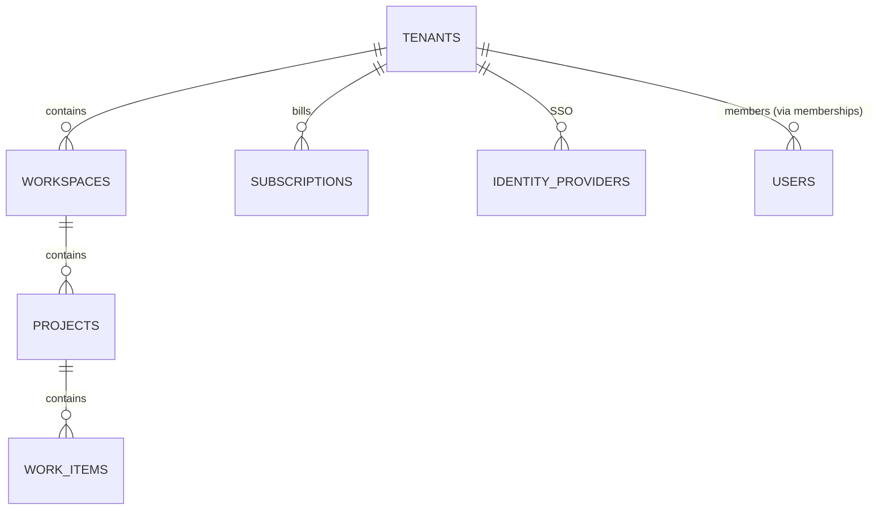

# Database Schema — Canonical Physical Design

> **Authoritative source of truth for the *physical* schema.**
> `01_DB design/mini_rally_database_design.md` remains the *business/logical* reference (entity catalogue, relationships, Vietnamese notes). Where the two differ, **this document wins** for column types, naming, tenancy, RLS, indexes, and partitioning. It is the spec that the Drizzle table definitions and `drizzle-kit` migrations must match.

Aligned with `ARCHITECTURE_CURRENT.md` (stack, RLS rules §4.1), `BACKEND_STRUCTURE.md` (module ownership, pagination §16), and `DOMAIN_DESIGN.md` (work-item core, outbox flow).

---

## 1. Locked Decisions

> Master registry is `ARCHITECTURE_CURRENT.md §11`. Below are the **database-scoped** locks only.

| # | Topic | Decision | Rationale |
|---|---|---|---|
| 1 | **Tenant boundary** | `tenant_id` (dedicated column) referencing **`tenancy.tenants`** — the paying organization/account. **Isolation + billing + SSO boundary.** Workspaces nest *under* a tenant; projects under workspaces. | Rally model is Subscription → Workspace → Project. Enterprise customers run **many workspaces under one account** with shared billing and SSO. A dedicated `tenant_id` gives a stable RLS key decoupled from "workspace" naming. Refines the earlier "workspace = tenant" assumption. |
| 2 | **Schema organization** | One database, **one Postgres `SCHEMA` per bounded context**: `identity`, `tenancy`, `work`, `planning`, `collab`, `platform`. | Mirrors module ownership in `BACKEND_STRUCTURE.md`; clean future-extraction seam; explicit `search_path` hygiene. RLS is still applied per-table. |
| 3 | **Enumerations** | **`VARCHAR + CHECK`** for fixed sets; **lookup tables** only for user-extensible sets (workflow statuses, labels — already tables). No native PG `ENUM`. | Native `ENUM` `ALTER` is migration-painful and lock-heavy; `CHECK` evolves cleanly and maps directly to Zod/Drizzle. |
| 4 | **Soft-delete × RLS** | RLS policies are **tenant-only** (`USING`/`WITH CHECK` on `tenant_id`). `deleted_at` filtering is **application-layer**, backed by **partial indexes** `WHERE deleted_at IS NULL`. | Keeps RLS single-purpose and auditable; deleted rows stay restorable and visible to audit *within the tenant*. |
| 5 | **Audit / activity** | Single append-only **`platform.activity_logs`**, **time-partitioned (monthly)**, written by an outbox consumer (never inline). | One immutable feed; partitioning caps unbounded growth and keeps writes/reads on small partitions. |
| 6 | **Partitioning (day-1)** | Declarative **range partitioning by month** on the two fastest-growing append tables: `platform.activity_logs` and `platform.outbox_events` (post-publish archive). All other big tables are **partition-ready but single** until a trigger fires. | Right-sized: pay partitioning complexity only where growth is unbounded; `work_items` tenant/hash partitioning is reserved (triggered at scale). |
| 7 | **Primary keys** | **UUIDv7** (`uuidv7()` on PG 18, app-generated fallback). Time-ordered → index locality of bigserial without the global-uniqueness/sharding problems. | Locked in `ARCHITECTURE_CURRENT.md`. |

---

## 1.1 Schema Redesign — Architect Review of the BA Logical Model

The BA's 32-table logical model (`01_DB design/`) is a sound MVP catalogue but was authored pre-pivot. The following redesigns are **locked** to match our architecture, the product use-cases (`00_Documents/mini_rally_usecase_role_mapping.md`), and scale.

| # | Area | BA model | Decision (LOCKED) | Why |
|---|---|---|---|---|
| **R1** | Role assignment | `roles`/`permissions`/`role_permissions`, no scoped user binding | **Add `access.user_role_assignments`** (`user_id`, `role_id`, `scope_type` workspace\|project, `scope_id`). `roles` gain `scope_type` + `is_system`. Seed 6 system roles; custom roles = enterprise. | Use-cases need **scoped** authority (PM = project-scoped). Powers the RBAC+ABAC engine in `DOMAIN_DESIGN.md`. |
| **R2** | Sprint/Release membership | junctions `sprint_items`, `release_items` | **Dropped.** `iteration_id` + `release_id` become **FK columns on `work_items`** (indexed). | An item is in **one** iteration + one release at a time — not M:N. Removes a join from every board/backlog query. Move history lives in events/`activity_logs`. |
| **R3** | Work-item fields | minimal | Add `story_points`, `acceptance_criteria`, `is_blocked`, `blocked_reason`. | Required by Backlog/Board/WorkItem use-cases. |
| **R4** | Reporting (burndown/velocity) | none (implied live compute) | **Add `planning.sprint_daily_snapshots`** (daily remaining/completed/scope-change), written by scheduled job + events → reporting read model. | Historical burndown **cannot** be reconstructed from current state; live event-replay is too costly at scale. |
| **R5** | Custom fields | none | **Fast-follow:** reserve `custom_fields JSONB` on `work_items` now; add `work.custom_field_defs` (per-project, typed, validated) when enabled. GIN index when queried. | Rally-parity / enterprise need, but not MVP-blocking. |
| **R6** | Mentions | comments only | Store `mentioned_user_ids UUID[]` on comment → outbox → notification fan-out. | Drives “notify on mention” use-case. |
| **R7** | Attachments | storage unclear | **Metadata only**: `s3_key`, `size_bytes`, `content_type`, `uploaded_by`, `scan_status`. Never blob-in-DB. | Cost/perf/security; AV scanning gate. |
| **R8** | Hierarchy | `parent_id` self-ref | Keep `parent_id`; **reserve** materialized-path / closure-table as triggered. Rollups via events → read model. | Avoids premature complexity; deep-subtree optimization only at scale. |
| **R9** | Settings | `workspace_settings`/`project_settings` typed columns | **JSONB** (`settings JSONB`), one row per scope, validated by Zod. | Avoids column sprawl; flexible per-tenant config. |

---

## 2. Tenant Model



- **`tenancy.tenants`** = the customer account. Carries billing, SSO config, plan limits. **This is the RLS isolation boundary.**
- **`tenancy.workspaces`** = an organizational container inside a tenant (a department, product line, or "the whole company" for SMB — a tenant always has ≥1 workspace).
- **`work.projects`** = where work lives, under a workspace.
- **Every domain row carries `tenant_id`** directly (denormalized down the tree) so RLS and tenant-leading composite indexes work without joins. `workspace_id` / `project_id` are *additional* scoping columns, not the isolation key.

> **Migration note:** existing logical doc uses `workspace_id` as tenant. The physical schema adds `tenant_id` as the true isolation column. For SMB tenants with a single workspace this is invisible; for enterprise it unlocks multi-workspace accounts without re-migration.

---

## 3. Schema → Context → Table Map

| Postgres schema | Bounded context | Tables |
|---|---|---|
| `tenancy` | Tenancy & billing | `tenants`, `workspaces`, `workspace_members`, `workspace_invitations`, `workspace_settings`, `plans`, `subscriptions`, `subscription_seats`, `identity_providers` |
| `identity` | Auth & users | `users`, `auth_sessions`, `password_reset_tokens`, `mfa_credentials`, `notification_preferences` |
| `access` | RBAC + ABAC | `roles`, `permissions`, `role_permissions`, **`user_role_assignments`** *(R1)* |
| `work` | Work-item core | `projects`, `project_members`, `project_settings`, `teams`, `team_members`, `project_teams`, `workflow_statuses`, `workflow_transitions`, `work_items`, `work_item_relations`, `labels`, `work_item_labels`, **`custom_field_defs`** *(R5, fast-follow)* |
| `planning` | Backlog / sprint / release | `sprints`, `releases`, **`sprint_daily_snapshots`** *(R4)* — ~~`sprint_items`~~ ~~`release_items`~~ dropped *(R2)* |
| `collab` | Collaboration | `comments`, `attachments`, `watchers`, `saved_filters` |
| `platform` | Cross-cutting infra | `outbox_events`, `idempotency_keys`, `activity_logs`, `notifications` |

> Roles/permissions split into their own `access` schema (was "Role & Permission" group) to match the `access` module that owns the permission engine in `DOMAIN_DESIGN.md`. Changes vs BA model are tagged *(Rn)* — see §1.1.

---

## 4. Standard Column Template

Every **tenant-scoped domain table** starts from this template. Deviations must be justified per-table.

```sql
CREATE TABLE <schema>.<table> (
    id           UUID        NOT NULL DEFAULT uuidv7(),        -- PK, time-ordered
    tenant_id    UUID        NOT NULL,                          -- RLS isolation key
    -- ... domain columns ...
    version      INTEGER     NOT NULL DEFAULT 1,                -- optimistic concurrency (mutable entities)
    created_at   TIMESTAMPTZ NOT NULL DEFAULT now(),            -- UTC
    updated_at   TIMESTAMPTZ NOT NULL DEFAULT now(),            -- UTC, bumped by app/UoW
    created_by   UUID,                                          -- identity.users.id (nullable for system)
    updated_by   UUID,
    deleted_at   TIMESTAMPTZ,                                   -- soft-delete (NULL = live)
    CONSTRAINT pk_<table> PRIMARY KEY (id)
);
```

Rules:
- `version` only on **mutable** entities (work_items, projects, sprints, board config…). Append-only/immutable tables (activity_logs, outbox_events) omit it.
- `tenant_id` is **always present and `NOT NULL`** on domain tables. Global tables (`plans`, `permissions` catalogue) are the only exception and live without RLS.
- `updated_at` is bumped by the Unit of Work, not by a DB trigger (keeps logic in app layer, testable).

---

## 5. Row-Level Security Template

Per `ARCHITECTURE_CURRENT.md §4.1`. Applied to **every** tenant-scoped table.

```sql
-- Tenant context is set per-request inside the transaction:
--   SET LOCAL app.tenant_id = '<uuid>';
-- The application connects as a NOBYPASSRLS role. Migrations use a separate privileged role.

ALTER TABLE work.work_items ENABLE ROW LEVEL SECURITY;
ALTER TABLE work.work_items FORCE ROW LEVEL SECURITY;          -- applies even to table owner

CREATE POLICY tenant_isolation ON work.work_items
    USING      (tenant_id = current_setting('app.tenant_id')::uuid)   -- read/update/delete visibility
    WITH CHECK (tenant_id = current_setting('app.tenant_id')::uuid);  -- block cross-tenant writes
```

- **Fail-closed:** if `app.tenant_id` is unset, `current_setting(...)::uuid` raises → query fails rather than leaking. (Use `current_setting('app.tenant_id', true)` only in audited system paths that intentionally bypass per-tenant scope.)
- **`WITH CHECK`** prevents inserting/updating a row into another tenant.
- **Belt-and-suspenders:** the repository layer *also* adds `WHERE tenant_id = :ctx` — RLS is the backstop, not the only guard.
- **Mandatory test:** every table ships with a Testcontainers isolation test (tenant A cannot see/write tenant B). See `BACKEND_STRUCTURE.md §9`.

---

## 6. Index Strategy

Designed around the actual access patterns (keyset pagination §16, board/backlog reads, tenant isolation).

| Pattern | Index shape | Example |
|---|---|---|
| **Tenant-leading composite** (default for every list query) | `(tenant_id, <filter/sort cols>, id)` | `work_items (tenant_id, project_id, status, rank)` |
| **Keyset pagination** | `(tenant_id, <sort_col>, id)` — `id` tiebreaker matches the cursor | `work_items (tenant_id, updated_at DESC, id)` |
| **Every foreign key** | single or composite index leading `tenant_id` then FK | `comments (tenant_id, work_item_id)` |
| **Soft-delete hot path** | **partial** `WHERE deleted_at IS NULL` | `work_items (tenant_id, project_id, status) WHERE deleted_at IS NULL` |
| **Unique within tenant/scope** | partial unique | `UNIQUE (project_id, item_key)`; `UNIQUE (tenant_id, lower(email)) WHERE deleted_at IS NULL` |
| **JSONB search** (settings, event payload) | `GIN` only where queried | `outbox_events USING GIN (payload)` *(only if needed)* |
| **Full-text** (work-item title/desc) | `GIN (to_tsvector(...))`, triggered when search module lands | reserved |

Principles:
- **No index without a query.** Start from the query, not the column.
- Composite indexes **always lead with `tenant_id`** so RLS-scoped scans stay on the index.
- Prefer **partial indexes** for the live-rows path so deleted rows don't bloat the hot index.

---

## 7. Enumeration Strategy

```sql
-- Fixed set → VARCHAR + CHECK (evolves with a cheap migration, no ALTER TYPE locks)
status VARCHAR(20) NOT NULL
    CONSTRAINT chk_outbox_status CHECK (status IN ('pending','published','failed')),

-- User-extensible set → lookup table (already modelled), FK + tenant scope
status_id UUID NOT NULL REFERENCES work.workflow_statuses(id)
```

| Concept | Mechanism |
|---|---|
| outbox status, subscription status, mfa type, idp type, channel, relation type, priority | `VARCHAR + CHECK` |
| workflow statuses, transitions, labels, roles | **lookup tables** (per-tenant configurable) |

---

## 8. Partitioning Strategy

Declarative **range partitioning by month** on the two unbounded append tables, from day 1.

```sql
CREATE TABLE platform.activity_logs (
    id          UUID        NOT NULL DEFAULT uuidv7(),
    tenant_id   UUID        NOT NULL,
    occurred_at TIMESTAMPTZ NOT NULL,
    -- ... actor, verb, object_type, object_id, changes JSONB ...
    PRIMARY KEY (occurred_at, id)              -- partition key must be in PK
) PARTITION BY RANGE (occurred_at);

-- one partition per month, created ahead by a scheduled job; old ones detached/archived to S3
CREATE TABLE platform.activity_logs_2026_06
    PARTITION OF platform.activity_logs
    FOR VALUES FROM ('2026-06-01') TO ('2026-07-01');
```

- Same pattern for `platform.outbox_events` (partition by `created_at`; published rows pruned/archived).
- RLS is applied on the **parent**; it propagates to partitions.
- **Reserved / triggered:** `work_items` and `comments` get **hash partitioning by `tenant_id`** only when a single tenant or total row count crosses the trigger in `ARCHITECTURE_FUTURE_SCALE.md`. Designed-for, not enabled.
- **Maintenance job:** a scheduled task **creates next-month partitions ahead of time** and **detaches + archives** partitions past retention (activity → S3/Glacier; published outbox → pruned). Use `pg_partman` or a small in-app cron. A missing future partition must hard-fail CI/readiness, never silently drop writes.

### Required Postgres extensions

```sql
-- enabled once per database by the privileged migration role
CREATE EXTENSION IF NOT EXISTS pgcrypto;   -- gen_random_uuid() fallback pre-PG18
CREATE EXTENSION IF NOT EXISTS citext;     -- case-insensitive email
-- uuidv7(): native in PG18; pre-18 use an app-side generator or uuid-ossp/pg_uuidv7
```

---

## 9. Key Table DDL (representative)

Full canonical DDL for the load-bearing tables. The remaining tables follow §4–§7 mechanically.

### 9.1 `tenancy.tenants`

```sql
CREATE TABLE tenancy.tenants (
    id            UUID        NOT NULL DEFAULT uuidv7(),
    name          VARCHAR(200) NOT NULL,
    slug          VARCHAR(63)  NOT NULL,                 -- subdomain: acme.rally.com
    status        VARCHAR(20)  NOT NULL DEFAULT 'active'
        CONSTRAINT chk_tenant_status CHECK (status IN ('active','suspended','deleted')),
    region        VARCHAR(20)  NOT NULL DEFAULT 'ap-southeast-1',
    version       INTEGER      NOT NULL DEFAULT 1,
    created_at    TIMESTAMPTZ  NOT NULL DEFAULT now(),
    updated_at    TIMESTAMPTZ  NOT NULL DEFAULT now(),
    deleted_at    TIMESTAMPTZ,
    PRIMARY KEY (id),
    CONSTRAINT uq_tenant_slug UNIQUE (slug)
);
-- tenants is the root: NO tenant_id, NO RLS (it IS the tenant). Access guarded at app/superadmin layer.
```

### 9.2 `tenancy.workspaces`

```sql
CREATE TABLE tenancy.workspaces (
    id          UUID         NOT NULL DEFAULT uuidv7(),
    tenant_id   UUID         NOT NULL REFERENCES tenancy.tenants(id),
    name        VARCHAR(200) NOT NULL,
    key         VARCHAR(20)  NOT NULL,                   -- short code
    version     INTEGER      NOT NULL DEFAULT 1,
    created_at  TIMESTAMPTZ  NOT NULL DEFAULT now(),
    updated_at  TIMESTAMPTZ  NOT NULL DEFAULT now(),
    deleted_at  TIMESTAMPTZ,
    PRIMARY KEY (id),
    CONSTRAINT uq_workspace_key UNIQUE (tenant_id, key)
);
CREATE INDEX ix_workspaces_tenant ON tenancy.workspaces (tenant_id) WHERE deleted_at IS NULL;
-- + RLS tenant_isolation policy (§5)
```

### 9.3 `work.work_items`

```sql
CREATE TABLE work.work_items (
    id           UUID         NOT NULL DEFAULT uuidv7(),
    tenant_id    UUID         NOT NULL,
    workspace_id UUID         NOT NULL,
    project_id   UUID         NOT NULL REFERENCES work.projects(id),
    item_key     VARCHAR(50)  NOT NULL,                  -- e.g. COX-123 (per-project sequence)
    type         VARCHAR(20)  NOT NULL
        CONSTRAINT chk_wi_type CHECK (type IN ('initiative','feature','story','task','defect')),
    title        VARCHAR(500) NOT NULL,
    description  TEXT,
    status_id    UUID         NOT NULL REFERENCES work.workflow_statuses(id),
    priority     VARCHAR(20)  NOT NULL DEFAULT 'medium'
        CONSTRAINT chk_wi_priority CHECK (priority IN ('lowest','low','medium','high','highest')),
    parent_id    UUID         REFERENCES work.work_items(id),   -- hierarchy (R8: parent_id only)
    assignee_id  UUID,                                          -- identity.users.id
    iteration_id UUID         REFERENCES planning.sprints(id),  -- R2: one iteration at a time
    release_id   UUID         REFERENCES planning.releases(id), -- R2: one release at a time
    story_points NUMERIC(6,2),                                  -- R3
    acceptance_criteria TEXT,                                   -- R3
    is_blocked   BOOLEAN      NOT NULL DEFAULT false,           -- R3
    blocked_reason TEXT,                                        -- R3
    rank         VARCHAR(255),                                  -- LexoRank, scoped (project,column)
    custom_fields JSONB,                                        -- R5: reserved (defs table fast-follow)
    version      INTEGER      NOT NULL DEFAULT 1,                -- optimistic lock → 409
    created_at   TIMESTAMPTZ  NOT NULL DEFAULT now(),
    updated_at   TIMESTAMPTZ  NOT NULL DEFAULT now(),
    created_by   UUID,
    updated_by   UUID,
    deleted_at   TIMESTAMPTZ,
    PRIMARY KEY (id),
    CONSTRAINT uq_wi_item_key UNIQUE (project_id, item_key)
);

-- access-pattern indexes
CREATE INDEX ix_wi_board       ON work.work_items (tenant_id, project_id, status_id, rank)   WHERE deleted_at IS NULL;
CREATE INDEX ix_wi_backlog     ON work.work_items (tenant_id, project_id, rank)              WHERE deleted_at IS NULL AND parent_id IS NULL;
CREATE INDEX ix_wi_assignee    ON work.work_items (tenant_id, assignee_id)                   WHERE deleted_at IS NULL;
CREATE INDEX ix_wi_parent      ON work.work_items (tenant_id, parent_id);
CREATE INDEX ix_wi_iteration   ON work.work_items (tenant_id, iteration_id)                  WHERE deleted_at IS NULL;  -- R2
CREATE INDEX ix_wi_release     ON work.work_items (tenant_id, release_id)                    WHERE deleted_at IS NULL;  -- R2
CREATE INDEX ix_wi_blocked     ON work.work_items (tenant_id, project_id)                    WHERE is_blocked AND deleted_at IS NULL;  -- R3 board filter
CREATE INDEX ix_wi_keyset_upd  ON work.work_items (tenant_id, updated_at DESC, id);          -- §16 keyset
-- + RLS tenant_isolation policy (§5)
```

### 9.4 `platform.outbox_events` (partitioned)

```sql
CREATE TABLE platform.outbox_events (
    id             UUID         NOT NULL DEFAULT uuidv7(),
    tenant_id      UUID         NOT NULL,
    aggregate_type VARCHAR(100) NOT NULL,
    aggregate_id   UUID         NOT NULL,
    event_type     VARCHAR(150) NOT NULL,
    event_version  INTEGER      NOT NULL DEFAULT 1,
    payload        JSONB        NOT NULL,
    traceparent    VARCHAR(64),                          -- W3C trace context for async correlation (§14)
    status         VARCHAR(20)  NOT NULL DEFAULT 'pending'
        CONSTRAINT chk_outbox_status CHECK (status IN ('pending','published','failed')),
    attempts       INTEGER      NOT NULL DEFAULT 0,
    created_at     TIMESTAMPTZ  NOT NULL DEFAULT now(),
    published_at   TIMESTAMPTZ,
    PRIMARY KEY (created_at, id)
) PARTITION BY RANGE (created_at);

-- relay claim query: WHERE status='pending' ... FOR UPDATE SKIP LOCKED
CREATE INDEX ix_outbox_pending ON platform.outbox_events (created_at, id) WHERE status = 'pending';
```

### 9.5 `identity.auth_sessions`

```sql
CREATE TABLE identity.auth_sessions (
    id               UUID         NOT NULL DEFAULT uuidv7(),   -- = session_id in JWT
    tenant_id        UUID         NOT NULL,
    user_id          UUID         NOT NULL REFERENCES identity.users(id),
    token_hash       VARCHAR(255) NOT NULL,                    -- hash of current refresh token (whitelist)
    family_id        UUID         NOT NULL,                    -- rotation family; reuse → kill family
    session_version  INTEGER      NOT NULL DEFAULT 1,          -- mass-invalidate
    ip               INET,
    user_agent       TEXT,
    expires_at       TIMESTAMPTZ  NOT NULL,
    revoked_at       TIMESTAMPTZ,
    created_at       TIMESTAMPTZ  NOT NULL DEFAULT now(),
    last_used_at     TIMESTAMPTZ,
    PRIMARY KEY (id),
    CONSTRAINT uq_auth_token_hash UNIQUE (token_hash)
);
CREATE INDEX ix_auth_user_active ON identity.auth_sessions (tenant_id, user_id) WHERE revoked_at IS NULL;
CREATE INDEX ix_auth_family      ON identity.auth_sessions (family_id);
-- + RLS tenant_isolation policy (§5)
```

### 9.6 `access.user_role_assignments` *(R1)*

```sql
CREATE TABLE access.user_role_assignments (
    id          UUID         NOT NULL DEFAULT uuidv7(),
    tenant_id   UUID         NOT NULL,
    user_id     UUID         NOT NULL REFERENCES identity.users(id),
    role_id     UUID         NOT NULL REFERENCES access.roles(id),
    scope_type  VARCHAR(20)  NOT NULL
        CONSTRAINT chk_ura_scope CHECK (scope_type IN ('workspace','project')),
    scope_id    UUID         NOT NULL,                 -- workspace_id or project_id
    created_at  TIMESTAMPTZ  NOT NULL DEFAULT now(),
    created_by  UUID,
    deleted_at  TIMESTAMPTZ,
    PRIMARY KEY (id),
    CONSTRAINT uq_ura UNIQUE (user_id, role_id, scope_type, scope_id)
);
CREATE INDEX ix_ura_lookup ON access.user_role_assignments (tenant_id, user_id) WHERE deleted_at IS NULL;
CREATE INDEX ix_ura_scope  ON access.user_role_assignments (tenant_id, scope_type, scope_id) WHERE deleted_at IS NULL;
-- access.roles gains: scope_type VARCHAR CHECK(workspace|project), is_system BOOLEAN.
-- Resolved permission set is cached in Valkey, invalidated on assignment/role change (DOMAIN_DESIGN §B4).
-- + RLS tenant_isolation policy (§5)
```

### 9.7 `planning.sprint_daily_snapshots` *(R4)*

```sql
CREATE TABLE planning.sprint_daily_snapshots (
    id               UUID        NOT NULL DEFAULT uuidv7(),
    tenant_id        UUID        NOT NULL,
    sprint_id        UUID        NOT NULL REFERENCES planning.sprints(id),
    snapshot_date    DATE        NOT NULL,
    remaining_points NUMERIC(10,2) NOT NULL DEFAULT 0,
    completed_points NUMERIC(10,2) NOT NULL DEFAULT 0,
    total_points     NUMERIC(10,2) NOT NULL DEFAULT 0,   -- captures scope change
    items_total      INTEGER     NOT NULL DEFAULT 0,
    items_done       INTEGER     NOT NULL DEFAULT 0,
    created_at       TIMESTAMPTZ NOT NULL DEFAULT now(),
    PRIMARY KEY (id),
    CONSTRAINT uq_sprint_snapshot UNIQUE (sprint_id, snapshot_date)   -- idempotent daily write
);
CREATE INDEX ix_snapshot_burndown ON planning.sprint_daily_snapshots (tenant_id, sprint_id, snapshot_date);
-- Append-only read model: written by scheduled job + sprint events. No version. + RLS (§5)
```

### 9.8 `collab.attachments` *(R7)*

```sql
CREATE TABLE collab.attachments (
    id           UUID         NOT NULL DEFAULT uuidv7(),
    tenant_id    UUID         NOT NULL,
    work_item_id UUID         NOT NULL REFERENCES work.work_items(id),
    s3_key       VARCHAR(1024) NOT NULL,                 -- object storage pointer (never blob in DB)
    filename     VARCHAR(500) NOT NULL,
    content_type VARCHAR(150) NOT NULL,
    size_bytes   BIGINT       NOT NULL,
    scan_status  VARCHAR(20)  NOT NULL DEFAULT 'pending'
        CONSTRAINT chk_att_scan CHECK (scan_status IN ('pending','clean','infected','failed')),
    uploaded_by  UUID         NOT NULL,
    created_at   TIMESTAMPTZ  NOT NULL DEFAULT now(),
    deleted_at   TIMESTAMPTZ,
    PRIMARY KEY (id)
);
CREATE INDEX ix_att_work_item ON collab.attachments (tenant_id, work_item_id) WHERE deleted_at IS NULL;
-- comments table gains: mentioned_user_ids UUID[] (R6) → outbox → notification fan-out. + RLS (§5)
```

---

## 9b. Remaining Tables — Full DDL

All tenant-scoped tables below also get the RLS `tenant_isolation` policy (§5), follow the standard column template (§4), and use `VARCHAR + CHECK` enums (§7). Only domain-specific columns + indexes/constraints are shown; the boilerplate (`id`, `created_at`, `updated_at`, `created_by/by`, `deleted_at`, `version` where mutable) is implied per §4.

### Gap resolutions applied here

| Gap | Resolution |
|---|---|
| `project_counters` missing | Added (§9b `work`). |
| `workflow_statuses.category` | Added `category` `todo`/`in_progress`/`done` → drives board grouping + burndown "done". |
| `work_items.estimate` redundant | **Removed** — `story_points` is the single sizing field. |
| `sprints`/`releases` thin | Full lifecycle fields below. |
| `comments` threading | `parent_id` (one-level threads). |
| `labels` scope | **Project-scoped**, `UNIQUE (project_id, lower(name))`. |
| `saved_filters` shape | Stores the §16 structured filter JSON in `definition JSONB`. |
| settings (R9) | `settings JSONB` on `workspace_settings`/`project_settings`. |

### identity

```sql
CREATE TABLE identity.users (
    id            UUID NOT NULL DEFAULT uuidv7(),
    email         CITEXT NOT NULL,                       -- case-insensitive
    full_name     VARCHAR(200) NOT NULL,
    avatar_url    VARCHAR(1024),
    locale        VARCHAR(10) NOT NULL DEFAULT 'en',     -- i18n (UI only; data is UTC)
    timezone      VARCHAR(64) NOT NULL DEFAULT 'UTC',    -- per-user display TZ
    password_hash VARCHAR(255),                          -- null when SSO-only
    status        VARCHAR(20) NOT NULL DEFAULT 'active'
        CONSTRAINT chk_user_status CHECK (status IN ('active','disabled','invited')),
    last_login_at TIMESTAMPTZ,
    version INTEGER NOT NULL DEFAULT 1,
    created_at TIMESTAMPTZ NOT NULL DEFAULT now(), updated_at TIMESTAMPTZ NOT NULL DEFAULT now(), deleted_at TIMESTAMPTZ,
    PRIMARY KEY (id)
);
-- Global identity (a person may belong to many tenants via memberships) → NO tenant_id, NO RLS.
CREATE UNIQUE INDEX uq_users_email ON identity.users (email) WHERE deleted_at IS NULL;

CREATE TABLE identity.password_reset_tokens (
    id UUID NOT NULL DEFAULT uuidv7(), user_id UUID NOT NULL REFERENCES identity.users(id),
    token_hash VARCHAR(255) NOT NULL, expires_at TIMESTAMPTZ NOT NULL, used_at TIMESTAMPTZ,
    created_at TIMESTAMPTZ NOT NULL DEFAULT now(), PRIMARY KEY (id),
    CONSTRAINT uq_prt_hash UNIQUE (token_hash)
);

CREATE TABLE identity.mfa_credentials (
    id UUID NOT NULL DEFAULT uuidv7(), user_id UUID NOT NULL REFERENCES identity.users(id),
    type VARCHAR(20) NOT NULL CONSTRAINT chk_mfa_type CHECK (type IN ('totp','webauthn')),
    secret_enc TEXT NOT NULL,                             -- encrypted at rest (KMS)
    label VARCHAR(100), created_at TIMESTAMPTZ NOT NULL DEFAULT now(), last_used_at TIMESTAMPTZ, deleted_at TIMESTAMPTZ,
    PRIMARY KEY (id)
);
CREATE INDEX ix_mfa_user ON identity.mfa_credentials (user_id) WHERE deleted_at IS NULL;

CREATE TABLE identity.notification_preferences (
    id UUID NOT NULL DEFAULT uuidv7(), tenant_id UUID NOT NULL,
    user_id UUID NOT NULL REFERENCES identity.users(id),
    event_type VARCHAR(100) NOT NULL,                     -- assigned, mentioned, status_changed, comment...
    channel VARCHAR(20) NOT NULL CONSTRAINT chk_np_channel CHECK (channel IN ('in_app','email')),
    enabled BOOLEAN NOT NULL DEFAULT true,
    created_at TIMESTAMPTZ NOT NULL DEFAULT now(), updated_at TIMESTAMPTZ NOT NULL DEFAULT now(),
    PRIMARY KEY (id), CONSTRAINT uq_np UNIQUE (tenant_id, user_id, event_type, channel)
);  -- + RLS
```

### tenancy

```sql
CREATE TABLE tenancy.workspace_members (
    id UUID NOT NULL DEFAULT uuidv7(), tenant_id UUID NOT NULL,
    workspace_id UUID NOT NULL REFERENCES tenancy.workspaces(id),
    user_id UUID NOT NULL REFERENCES identity.users(id),
    status VARCHAR(20) NOT NULL DEFAULT 'active' CONSTRAINT chk_wm_status CHECK (status IN ('active','suspended')),
    joined_at TIMESTAMPTZ NOT NULL DEFAULT now(),
    created_at TIMESTAMPTZ NOT NULL DEFAULT now(), updated_at TIMESTAMPTZ NOT NULL DEFAULT now(), deleted_at TIMESTAMPTZ,
    PRIMARY KEY (id), CONSTRAINT uq_wm UNIQUE (workspace_id, user_id)
);  -- role NOT stored here → access.user_role_assignments (R1). + RLS
CREATE INDEX ix_wm_user ON tenancy.workspace_members (tenant_id, user_id) WHERE deleted_at IS NULL;

CREATE TABLE tenancy.workspace_invitations (
    id UUID NOT NULL DEFAULT uuidv7(), tenant_id UUID NOT NULL, workspace_id UUID NOT NULL REFERENCES tenancy.workspaces(id),
    email CITEXT NOT NULL, role_id UUID NOT NULL REFERENCES access.roles(id),
    token_hash VARCHAR(255) NOT NULL, status VARCHAR(20) NOT NULL DEFAULT 'pending'
        CONSTRAINT chk_inv_status CHECK (status IN ('pending','accepted','revoked','expired')),
    expires_at TIMESTAMPTZ NOT NULL, invited_by UUID, created_at TIMESTAMPTZ NOT NULL DEFAULT now(),
    PRIMARY KEY (id), CONSTRAINT uq_inv_token UNIQUE (token_hash)
);
CREATE INDEX ix_inv_ws ON tenancy.workspace_invitations (tenant_id, workspace_id, status);

CREATE TABLE tenancy.workspace_settings (
    id UUID NOT NULL DEFAULT uuidv7(), tenant_id UUID NOT NULL,
    workspace_id UUID NOT NULL REFERENCES tenancy.workspaces(id),
    settings JSONB NOT NULL DEFAULT '{}',                 -- R9: Zod-validated
    version INTEGER NOT NULL DEFAULT 1,
    created_at TIMESTAMPTZ NOT NULL DEFAULT now(), updated_at TIMESTAMPTZ NOT NULL DEFAULT now(),
    PRIMARY KEY (id), CONSTRAINT uq_ws_settings UNIQUE (workspace_id)
);  -- + RLS

-- Billing (schema present, logic fast-follow)
CREATE TABLE tenancy.plans (   -- GLOBAL catalogue, no tenant_id/RLS
    id UUID NOT NULL DEFAULT uuidv7(), code VARCHAR(50) NOT NULL, name VARCHAR(100) NOT NULL,
    tier VARCHAR(20) NOT NULL CONSTRAINT chk_plan_tier CHECK (tier IN ('free','pro','enterprise')),
    limits JSONB NOT NULL DEFAULT '{}', price_cents INTEGER, billing_period VARCHAR(20),
    created_at TIMESTAMPTZ NOT NULL DEFAULT now(), PRIMARY KEY (id), CONSTRAINT uq_plan_code UNIQUE (code)
);
CREATE TABLE tenancy.subscriptions (
    id UUID NOT NULL DEFAULT uuidv7(), tenant_id UUID NOT NULL, plan_id UUID NOT NULL REFERENCES tenancy.plans(id),
    status VARCHAR(20) NOT NULL CONSTRAINT chk_sub_status CHECK (status IN ('trialing','active','past_due','canceled')),
    trial_ends_at TIMESTAMPTZ, current_period_end TIMESTAMPTZ, version INTEGER NOT NULL DEFAULT 1,
    created_at TIMESTAMPTZ NOT NULL DEFAULT now(), updated_at TIMESTAMPTZ NOT NULL DEFAULT now(),
    PRIMARY KEY (id), CONSTRAINT uq_sub_tenant UNIQUE (tenant_id)
);  -- + RLS
CREATE TABLE tenancy.subscription_seats (
    id UUID NOT NULL DEFAULT uuidv7(), tenant_id UUID NOT NULL,
    subscription_id UUID NOT NULL REFERENCES tenancy.subscriptions(id),
    user_id UUID NOT NULL REFERENCES identity.users(id), assigned_at TIMESTAMPTZ NOT NULL DEFAULT now(),
    PRIMARY KEY (id), CONSTRAINT uq_seat UNIQUE (subscription_id, user_id)
);  -- + RLS

CREATE TABLE tenancy.identity_providers (
    id UUID NOT NULL DEFAULT uuidv7(), tenant_id UUID NOT NULL,
    type VARCHAR(20) NOT NULL CONSTRAINT chk_idp_type CHECK (type IN ('oidc','saml')),
    config JSONB NOT NULL,                                -- issuer, metadata, attribute mappings
    status VARCHAR(20) NOT NULL DEFAULT 'active' CONSTRAINT chk_idp_status CHECK (status IN ('active','disabled')),
    version INTEGER NOT NULL DEFAULT 1,
    created_at TIMESTAMPTZ NOT NULL DEFAULT now(), updated_at TIMESTAMPTZ NOT NULL DEFAULT now(),
    PRIMARY KEY (id)
);  -- + RLS
```

### access

```sql
CREATE TABLE access.roles (
    id UUID NOT NULL DEFAULT uuidv7(), tenant_id UUID,        -- NULL = built-in system role (global)
    name VARCHAR(100) NOT NULL, code VARCHAR(50) NOT NULL,
    scope_type VARCHAR(20) NOT NULL CONSTRAINT chk_role_scope CHECK (scope_type IN ('workspace','project')),
    is_system BOOLEAN NOT NULL DEFAULT false,                -- seeded, immutable
    description TEXT, version INTEGER NOT NULL DEFAULT 1,
    created_at TIMESTAMPTZ NOT NULL DEFAULT now(), updated_at TIMESTAMPTZ NOT NULL DEFAULT now(), deleted_at TIMESTAMPTZ,
    PRIMARY KEY (id), CONSTRAINT uq_role_code UNIQUE (tenant_id, code)
);  -- RLS allows tenant_id = ctx OR tenant_id IS NULL (system roles visible to all)

CREATE TABLE access.permissions (   -- GLOBAL catalogue, no tenant_id/RLS
    id UUID NOT NULL DEFAULT uuidv7(),
    code VARCHAR(100) NOT NULL,                              -- module.action e.g. work_item.create
    module VARCHAR(50) NOT NULL, action VARCHAR(50) NOT NULL, description TEXT,
    created_at TIMESTAMPTZ NOT NULL DEFAULT now(), PRIMARY KEY (id), CONSTRAINT uq_perm_code UNIQUE (code)
);
CREATE TABLE access.role_permissions (
    id UUID NOT NULL DEFAULT uuidv7(), tenant_id UUID,        -- mirrors role scope
    role_id UUID NOT NULL REFERENCES access.roles(id), permission_id UUID NOT NULL REFERENCES access.permissions(id),
    PRIMARY KEY (id), CONSTRAINT uq_role_perm UNIQUE (role_id, permission_id)
);
```

### work

```sql
CREATE TABLE work.projects (
    id UUID NOT NULL DEFAULT uuidv7(), tenant_id UUID NOT NULL, workspace_id UUID NOT NULL REFERENCES tenancy.workspaces(id),
    name VARCHAR(200) NOT NULL, key VARCHAR(10) NOT NULL,    -- e.g. COX → item COX-123
    description TEXT, status VARCHAR(20) NOT NULL DEFAULT 'active'
        CONSTRAINT chk_proj_status CHECK (status IN ('active','archived')),
    version INTEGER NOT NULL DEFAULT 1,
    created_at TIMESTAMPTZ NOT NULL DEFAULT now(), updated_at TIMESTAMPTZ NOT NULL DEFAULT now(), created_by UUID, updated_by UUID, deleted_at TIMESTAMPTZ,
    PRIMARY KEY (id), CONSTRAINT uq_project_key UNIQUE (workspace_id, key)
);  -- + RLS
CREATE INDEX ix_projects_ws ON work.projects (tenant_id, workspace_id) WHERE deleted_at IS NULL;

CREATE TABLE work.project_counters (    -- per-project item_key sequence (§10)
    project_id UUID NOT NULL REFERENCES work.projects(id), tenant_id UUID NOT NULL,
    next_seq BIGINT NOT NULL DEFAULT 1, PRIMARY KEY (project_id)
);  -- updated under advisory lock / UPDATE ... RETURNING in the insert tx. + RLS

CREATE TABLE work.project_members (
    id UUID NOT NULL DEFAULT uuidv7(), tenant_id UUID NOT NULL, project_id UUID NOT NULL REFERENCES work.projects(id),
    user_id UUID NOT NULL REFERENCES identity.users(id), joined_at TIMESTAMPTZ NOT NULL DEFAULT now(),
    created_at TIMESTAMPTZ NOT NULL DEFAULT now(), deleted_at TIMESTAMPTZ,
    PRIMARY KEY (id), CONSTRAINT uq_pm UNIQUE (project_id, user_id)
);  -- role via user_role_assignments (scope=project). + RLS
CREATE INDEX ix_pm_user ON work.project_members (tenant_id, user_id) WHERE deleted_at IS NULL;

CREATE TABLE work.project_settings (
    id UUID NOT NULL DEFAULT uuidv7(), tenant_id UUID NOT NULL, project_id UUID NOT NULL REFERENCES work.projects(id),
    settings JSONB NOT NULL DEFAULT '{}', version INTEGER NOT NULL DEFAULT 1,
    created_at TIMESTAMPTZ NOT NULL DEFAULT now(), updated_at TIMESTAMPTZ NOT NULL DEFAULT now(),
    PRIMARY KEY (id), CONSTRAINT uq_project_settings UNIQUE (project_id)
);  -- + RLS

CREATE TABLE work.teams (
    id UUID NOT NULL DEFAULT uuidv7(), tenant_id UUID NOT NULL, workspace_id UUID NOT NULL REFERENCES tenancy.workspaces(id),
    name VARCHAR(200) NOT NULL, version INTEGER NOT NULL DEFAULT 1,
    created_at TIMESTAMPTZ NOT NULL DEFAULT now(), updated_at TIMESTAMPTZ NOT NULL DEFAULT now(), deleted_at TIMESTAMPTZ,
    PRIMARY KEY (id)
);  -- + RLS
CREATE TABLE work.team_members (
    id UUID NOT NULL DEFAULT uuidv7(), tenant_id UUID NOT NULL, team_id UUID NOT NULL REFERENCES work.teams(id),
    user_id UUID NOT NULL REFERENCES identity.users(id), PRIMARY KEY (id), CONSTRAINT uq_tm UNIQUE (team_id, user_id)
);  -- + RLS
CREATE TABLE work.project_teams (
    id UUID NOT NULL DEFAULT uuidv7(), tenant_id UUID NOT NULL,
    project_id UUID NOT NULL REFERENCES work.projects(id), team_id UUID NOT NULL REFERENCES work.teams(id),
    PRIMARY KEY (id), CONSTRAINT uq_pt UNIQUE (project_id, team_id)
);  -- + RLS

CREATE TABLE work.workflow_statuses (
    id UUID NOT NULL DEFAULT uuidv7(), tenant_id UUID NOT NULL, project_id UUID NOT NULL REFERENCES work.projects(id),
    name VARCHAR(100) NOT NULL,
    category VARCHAR(20) NOT NULL CONSTRAINT chk_wfs_cat CHECK (category IN ('todo','in_progress','done')),  -- board + burndown
    rank VARCHAR(255) NOT NULL,                               -- column order (LexoRank)
    is_default BOOLEAN NOT NULL DEFAULT false, version INTEGER NOT NULL DEFAULT 1,
    created_at TIMESTAMPTZ NOT NULL DEFAULT now(), updated_at TIMESTAMPTZ NOT NULL DEFAULT now(), deleted_at TIMESTAMPTZ,
    PRIMARY KEY (id), CONSTRAINT uq_wfs UNIQUE (project_id, name)
);  -- + RLS
CREATE TABLE work.workflow_transitions (
    id UUID NOT NULL DEFAULT uuidv7(), tenant_id UUID NOT NULL, project_id UUID NOT NULL REFERENCES work.projects(id),
    from_status_id UUID NOT NULL REFERENCES work.workflow_statuses(id),
    to_status_id   UUID NOT NULL REFERENCES work.workflow_statuses(id),
    PRIMARY KEY (id), CONSTRAINT uq_wft UNIQUE (project_id, from_status_id, to_status_id)
);  -- allowed moves; guards enforced in domain. + RLS

CREATE TABLE work.work_item_relations (
    id UUID NOT NULL DEFAULT uuidv7(), tenant_id UUID NOT NULL,
    source_id UUID NOT NULL REFERENCES work.work_items(id), target_id UUID NOT NULL REFERENCES work.work_items(id),
    type VARCHAR(30) NOT NULL CONSTRAINT chk_rel_type CHECK (type IN ('blocks','relates_to','duplicates','causes')),
    created_at TIMESTAMPTZ NOT NULL DEFAULT now(), created_by UUID,
    PRIMARY KEY (id), CONSTRAINT uq_rel UNIQUE (source_id, target_id, type),
    CONSTRAINT chk_rel_noself CHECK (source_id <> target_id)
);  -- + RLS
CREATE INDEX ix_rel_target ON work.work_item_relations (tenant_id, target_id);

CREATE TABLE work.labels (
    id UUID NOT NULL DEFAULT uuidv7(), tenant_id UUID NOT NULL, project_id UUID NOT NULL REFERENCES work.projects(id),
    name VARCHAR(50) NOT NULL, color VARCHAR(7),              -- #RRGGBB
    created_at TIMESTAMPTZ NOT NULL DEFAULT now(), deleted_at TIMESTAMPTZ, PRIMARY KEY (id)
);  -- project-scoped. + RLS
CREATE UNIQUE INDEX uq_label_name ON work.labels (project_id, lower(name)) WHERE deleted_at IS NULL;
CREATE TABLE work.work_item_labels (
    id UUID NOT NULL DEFAULT uuidv7(), tenant_id UUID NOT NULL,
    work_item_id UUID NOT NULL REFERENCES work.work_items(id), label_id UUID NOT NULL REFERENCES work.labels(id),
    PRIMARY KEY (id), CONSTRAINT uq_wil UNIQUE (work_item_id, label_id)
);  -- + RLS

CREATE TABLE work.custom_field_defs (    -- R5 fast-follow
    id UUID NOT NULL DEFAULT uuidv7(), tenant_id UUID NOT NULL, project_id UUID NOT NULL REFERENCES work.projects(id),
    key VARCHAR(50) NOT NULL, label VARCHAR(100) NOT NULL,
    field_type VARCHAR(20) NOT NULL CONSTRAINT chk_cfd_type CHECK (field_type IN ('text','number','date','select','multiselect','checkbox')),
    options JSONB, required BOOLEAN NOT NULL DEFAULT false, rank VARCHAR(255),
    created_at TIMESTAMPTZ NOT NULL DEFAULT now(), updated_at TIMESTAMPTZ NOT NULL DEFAULT now(), deleted_at TIMESTAMPTZ,
    PRIMARY KEY (id), CONSTRAINT uq_cfd UNIQUE (project_id, key)
);  -- validates work_items.custom_fields JSONB. + RLS
```

### planning

```sql
CREATE TABLE planning.sprints (
    id UUID NOT NULL DEFAULT uuidv7(), tenant_id UUID NOT NULL, project_id UUID NOT NULL REFERENCES work.projects(id),
    name VARCHAR(200) NOT NULL, goal TEXT,
    state VARCHAR(20) NOT NULL DEFAULT 'future' CONSTRAINT chk_sprint_state CHECK (state IN ('future','active','closed')),
    start_date DATE, end_date DATE,
    capacity_points NUMERIC(10,2),                           -- planned capacity
    completed_points NUMERIC(10,2),                          -- denormalized at close (velocity source)
    version INTEGER NOT NULL DEFAULT 1,
    created_at TIMESTAMPTZ NOT NULL DEFAULT now(), updated_at TIMESTAMPTZ NOT NULL DEFAULT now(), deleted_at TIMESTAMPTZ,
    PRIMARY KEY (id), CONSTRAINT chk_sprint_dates CHECK (end_date IS NULL OR start_date IS NULL OR end_date >= start_date)
);  -- + RLS
CREATE INDEX ix_sprints_active ON planning.sprints (tenant_id, project_id, state) WHERE deleted_at IS NULL;

CREATE TABLE planning.releases (
    id UUID NOT NULL DEFAULT uuidv7(), tenant_id UUID NOT NULL, project_id UUID NOT NULL REFERENCES work.projects(id),
    name VARCHAR(200) NOT NULL, version_label VARCHAR(50), description TEXT,
    state VARCHAR(20) NOT NULL DEFAULT 'planned' CONSTRAINT chk_release_state CHECK (state IN ('planned','in_progress','released')),
    release_date DATE, version INTEGER NOT NULL DEFAULT 1,
    created_at TIMESTAMPTZ NOT NULL DEFAULT now(), updated_at TIMESTAMPTZ NOT NULL DEFAULT now(), deleted_at TIMESTAMPTZ,
    PRIMARY KEY (id)
);  -- + RLS
CREATE INDEX ix_releases_proj ON planning.releases (tenant_id, project_id, state) WHERE deleted_at IS NULL;
```

### collab

```sql
CREATE TABLE collab.comments (
    id UUID NOT NULL DEFAULT uuidv7(), tenant_id UUID NOT NULL, work_item_id UUID NOT NULL REFERENCES work.work_items(id),
    parent_id UUID REFERENCES collab.comments(id),           -- one-level threads
    body TEXT NOT NULL,
    mentioned_user_ids UUID[] NOT NULL DEFAULT '{}',         -- R6 → notification fan-out
    version INTEGER NOT NULL DEFAULT 1, author_id UUID NOT NULL,
    created_at TIMESTAMPTZ NOT NULL DEFAULT now(), updated_at TIMESTAMPTZ NOT NULL DEFAULT now(), deleted_at TIMESTAMPTZ,
    PRIMARY KEY (id)
);  -- + RLS
CREATE INDEX ix_comments_item ON collab.comments (tenant_id, work_item_id, created_at) WHERE deleted_at IS NULL;

CREATE TABLE collab.watchers (
    id UUID NOT NULL DEFAULT uuidv7(), tenant_id UUID NOT NULL,
    work_item_id UUID NOT NULL REFERENCES work.work_items(id), user_id UUID NOT NULL REFERENCES identity.users(id),
    created_at TIMESTAMPTZ NOT NULL DEFAULT now(), PRIMARY KEY (id), CONSTRAINT uq_watcher UNIQUE (work_item_id, user_id)
);  -- + RLS
CREATE INDEX ix_watchers_user ON collab.watchers (tenant_id, user_id);

CREATE TABLE collab.saved_filters (
    id UUID NOT NULL DEFAULT uuidv7(), tenant_id UUID NOT NULL, owner_id UUID NOT NULL REFERENCES identity.users(id),
    project_id UUID REFERENCES work.projects(id),            -- null = workspace-wide
    name VARCHAR(150) NOT NULL,
    definition JSONB NOT NULL,                               -- §16 structured filter {sort, filters[]}
    is_shared BOOLEAN NOT NULL DEFAULT false, version INTEGER NOT NULL DEFAULT 1,
    created_at TIMESTAMPTZ NOT NULL DEFAULT now(), updated_at TIMESTAMPTZ NOT NULL DEFAULT now(), deleted_at TIMESTAMPTZ,
    PRIMARY KEY (id)
);  -- + RLS
CREATE INDEX ix_filters_owner ON collab.saved_filters (tenant_id, owner_id) WHERE deleted_at IS NULL;
```

### platform

```sql
CREATE TABLE platform.idempotency_keys (
    id UUID NOT NULL DEFAULT uuidv7(), tenant_id UUID NOT NULL,
    idempotency_key VARCHAR(255) NOT NULL, endpoint VARCHAR(255) NOT NULL,
    request_hash TEXT NOT NULL,                              -- reject key reuse with different payload
    response_snapshot JSONB, status_code INTEGER,
    created_at TIMESTAMPTZ NOT NULL DEFAULT now(), expires_at TIMESTAMPTZ NOT NULL,
    PRIMARY KEY (id), CONSTRAINT uq_idem UNIQUE (tenant_id, endpoint, idempotency_key)
);  -- + RLS; expired rows pruned by job

CREATE TABLE platform.notifications (
    id UUID NOT NULL DEFAULT uuidv7(), tenant_id UUID NOT NULL, user_id UUID NOT NULL REFERENCES identity.users(id),
    type VARCHAR(50) NOT NULL,                               -- assigned, mentioned, status_changed, comment...
    title VARCHAR(255) NOT NULL, body TEXT,
    entity_type VARCHAR(50), entity_id UUID,                 -- deep-link target
    read_at TIMESTAMPTZ, created_at TIMESTAMPTZ NOT NULL DEFAULT now(),
    PRIMARY KEY (id)
);  -- written by notification consumer (outbox). + RLS
CREATE INDEX ix_notif_unread ON platform.notifications (tenant_id, user_id, created_at DESC) WHERE read_at IS NULL;

-- platform.activity_logs: see §8 (partitioned). Columns:
--   id, tenant_id, occurred_at, actor_id, verb, object_type, object_id, project_id, changes JSONB, correlation_id
CREATE INDEX ix_activity_object ON platform.activity_logs (tenant_id, object_type, object_id, occurred_at DESC);
```

---

## 9c. Reference / Seed Data

Seeded by an idempotent migration. System roles have `tenant_id = NULL`, `is_system = true`.

**System roles** (`access.roles`):

| code | scope_type | maps to |
|---|---|---|
| `workspace_admin` | workspace | Workspace Admin |
| `project_manager` | project | PM / Scrum Master |
| `product_owner` | project | PO / BA |
| `developer` | project | Developer |
| `qa` | project | Tester / QA |
| `viewer` | project | Viewer / Stakeholder |

**Permission catalogue** (`access.permissions`, `module.action`) — seed list (extensible):

```text
workspace.manage   workspace.invite_user   workspace.manage_roles
project.create  project.read  project.update  project.archive  project.manage_members  project.configure
team.manage     team.manage_members
work_item.create  work_item.read  work_item.update  work_item.delete  work_item.assign
work_item.change_status  work_item.set_priority  work_item.estimate  work_item.link
backlog.read  backlog.groom  backlog.prioritize
sprint.create  sprint.update  sprint.start  sprint.close  sprint.move_item
board.read  board.move_item
release.create  release.update  release.assign_item  release.close
comment.create  attachment.upload
report.read  report.export
workflow.configure  label.manage  audit.read
settings.workspace  settings.project
```

`role_permissions` grants are derived directly from the use-case matrix in `00_Documents/mini_rally_usecase_role_mapping.md`.

---

## 10. Sequences & `item_key`

- **`item_key`** (`COX-123`) is a **per-project monotonic counter**, not a global sequence. Implemented via a `work.project_counters (project_id, next_seq)` row updated under a **per-project advisory lock** (or `UPDATE ... RETURNING`), inside the same transaction that inserts the work item. See `DOMAIN_DESIGN.md §B5`.
- **PKs use UUIDv7**, never sequences — `item_key` is the only human-facing counter.

---

## 11. Migration Discipline

- `drizzle-kit` generates base SQL → **hand-extended** for: RLS `ENABLE/FORCE` + policies, partitioning, partial/expression indexes, advisory-lock helpers. (drizzle-kit does not emit these.)
- **Expand → migrate → contract** for every breaking change (add nullable → backfill → enforce → drop old). No destructive single-step migrations against live tenants.
- Migrations run as a **privileged role**; the app runtime role is **`NOBYPASSRLS`** and cannot alter policies.
- Each migration ships with its **rollback** and is gated by the tenant-isolation test suite in CI.

---

*Companion docs:* `ARCHITECTURE_CURRENT.md` (decisions/stack, RLS §4.1) · `BACKEND_STRUCTURE.md` (module ownership, pagination §16, observability §14) · `DOMAIN_DESIGN.md` (work-item core §B5, outbox §B6) · `FOUNDATION_PHASE.md` (first-phase tasks) · `01_DB design/mini_rally_database_design.md` (logical entity catalogue).
