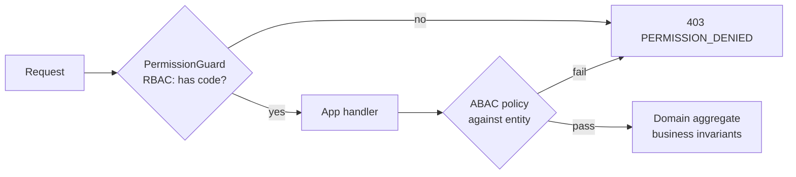
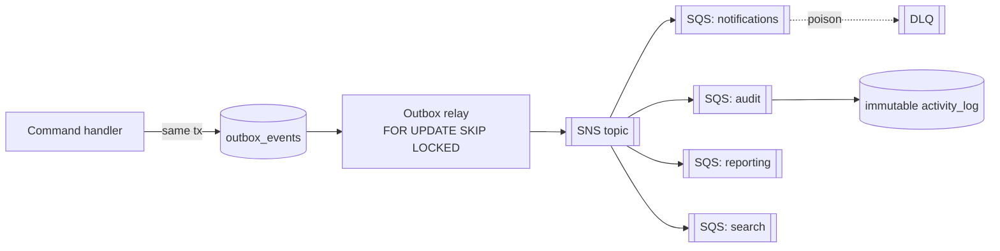

# `rally-api` — Domain Design (Access, Work Items, Outbox)

> **Scope:** core domain design for the first real contexts. Companion to `BACKEND_STRUCTURE.md` (layout) and `ARCHITECTURE_CURRENT.md` (stack/decisions). Covers the **permission engine (B4)**, **work-item core (B5)**, and **outbox/event flow (B6)**. Stack locked: NestJS+Fastify, Drizzle, PostgreSQL+RLS, UUIDv7/ULID, Zod, transactional outbox → SNS/SQS, Valkey.

---

## 1. Permission Engine — RBAC + ABAC (`access` module) [B4]

**Two-phase, deny-by-default: a coarse RBAC gate at the edge, a fine ABAC policy at the resource.**

### Model
- `user → role (scoped) → permission codes`. **Scope** = `workspace` or `project`.
- **Permission code** = `resource:action` — e.g. `work_item:update`, `project:archive`, `sprint:close`, `member:invite`.
- **Roles** carry a set of permission codes within a scope. Built-in roles seeded (Admin, Manager, Member, Viewer); **custom roles per workspace** are an enterprise feature (deny-by-default catalog).

### Phase 1 — RBAC (Guard, coarse)
- `PermissionGuard` answers "does this user hold `work_item:update` in this scope?" — a cheap set-membership check.
- The **effective permission set** for `(user, tenant, project)` is **resolved once and cached in Valkey**, invalidated on role/membership change. No per-request recompute.

### Phase 2 — ABAC (Policy/Specification, fine)
- In the **application layer**, against the **actual entity**: "only assignee or reporter may X", "cannot edit an archived item", "same-team-only".
- Expressed as **composable Policy objects** (Specification pattern), not scattered `if`s.

### Where rules live (important separation)
- **Business invariants** (e.g. a closed item cannot change status) live in the **domain aggregate** — they are truth, not authorization.
- **Access-control rules** (who may act) live in **application-layer policies** — keep the domain free of auth concerns.
- **Platform/superadmin** scope is separate, explicit, and audited — never the default request path.



---

## 2. Work-Item Core [B5]

**One `WorkItem` aggregate (typed), a workflow state machine it consults, LexoRank for order.**

### Aggregate & types
- **Single `WorkItem` aggregate + single table** with a `type` discriminator: `initiative | feature | story | task | defect`.
- Shared fields + **type-specific fields** (defect: severity, steps, environment…) validated by **per-type policies (Strategy)** — never a giant `switch`.
- Aggregate enforces invariants: legal status transition, parent/child rules, required-fields-per-type, blocked/unblock rules.

### Workflow state machine (`workflow` context owns it)
- `workflow` owns **statuses** + **allowed transitions** per project/type.
- `WorkItem.changeStatus(target, allowedTransitions, guards)` validates against the **allowed transition set** (provided via port, not hard-coded) and **transition guards** (e.g. can't close with open children, required fields present) → emits `WorkItemStatusChanged`.

### Hierarchy & rollups
- `parent_id` builds the tree (initiative → feature → story → task).
- **Rollups** (story points, child counts, estimate/remaining/actual) are computed **via events into the `reporting` read model** — O(1) on read, never recomputed per request.

### Ordering — LexoRank
- **`rank`** is a value object (lexicographic string), scoped to `(project, board-column / backlog)`.
- `MoveWorkItem` computes a rank **between the two neighbors** = single-row update, no renumber, no neighbor locks.
- Rare **rebalance** (when ranks converge) runs under a **Postgres advisory lock**.
- (`position INT` is deprecated in the DB design doc.)

### Identity & concurrency
- **`item_key`** (`COX-123`) = per-project counter via **Postgres sequence / advisory lock** (atomic, race-free).
- **Optimistic concurrency** via `version` → `409 WORK_ITEM_VERSION_CONFLICT` on concurrent edit; FE refetches.
- **Relations** (`blocks` / `relates` / `duplicates`) in their own `work_item_relations` table.

---

## 2b. Product Rules (locked 2026-06-20)

**Type hierarchy & estimation**

| Type | Allowed parent | Estimable | Note |
|---|---|---|---|
| `initiative` | — (root) | no | portfolio top |
| `feature` | initiative (optional) | no | portfolio item (Rally-aligned) |
| `story` | feature (optional) | **yes (points)** | |
| `task` | story (optional) | no | execution breakdown |
| `defect` | story / feature (optional) or none | points (optional) | QA-raised |

- Estimation = **story points only** (free numeric, Fibonacci by convention). **No time tracking** in MVP.
- Parent attachment is **optional** for MVP; only the **type → allowed-parent-type** matrix is enforced, plus a **cycle guard** (a node cannot be its own ancestor).

**Default workflow** (seeded on project create)
- Statuses: `To Do` (`todo`) → `In Progress` (`in_progress`) → `Done` (`done`).
- Transitions: linear forward + reopen backward (`Done→In Progress`, `In Progress→To Do`). Per-project editable later.

**Board semantics**
- **Kanban board** = items grouped by `workflow_statuses` (ordered by `rank`), excludes soft-deleted.
- **Scrum board** = same projection scoped to the **active sprint**.
- **Swimlanes by assignee** = view option (no schema change). **WIP limits = out for MVP** (config reserved, unenforced).

---

## 3. Outbox & Event Flow [B6]

**Atomic write, worker relays, SNS→SQS fan-out, idempotent consumers, DLQ.**

### Write (in the UoW transaction)
- The command handler writes the **aggregate row** and the **`outbox_events` row** in the **same transaction** (RLS context set). No dual-write, no lost events.

### Relay (worker process)
- Polls `outbox_events WHERE status='pending'` using **`FOR UPDATE SKIP LOCKED`** (safe horizontal parallelism), publishes to SNS, marks `published`.
- Backoff on failure; repeated failure → `status='failed'` + alert. **CDC/Debezium is the triggered upgrade** later (not day 1).

### Event envelope (versioned contract)
```json
{
  "eventId": "uuidv7",
  "type": "WorkItemStatusChanged",
  "version": 1,
  "occurredAt": "2026-06-20T…Z",
  "tenantId": "…",
  "aggregateType": "WorkItem",
  "aggregateId": "…",
  "payload": { }
}
```
- Event types are **versioned contracts** — payloads never change shape silently.

### Fan-out & consumers
- **SNS topic → one SQS queue per consumer group** (`notifications`, `audit`, `reporting`, `search`) → independent scaling + **independent DLQ** per consumer.
- **Consumers are idempotent** (dedupe by `eventId` / idempotency key) → at-least-once delivery becomes **effectively-once**.
- **Poison messages** → DLQ after N attempts, alarmed and replayable.
- **Audit log** is simply the `audit` consumer writing the immutable `activity_log` from events.

### Ordering
- Default: **SQS standard** + order-tolerant idempotent consumers.
- Use **FIFO with `MessageGroupId = aggregateId`** only where strict per-aggregate order is genuinely required (throughput/cost tradeoff).



---

## 4. Tenant Onboarding & Provisioning [B7]

Three entry paths, **one shared atomic bootstrap**. Rally is invite/sales-provisioned only; we add self-serve on top (superset) for product-led growth.

| Path | Who | Flow |
|---|---|---|
| **Self-serve signup** | SMB / trial | Public signup → verify email → **bootstrap** → land in default project |
| **Invite** | teammates | Existing admin invites email → accept → join existing tenant (no new tenant) |
| **Enterprise provisioned** | sales-led | Tenant pre-created + **SSO/SCIM**; users JIT-provisioned on first SSO login |

### Atomic bootstrap (one transaction)
Creating a tenant runs as a **single Unit of Work** (all-or-nothing, RLS context = the new tenant):

```text
1. tenancy.tenants            (status=active, slug)
2. tenancy.workspaces         (the first workspace)
3. identity.users             (or link existing) + tenancy.workspace_members
4. access.user_role_assignments  (founder → workspace_admin, scope=workspace)
5. work.projects              (a default starter project) + work.project_counters
6. work.workflow_statuses     (seed To Do/In Progress/Done) + workflow_transitions
7. tenancy.subscriptions      (free plan) 
8. outbox: TenantProvisioned  (→ welcome email, analytics, search index)
```

- **Idempotent** via an idempotency key on signup (double-submit / retry safe).
- Failure at any step → full rollback; no half-born tenant.
- **Slug/email uniqueness** checked inside the tx (partial unique indexes).
- Enterprise path skips steps 3–4 user creation (SCIM feeds users) but still seeds workspace/project/workflow.

---

## 5. Realtime Delivery [B8]

Server-authoritative; **layered so no WebSocket gateway enters the foundation.**

| Stage | Mechanism | Scope |
|---|---|---|
| **MVP** | TanStack Query **optimistic update + refetch/poll** | board moves, lists, detail — no realtime infra |
| **Fast-follow** | **SSE** (server→client, one-way) over the **existing outbox fan-out** | notifications, activity feed, "entity changed → invalidate" signals |
| **Triggered** | **WebSocket** | only for true multi-user **live co-editing / presence** |

- **SSE chosen over WebSocket** for the middle tier: one-way is sufficient, cheaper, **no sticky sessions** behind the ALB, and the events already exist in the outbox (a `realtime` SQS consumer pushes to connected clients).
- **Seam designed now** (events are already emitted); SSE endpoint implemented in fast-follow. WebSocket stays out until a co-editing requirement appears.

---

*Companion docs:* `BACKEND_STRUCTURE.md` (module/folder layout) · `FRONTEND_STRUCTURE.md` (`rally-web` SPA) · `ARCHITECTURE_CURRENT.md` (decisions/stack) · `FOUNDATION_PHASE.md` (first-phase tasks) · `01_DB design/mini_rally_database_design.md` (tables).
