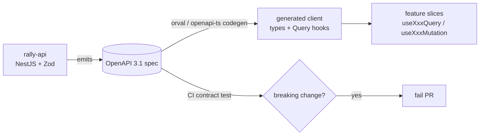

# `rally-web` — Frontend Architecture & Structure (React SPA, Feature-Sliced)

> **Scope:** internal structure of the frontend repo `rally-web`. Companion to `ARCHITECTURE_CURRENT.md` (decisions/stack), `BACKEND_STRUCTURE.md` (the API it consumes), `DOMAIN_DESIGN.md` (work-item model, realtime, onboarding) and `FOUNDATION_PHASE.md` (task plan). The FE↔BE boundary is an **OpenAPI-first contract** — the backend owns the spec, the frontend generates its client and types from it. The two repos never share runtime code.

---

## 1. Goals & Principles

1. **Authed SPA, not SSR** — Rally is a private application behind login with no SEO surface and very high interactivity (boards, grids, drag, live filters). A single-page app is the correct shape; it keeps the deploy a static artifact (S3 + CloudFront) with no Node render server to operate. SSR/Next is revisited **only** if a public marketing/docs surface appears, and that would be a *separate* site.
2. **Contract-first, zero hand-written API types** — every request/response type, query, and mutation hook is **generated from the backend OpenAPI spec**. Hand-writing API DTOs on the client is forbidden; it is the #1 source of FE↔BE drift.
3. **Server state ≠ client state** — the vast majority of "state" is server data (cached/synchronized by TanStack Query) or URL state (owned by the router). A global client store stays deliberately tiny and holds only ephemeral UI state.
4. **Feature-Sliced Design (FSD)** — the app is partitioned into vertical feature slices with a strict, lint-enforced import direction, mirroring the backend's bounded contexts. A feature owns its UI, hooks, and local model; cross-feature reuse only happens through lower shared layers.
5. **Type-safe everywhere** — typed routes, typed search params, typed API client, typed forms (Zod). The compiler — not runtime testing — catches the majority of integration mistakes.
6. **Accessibility and performance are defaults, not retrofits** — Radix primitives (keyboard/ARIA built-in), code-splitting per route, virtualization for any long list, and optimistic updates for every interactive write.
7. **Design tokens over ad-hoc styling** — one Tailwind v4 theme + shadcn token set is the single source of visual truth; no inline hex, no component-local color decisions.

---

## 2. Locked Stack

| Concern | Choice | Rationale for this product |
|---|---|---|
| **Language / framework** | **React 19 + TypeScript**, **SPA** | Private authed app; no SSR benefit. Concurrent features (transitions, `useOptimistic`, Actions) fit board/grid interactivity |
| **Build / dev** | **Vite 6+** (Rolldown-Vite when stable) | Already the mockup's tooling; instant HMR, fast prod builds, first-class TS |
| **Routing** | **TanStack Router** | **Type-safe routes + typed search params**. Rally is deep-nested (workspace → project → board → item) with heavy URL state (filters, sort, board config). Typed search params make filters shareable, restorable, and refactor-safe. Integrates natively with TanStack Query loaders |
| **Server state** | **TanStack Query v5** | The data backbone: caching, dedupe, background refetch (the MVP realtime mechanism), optimistic mutations (board moves), keyset/infinite lists, retry/backoff |
| **Client state** | **Zustand** + URL | Only ephemeral UI state (open panels, drag session, command palette). Most state lives in the server cache or the URL — the global store stays minimal |
| **Styling / UI** | **Tailwind v4 + shadcn/ui** (Radix primitives) | The mockup's existing language; copy-in components = full control, accessible by default, no upstream version lock |
| **Forms + validation** | **React Hook Form + Zod** | Uncontrolled-input performance; Zod schemas are **shared/derived from the API contract** so client and server validate identically |
| **Tables / grids** | **TanStack Table** | Backlog and grid views: column-driven, sortable, virtualization-ready |
| **Board drag & drop** | **dnd-kit** | Accessible (keyboard + screen reader), modern, performant. Replaces the mockup's legacy `react-dnd` |
| **Charts** | **Recharts** | Burndown / velocity / defect-summary reports; already in the mockup |
| **Virtualization** | **TanStack Virtual** | Any long backlog / activity feed / list stays at 60fps |
| **Toasts** | **sonner** | Already in the mockup |
| **Motion** | **motion** (Framer Motion) | Used sparingly for affordances, not decoration |
| **Dates** | **date-fns** + `Intl` | Per-user timezone/locale (mirrors BE `users.locale` / `timezone`); render in user tz, store/transport UTC |
| **i18n** | **react-i18next** | Ships English-only but **wrapped from day 1** — no hard-coded UI strings (mirrors the BE i18n-ready decision) |
| **Icons** | **lucide-react** | Already in the mockup |
| **Testing** | **Vitest** + **React Testing Library** + **Playwright** (e2e) + **MSW** (mock the generated client) | Unit/component fast loop, real-browser e2e, network mocking against the contract |
| **Lint / format** | **ESLint (flat) + Prettier + `eslint-plugin-boundaries`** | The boundaries plugin **enforces the FSD import direction** in CI |

**Explicitly dropped from the mockup** (Figma/scaffold artifacts, not architectural choices): **MUI / Emotion** (we are shadcn + Tailwind, not Material), **react-dnd** (→ dnd-kit), **react-router** (→ TanStack Router). The mockup remains the **visual reference**, not the structural one.

### Why SPA over Next.js (explicit)
Next would add an SSR/RSC server, a second deploy target, and a hydration model for **zero benefit** on a private, authed, write-heavy app — while complicating the clean "static client + OpenAPI contract" boundary with the backend. The cost (operational + conceptual) is real; the upside (SEO, fast first paint for anonymous users) does not apply behind a login wall.

---

## 3. The Decisive Pattern — Contract-First Client Generation

This is the most important frontend decision and the direct counterpart to the backend's OpenAPI-first boundary.



- The backend publishes the **OpenAPI 3.1 spec** as a versioned artifact. The frontend runs a codegen step (**orval** or **openapi-typescript + openapi-fetch**) that produces:
  - all request/response **types**,
  - typed **TanStack Query hooks** (`useListWorkItemsQuery`, `useMoveWorkItemMutation`, …),
  - a typed fetch client wired to the shared HTTP layer.
- Generated code lives in `src/shared/api/generated/` and is **never edited by hand**; regeneration is a CI step keyed to the spec version.
- A **contract test** in CI fails the PR if the spec drifts incompatibly — silent FE↔BE breakage becomes a build error, not a production incident.
- **Runtime validation at the boundary:** responses are parsed with the generated Zod schemas (`drizzle-zod`/`nestjs-zod` lineage on the BE) so the client refuses malformed payloads instead of rendering `undefined`.

---

## 4. Repository Structure (Feature-Sliced Design)

FSD gives a **lint-enforced, one-directional** dependency graph. Layers may only import from layers **below** them: `app → processes → pages → widgets → features → entities → shared`. This mirrors the backend's bounded contexts and keeps features independently removable.

```text
rally-web/
├─ src/
│  ├─ app/                      # composition root: providers, router, global styles
│  │  ├─ providers/             # QueryClientProvider, RouterProvider, Theme, ErrorBoundary, i18n
│  │  ├─ router/                # TanStack Router tree, route guards (auth), loaders
│  │  └─ styles/                # tailwind.css, theme tokens, fonts
│  │
│  ├─ pages/                    # route-level screens (one per URL), thin — compose widgets
│  │  ├─ login/  home/  backlog/  board/  work-item/  reports/  settings/  …
│  │
│  ├─ widgets/                  # large composite UI blocks reused across pages
│  │  ├─ app-shell/             # top nav, workspace/project switcher, sidebar (from mockup layout)
│  │  ├─ board/                 # the kanban board widget (dnd-kit)
│  │  ├─ backlog-grid/          # TanStack Table grid
│  │  └─ activity-feed/  notifications-panel/  …
│  │
│  ├─ features/                 # vertical user actions (a verb): own UI + hooks + model
│  │  ├─ auth/                  # login, refresh, logout, session
│  │  ├─ work-item-create/      # NewItemModal + mutation
│  │  ├─ work-item-move/        # optimistic board move
│  │  ├─ work-item-edit/  assign/  comment/  attach/  filter-backlog/  invite-member/  …
│  │
│  ├─ entities/                 # domain nouns: display + read model + entity-scoped hooks
│  │  ├─ work-item/  project/  workspace/  user/  sprint/  release/  comment/  …
│  │
│  ├─ shared/                   # framework-agnostic reusable foundation (no domain knowledge)
│  │  ├─ api/
│  │  │  ├─ generated/          # ⚠ codegen output — never hand-edited
│  │  │  ├─ http-client.ts      # fetch wrapper: auth header, refresh, CSRF, trace headers
│  │  │  └─ query-client.ts     # TanStack Query defaults (staleTime, retry, error map)
│  │  ├─ ui/                    # shadcn components (button, dialog, table primitives…)
│  │  ├─ lib/                   # date/tz, formatters, cn(), guards, result types
│  │  ├─ config/                # env, feature flags, route constants
│  │  └─ i18n/                  # i18next setup + en locale namespaces
│  │
│  └─ main.tsx                  # entry: mount <App/>
│
├─ public/
├─ tests/                       # e2e (Playwright), MSW handlers
├─ index.html
├─ vite.config.ts
├─ orval.config.ts             # (or openapi-ts) codegen config pointed at the spec
├─ tailwind.config / theme
└─ eslint.config.js            # flat config + boundaries rules
```

### Layer responsibilities

| Layer | Owns | May import |
|---|---|---|
| **app** | providers, router tree, global error boundary, theme | everything below |
| **pages** | one screen per route; composes widgets; reads route params | widgets ↓ |
| **widgets** | self-contained composite blocks (board, grid, shell) | features ↓ |
| **features** | a single user action; its mutation/optimistic logic | entities ↓ |
| **entities** | a domain noun's read model + display components | shared ↓ |
| **shared** | API client, design system, utils, config — **no domain** | nothing above |

The import direction is enforced by `eslint-plugin-boundaries` in CI — a `feature` importing another `feature`, or `shared` importing a `feature`, fails the build.

---

## 5. State Management Strategy

State is classified, and each class has exactly one home. The frequent failure mode (dumping server data into a global store) is structurally prevented.

| State class | Example | Home | Mechanism |
|---|---|---|---|
| **Server state** | work items, projects, comments, board columns | **TanStack Query cache** | generated query hooks; cache key = resource + filters |
| **URL state** | active filters, sort, selected item, board config, pagination cursor | **TanStack Router search params** | typed, shareable, restorable links |
| **Global UI state** | command palette, theme, current workspace/project context, toasts | **Zustand** (small slices) | ephemeral, no server data |
| **Local component state** | input value, hover, open/close | `useState` / RHF | never lifted unless shared |
| **Form state** | create/edit work item, settings | **React Hook Form + Zod** | uncontrolled inputs, schema from contract |

**Rule:** server data never lives in Zustand; URL-shareable state never lives in component state. This keeps deep links working and avoids cache/store desync.

---

## 6. Data Fetching & Realtime (tiered, mirrors `DOMAIN_DESIGN.md §5`)

The frontend implements the same layered realtime model the backend exposes — no realtime infrastructure is required for the MVP.

| Stage | Frontend mechanism |
|---|---|
| **MVP** | **TanStack Query optimistic updates + background refetch / interval polling.** Board moves and edits update the cache immediately (`onMutate` snapshot + rollback on error); lists refetch on focus/interval. No socket code |
| **Fast-follow** | **SSE subscription** (`EventSource`) on a `/events` stream that rides the backend outbox fan-out. A thin client maps incoming events → `queryClient.invalidateQueries` / `setQueryData` for notifications, activity feed, and "entity changed" board invalidation. One-way, no sticky sessions |
| **Triggered** | **WebSocket** client only if true multi-user live co-editing / presence is built |

The MVP and fast-follow share the **same cache-mutation surface** (`invalidate` / `setQueryData`), so adding SSE later does not change feature code — only the transport that triggers the update. This is the SSE *seam* on the client side.

### Optimistic write pattern (board move, the canonical case)
```text
onMutate:   snapshot board cache → apply moved card immediately → return rollback
mutationFn: call generated useMoveWorkItemMutation (PATCH /work-items/:id)
onError:    restore snapshot + sonner error toast
onSettled:  invalidate board query (reconcile with server truth)
```

---

## 7. Routing & Navigation Model

Routes follow the **navigation hierarchy** (`workspace → project → team → backlog/board → item`), which is distinct from the data-ownership hierarchy (`tenant → workspace → project → work_item`, see `DOMAIN_DESIGN.md`).

```text
/login
/                                   → workspace picker / home
/w/:workspaceSlug                   → workspace home
   /projects                        → project list
   /p/:projectKey
      /backlog        ?filter&sort&group        (typed search params)
      /board          ?swimlane&filter
      /sprints/:sprintId
      /releases/:releaseId
      /item/:itemKey                → work-item detail (drawer or page)
      /reports        ?type=burndown|velocity|defects
   /settings
/notifications
/settings (account)
```

- **Auth guard** at the router level: unauthenticated → redirect to `/login` preserving `redirect` search param.
- **Route-level code-splitting**: each page is lazy-loaded; the app shell (nav + switchers) is the only always-loaded chunk.
- **Loaders** prefetch the page's primary query via TanStack Query so navigation shows data, not spinners.
- **Filters live in the URL**, never in a store — a filtered backlog is a shareable, bookmarkable link.

---

## 8. Auth Integration (mirrors the BE hybrid token model)

| Token | Storage | Handling |
|---|---|---|
| **Access JWT** (5–15 min) | **in-memory only** (never localStorage) | attached as `Authorization: Bearer` by the shared HTTP client |
| **Refresh token** (rotating) | **httpOnly + Secure + SameSite cookie** | never touched by JS; sent automatically on the refresh call |
| **CSRF token** | cookie + header (double-submit) | added to mutating requests by the HTTP client |

- The shared `http-client` intercepts **401**, calls the refresh endpoint **once** (single-flight — concurrent 401s queue behind one refresh), retries the original request, and on refresh failure clears in-memory auth and redirects to login.
- **No tokens in localStorage** (XSS exfiltration risk) — access token lives only in a module closure / memory.
- `session_version` / denylist changes surface as a 401 → forced re-auth, matching the backend session model.
- Trace headers (`traceparent`) are injected so a request can be correlated end-to-end with the backend (OTel).

---

## 9. Performance Strategy

| Lever | Practice |
|---|---|
| **Code splitting** | per-route lazy chunks; heavy widgets (charts, board) split further; shell stays minimal |
| **Virtualization** | TanStack Virtual for backlog, activity feed, any list that can exceed ~50 rows |
| **Caching** | TanStack Query `staleTime` tuned per resource; keyset/cursor pagination (matches BE — no offset/`totalCount`) |
| **Optimistic UI** | every interactive write updates the cache before the round-trip |
| **Concurrent React** | `useTransition` for filter/sort/search so typing never blocks; `useOptimistic` for inline edits |
| **Bundle hygiene** | no MUI/Emotion runtime; tree-shakeable imports; `rollup-plugin-visualizer` budget check in CI |
| **Asset delivery** | static build on **S3 + CloudFront**, immutable hashed assets, long-cache + `index.html` no-cache |
| **Images/avatars** | served from S3/CDN; lazy-loaded; correctly sized |
| **Skeletons over spinners** | route loaders + suspense boundaries render layout-stable skeletons |

---

## 10. Quality, Accessibility & Tooling

- **Accessibility:** Radix primitives give keyboard + ARIA for free; dnd-kit provides keyboard-draggable board cards; color tokens meet WCAG AA contrast; focus management on dialogs/drawers. Target **WCAG 2.1 AA** (also a `PRODUCTION_READINESS.md` fast-follow item).
- **Testing pyramid:** Vitest + RTL for components/hooks → MSW to mock the **generated** client against the contract → Playwright for critical e2e flows (login, create item, move on board, run a report).
- **Type safety as a gate:** `tsc --noEmit`, ESLint flat config, and `eslint-plugin-boundaries` all run in CI; the codegen + contract test run before tests.
- **Design tokens:** one Tailwind v4 theme + shadcn token set; dark/light via CSS variables; no inline colors.
- **Error handling:** a top-level error boundary + per-route boundaries; API errors mapped to typed problem details (RFC 9457) surfaced via sonner; network/refresh failures handled centrally.
- **Feature flags + i18n** are wired day 1 (English-only, single flag provider) so later rollout/localization needs no refactor.

---

## 11. CI/CD & Deploy (the `rally-web` repo)

- **Build:** Vite static build → immutable hashed assets.
- **Deploy:** **S3 + CloudFront** (static hosting), CloudFront invalidation on `index.html`; provisioned by the **`rally-infra`** repo (OpenTofu), deployed by this repo's **GitHub Actions** (build → upload → invalidate). No SSR server to run.
- **Decoupled from infra:** like the backend, *provision* (CloudFront/S3 in `rally-infra`) is separate from *deploy* (asset upload in app CI) — see `ARCHITECTURE_CURRENT.md §8.1`.
- **Preview envs:** per-PR preview deploys (ephemeral bucket/path) for review.
- **Spec sync:** codegen runs against the **published, versioned** OpenAPI artifact; a contract test gates merges.

---

## 12. Foundation vs Later (frontend)

| Tier | Items |
|---|---|
| **Foundation (ship)** | SPA shell + auth flow + router guards; contract-first generated client; TanStack Query + optimistic board move (polling realtime); backlog grid + board widgets; create/edit/assign/comment work item; MVP reports (burndown/velocity/defects); i18n + flags wrapped; S3+CloudFront deploy |
| **Fast-follow** | **SSE** realtime subscription; SSO login UI; richer reports (workload, release progress); saved filters/views; bulk actions; full member-management UIs; advanced board (swimlanes, WIP visuals) |
| **Triggered** | WebSocket live co-editing/presence; offline/PWA; full localization (multiple locales); micro-frontend split (only on org/scale trigger — see `ARCHITECTURE_FUTURE_SCALE.md`) |

---

*Companion docs:* `ARCHITECTURE_CURRENT.md` (decisions/stack, §8.1 repos) · `BACKEND_STRUCTURE.md` (the API consumed) · `DOMAIN_DESIGN.md` (work-item model §2, onboarding §4, realtime §5) · `FOUNDATION_PHASE.md` (task plan) · `03_Mockup Design/` (visual reference).
