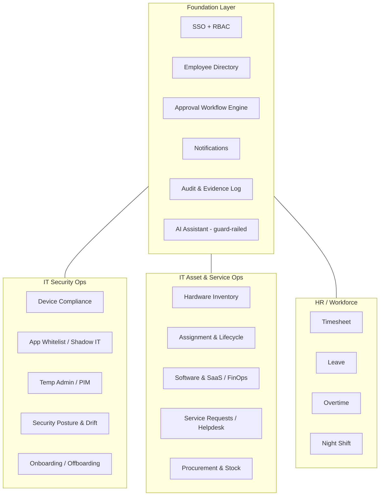

# OpsHub — Capability Map

> Full module and feature breakdown across the three domains and the shared foundation.

---

## Domain overview

---

## 1. Foundation

| Capability | Manages |
|------------|---------|
| **SSO + RBAC** | Entra ID login; roles: Employee, Manager, IT-Admin, Helpdesk, HR, Security, Auditor |
| **Employee directory** | People, departments, managers — synced from Entra, never hand-typed |
| **Approval workflow engine** | One reusable engine powering temp-admin, leave, OT, asset, and access requests |
| **Notifications** | Email / Teams / in-app on request, approval, expiry, breach |
| **Audit & evidence log** | Immutable trail of every privileged action; exportable; forwarded to Sentinel/SIEM |
| **AI assistant (guard-railed)** | Drafts requests, summarizes compliance, answers "who has X", flags anomalies — never auto-executes privileged actions |

> **The approval workflow engine is the backbone** — temp-admin, leave, and OT are all
> the same request → approve → time-bound action → audit pattern. Build it once.

## 2. IT Security Ops

| Module | Manages | Data source |
|--------|---------|-------------|
| **Device compliance** | Encryption, patch status, MFA, EDR health, OS version per device | Intune / Defender |
| **App whitelist & Shadow IT** | Employees/devices running non-whitelisted apps; flags unapproved AI tools, remote-access tools, miners | Defender / Intune |
| **Temp admin requests** | Time-boxed local-admin grants: reason, approval, auto-revoke, audit | Entra PIM / engine |
| **Security posture & drift** | Secure Score trend; ASR/firewall/GPO baseline vs actual; drift alerts | Defender / Graph |
| **Onboarding / offboarding** | One-click fan-out across Entra + Intune + GitHub + licenses with 1hr/24hr/7day SLA timers | Multi-system |

## 3. IT Asset & Service Ops

| Module | Manages |
|--------|---------|
| **Hardware inventory** | Laptops, monitors, phones, peripherals — serial, model, warranty, location, status |
| **Assignment & lifecycle** | Device ↔ employee, check-in/out, return on offboarding, depreciation; lifecycle: in_stock → assigned → returned → retired |
| **Software & SaaS / FinOps** | License inventory, seat utilization, renewals, cost optimization (flag unused/duplicate) |
| **Service requests / helpdesk** | Self-service catalog for hardware/software/access; AI-assisted triage |
| **Procurement & stock** | Stock levels, reorder thresholds, purchase requests |

## 4. HR / Workforce

| Module | Manages | Note |
|--------|---------|------|
| **Timesheet** | Daily/weekly hours, project allocation, approval | |
| **Leave** | Request → approve, balances/accrual, calendar, coverage | Labor-law dependent |
| **Overtime (OT)** | OT request, multiplier rules, approval, payroll export | Payroll/labor-law dependent |
| **Night shift** | Shift logging, allowances, rotation | |
| **Attendance (optional)** | Clock-in/out, anomalies | |

> **Build-vs-buy flag:** HR (timesheet/leave/OT) touches labor law + payroll. Build
> custom only if no HRIS exists, or integrate if one does. IT modules are the clear
> custom-build win.

## 5. Cross-cutting (2026 differentiators)

| Capability | Manages |
|------------|---------|
| **Single source of truth** | One record links employee ↔ device ↔ software ↔ access ↔ time |
| **Compliance & evidence center** | Auto-generated audit evidence: asset lifecycle, access reviews, OT/labor records |
| **Dashboards & analytics** | Compliance %, asset utilization, license spend, OT trends, drift incidents |
| **Guard-railed AI agents** | NL queries, anomaly flagging, draft-but-don't-execute on privileged actions |
| **Mobile self-service** | Employees submit requests/leave; managers approve from phone |

## 6. Core data model (sketch)

| Entity | Key fields | Notes |
|--------|-----------|-------|
| `Employee` | id, entra_oid, name, dept, manager_id, role | synced from Entra |
| `Asset` | id, type, serial, model, status, purchase_date, warranty_end | lifecycle states |
| `AssetAssignment` | asset_id, employee_id, assigned_at, returned_at | one active per asset |
| `SoftwareLicense` | id, product, seats_total, seats_used, renewal_date, cost | FinOps |
| `Request` (generic) | type, requester_id, approver_id, status, payload, expires_at | powers workflow engine |
| `AccessGrant` | employee_id, device_id, type=temp_admin, reason, status, expires_at | auto-revoke |
| `ComplianceFinding` | device_id, app_name, status, detected_at | read-only from Intune/Defender |
| `Timesheet` | employee_id, date, hours, project, shift_type | |
| `OvertimeEntry` | employee_id, date, hours, multiplier, status | |
| `ShiftLog` | employee_id, date, shift, allowance | |
| `AuditEvent` | actor_id, action, target, timestamp, metadata | immutable |
