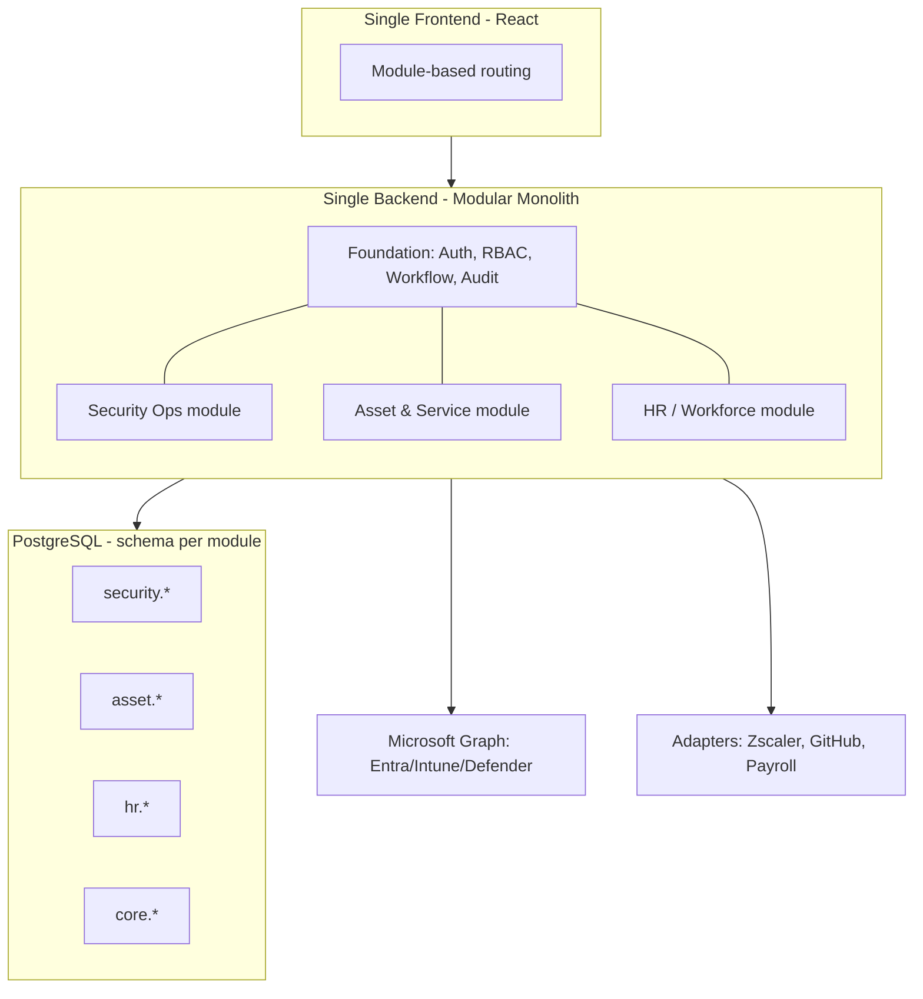

# OpsHub — Architecture Decision: Split vs All-in-One

> Status: Decided · Date: 2026-06-23

---

## Decision

**Build a modular monolith behind a single portal. Do NOT split into separate web apps,
and do NOT start with microservices.**

- **One frontend** — a single app with module-based routing.
- **One backend** — a modular monolith with clear bounded contexts per module.
- **One database** — schema-per-module for clean boundaries.
- **Split later** only at module seams, and only when a real driver appears.

## Why not separate web apps

| Reason | Detail |
|--------|--------|
| Single source of truth | The 2026 ITAM thesis is consolidation. Separate webs duplicate employee/device data and fight that goal. |
| Shared foundation | SSO, RBAC, workflow engine, and audit are used by every module — building them 2-3 times is waste. |
| Unified UX | Employees and managers want one login and one portal, not three. |
| Cross-module data | Offboarding spans IT + HR; a device links to an employee and their access. Splitting fragments the joins. |

## Why not microservices (yet)

| Reason | Detail |
|--------|--------|
| Small internal team | Microservices ops overhead (service mesh, distributed tracing, multiple deploys) isn't justified. |
| Premature decomposition | Module boundaries aren't fully proven yet; splitting now risks wrong seams. |
| Latency & complexity | Cross-service calls add failure modes for data that's naturally relational. |

## The modular monolith approach

### Module boundary rules

- Modules talk to each other **only through defined interfaces**, never direct table access.
- Each module owns its schema; cross-module reads go through the owning module's service.
- The Foundation layer is the only shared dependency.

### When to split a module out later

Extract a module into its own service **only** when one of these is true:

- **HR/Payroll** needs different compliance, a different team, or moves to a vendor.
- A module needs **independent scaling** (unlikely for an internal tool).
- A module needs a **separate release cadence** that the monolith blocks.

Because boundaries are clean from day one, extraction is a refactor, not a rewrite.

---

## Tech stack

### Frontend
- React + TypeScript + Vite
- Tailwind + shadcn/ui (reuse the `03_Mockup Design/` setup)
- TanStack Query + TanStack Table

### Backend (chosen)
- **NestJS 11 (Fastify adapter) + TypeScript / Node 24 LTS** — chosen for one language
  end-to-end and shared Zod schemas with the frontend; Nest modules map onto bounded contexts.
- Alternative for reference: ASP.NET Core 10 (stronger Graph SDK) — see `04_TECH_STACK_AND_PATTERNS.md` §9.
- Background jobs: BullMQ on Valkey for approval timers, auto-revoke, syncs.

### Data
- PostgreSQL 18 (schema-per-module) with Drizzle ORM + drizzle-kit
- Valkey 8 (cache + BullMQ job queue)

### Integrations
- Microsoft Graph (Entra, Intune, Defender, Purview)
- Graph change notifications / webhooks for near-real-time device state
- Per-integration adapters (Zscaler, CrowdStrike, Jamf, GitHub, Payroll) behind a common interface

### Auth & security (non-negotiable for this domain)
- Entra ID SSO (OIDC); enforce phishing-resistant MFA
- App registration with least-privilege, admin-consented Graph scopes
- App-level RBAC; all privileged actions behind approval + full audit log
- Secrets in Azure Key Vault (never env files)

### Infra
- AWS ECS Fargate (`ap-southeast-1`) behind ALB + WAF
- IaC: OpenTofu — reuse `rally-infra/modules/*`
- CI/CD: GitHub Actions via `rally-gitops` composite actions, with SonarQube / Veracode / Gitleaks gates

---

## Summary

| Question | Answer |
|----------|--------|
| Separate webs? | No — fragments data and UX, duplicates foundation |
| Microservices? | Not now — unjustified ops overhead for an internal tool |
| Chosen architecture | Modular monolith, single portal, schema-per-module |
| Future-proofing | Clean module boundaries enable later extraction (likely HR first) |
