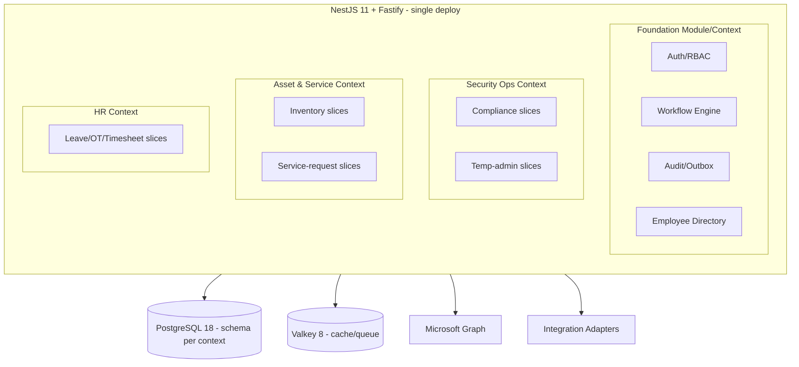
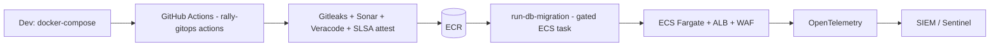

# OpsHub — Tech Stack, Architecture & Design Patterns

> Status: Recommended · Date: 2026-06-23
> All versions are current as of mid-2026. Pin exact versions at project init and
> renew via Renovate/Dependabot.

---

## 0. TL;DR

> **Reality check (2026-06):** the existing `rally` platform (`/home/nghiavt18/personal/rally`)
> already runs this exact stack in production. **OpsHub should be a sibling of `rally-api` /
> `rally-web`, reusing `rally-infra` (OpenTofu modules) and `rally-gitops` (shared GitHub
> Actions).** Versions below are aligned to rally.

| Layer | Choice (2026) |
|-------|---------------|
| Runtime | **Node.js 22 LTS** (24 ok) · **TypeScript 6** |
| Backend | **NestJS 11** with **Fastify 5 adapter** |
| App split | `apps/api` (HTTP) + `apps/worker` (background) — like rally |
| Module layout | `libs/{contracts, modules, platform, shared-kernel}`; each module = hexagonal layers |
| ORM | **Drizzle ORM** + drizzle-kit + **drizzle-zod** (Postgres) |
| Validation | **Zod 4** + **nestjs-zod** |
| Contract → FE | **`@nestjs/swagger` → `@hey-api/openapi-ts`** generated client (not a shared package) |
| Messaging/jobs | **AWS SQS/SNS** + `apps/worker` + `@nestjs/schedule` (cron/timers) |
| Resilience | **cockatiel** (retry / circuit breaker / timeout) |
| Workflow | State machine in a `workflow` module (reuse rally's pattern; XState 5 if explicit lib wanted) |
| Result/errors | **Result pattern** in `shared-kernel` (rally already has this) |
| Frontend | **React 19** · TypeScript 6 · **Vite 7** · React Router 7 · shadcn/ui |
| Styling | **Tailwind CSS 4** (Oxide) |
| Data fetching | TanStack Query v5 · TanStack Table v8 |
| Forms | React Hook Form + Zod 4 |
| DB | **PostgreSQL 17/18** (RDS) |
| Cache | **Valkey 8** (ElastiCache Serverless) |
| Identity | **Entra ID (OIDC)** · MSAL Node · `@azure/identity` · Graph JS client v3 |
| Secrets | AWS Secrets Manager (`@aws-sdk/client-secrets-manager`) |
| Observability | **OpenTelemetry** (Node SDK) · **pino** (`nestjs-pino`) |
| Container/host | Docker · **AWS ECS Fargate** (`ap-southeast-1`) |
| IaC | **OpenTofu** ≥ 1.9 — reuse `rally-infra/modules/*` |
| CI/CD | GitHub Actions via **`rally-gitops` composite actions** + Sonar/Veracode/Gitleaks |

> **Why NestJS is now doubly justified:** beyond one-language end-to-end, it gives
> **platform consistency with rally** — same infra modules, same shared CI/CD actions, same
> team patterns. That reuse outweighs .NET's stronger Graph SDK. The contract between API and
> web is shared via **OpenAPI codegen** (proven in rally-web), not a shared Zod package.
> .NET 10 alternative kept in §9 for reference only.

---

## 1. Architecture: Modular Monolith + Vertical Slices

Confirmed in [02_ARCHITECTURE_DECISION.md](02_ARCHITECTURE_DECISION.md): one deployable
modular monolith, schema-per-module, extract-later at clean seams.

Inside the monolith, organize by **bounded context (DDD)**, and inside each context by
**vertical slice** (feature owns its endpoint → handler → data), not by technical layer.



### Layering inside a slice (kept thin)

```
Controller (Fastify route)  ->  Command/Query (@nestjs/cqrs)  ->  Handler
   -> Domain (entities, value objects, XState machine)
   -> Persistence (Drizzle repository, schema per context)
   -> Outbox event (for cross-context / external side effects)
```

### Module communication rules
- Contexts never touch each other's tables/schemas. Cross-context calls go through a
  published **integration event** (Outbox → BullMQ → `EventBus`) or a public application
  service interface exported by the owning Nest module.
- Foundation is the only shared module dependency.

---

## 2. Design Patterns (and where each is used)

| Pattern | Where in OpsHub | Why |
|---------|-----------------|-----|
| **Modular Monolith** | Whole backend | One deploy, clean seams, future extraction |
| **Nest module per bounded context** | Security / Asset / HR / Foundation | Module = context; clear ownership, separate Drizzle schemas |
| **Vertical Slice** | Every feature | Feature cohesion over layered indirection |
| **DDD Bounded Contexts** | Security / Asset / HR / Foundation | Schema-per-context isolation |
| **CQRS (light)** | Commands vs queries via `@nestjs/cqrs` | Read/write separation without event-sourcing overhead |
| **Result pattern** | All handlers | `shared-kernel` Result type; no exceptions for control flow |
| **Outbox pattern** | Audit + integration events | Reliable side effects drained by `apps/worker` (no lost events on crash) |
| **State Machine** | Request lifecycle (Draft→Pending→Approved→Active→Expired/Revoked) | The temp-admin/leave/OT engine is a state machine (reuse rally `workflow` module) |
| **Strategy pattern** | Approval policies (auto-approve vs multi-step) | Pluggable approval rules per request type |
| **Adapter / Anti-Corruption Layer** | Graph, Intune, Zscaler, Payroll | Nest providers isolating external models from the domain |
| **Repository (thin, over Drizzle)** | Persistence | Drizzle is a typed query builder; keep repos thin |
| **DI (NestJS built-in)** | Everywhere | Constructor injection, testable providers |
| **BFF (Backend-for-Frontend)** | API shaped for the SPA | One tailored API surface, token handling server-side |
| **Feature flags** | Phased rollout | Ship modules dark, enable per role |
| **Idempotency keys** | All write endpoints + integrations | Safe retries for onboarding/offboarding fan-out |

### Frontend patterns
- **Feature-based structure** mirroring backend contexts.
- **Server state vs client state**: TanStack Query for server data, Zustand for local UI state.
- **Type-safe API client**: generate from the backend OpenAPI doc with **`@hey-api/openapi-ts`** (proven in `rally-web`) — never hand-write DTOs.
- **Composition over config**: shadcn/ui primitives composed into feature components.
- **Schema-first forms**: Zod schema is the single source for validation + TS types.

---

## 3. Backend stack detail (NestJS 11 + Fastify)

| Concern | Library (2026) | Note |
|---------|----------------|------|
| Framework | **NestJS 11** + `@nestjs/platform-fastify` | Fastify adapter for throughput + low overhead |
| HTTP server | **Fastify 5** (+ `@fastify/helmet`, `csrf-protection`, `cookie`, `compress`) | Hardened like rally-api |
| API docs | **`@nestjs/swagger`** | Emits OpenAPI consumed by the web codegen |
| ORM | **Drizzle ORM** + drizzle-kit + **drizzle-zod** | Typed query builder; schema-per-context; SQL-first migrations |
| Validation | **Zod 4** + `nestjs-zod` | Request/response schemas |
| Result/errors | **Result pattern** (`shared-kernel`) | Typed `Result`; map to HTTP in an exception filter |
| Resilience | **cockatiel** | Retry / circuit breaker / timeout on Graph/external calls |
| State machine | `workflow` module (XState 5 optional) | Request lifecycle |
| Background jobs | **`apps/worker`** + **AWS SQS/SNS** + `@nestjs/schedule` | Auto-revoke timers, scheduled syncs, Outbox drain |
| Identity (OpsHub) | **MSAL Node** / `@azure/identity` + **Graph JS client v3** | Entra OIDC + least-privilege scopes (rally uses local JWT; OpsHub adds Entra SSO) |
| AuthZ | Nest Guards (+ CASL) | Policy/attribute-based, maps to RBAC roles |
| Config | `@nestjs/config` + Zod-validated env | Typed, validated configuration |
| Health | `@nestjs/terminus` | `/health/ready` used by deploy gate |
| Observability | **OpenTelemetry Node SDK** + `nestjs-pino` | Traces/metrics/logs |
| Testing | **Vitest 4** + Testcontainers + Supertest | Real Postgres/Valkey in tests |

---

## 4. Frontend stack detail

| Concern | Library (2026) |
|---------|----------------|
| Framework | React 19 (Actions, `use`, ref-as-prop) |
| Language | TypeScript 6 |
| Build | Vite 7 |
| Routing | React Router 7 (framework mode) — or TanStack Router if you want fully type-safe routes |
| Styling | Tailwind CSS 4 (Oxide engine, CSS-first config) |
| Components | shadcn/ui (Radix primitives; `components.json` like rally-web) |
| API client | **`@hey-api/openapi-ts`** generated from the API OpenAPI doc |
| Server state | TanStack Query v5 |
| Tables/grids | TanStack Table v8 |
| Forms | React Hook Form + Zod 4 |
| Local state | Zustand |
| Charts | Recharts or visx |
| Auth | MSAL Browser / `@azure/msal-react` |
| Testing | Vitest 4 + React Testing Library + Playwright |

---

## 5. Data layer

- **PostgreSQL 17/18** (AWS RDS) — schema per bounded context (`core`, `security`, `asset`, `hr`).
- **Drizzle ORM** — typed schema definitions per context; **drizzle-kit** for SQL-first
  migrations (run as a gated ECS task via `rally-gitops/run-db-migration`).
- **Valkey 8** (ElastiCache Serverless) — distributed cache (`ioredis`).
- **Audit/Outbox tables** live in `core`; Outbox drained by `apps/worker` (SQS) into the `EventBus`.
- **Row-level tenancy** not needed (single org) — but keep `created_by`/`updated_by` everywhere for audit.
- Drizzle schema types are **inferred into TypeScript** and bridged to Zod via `drizzle-zod`.

---

## 6. Integration layer

- **Microsoft Graph JS client v3** (`@microsoft/microsoft-graph-client`) with `@azure/identity`
  / **MSAL Node** for Entra/Intune/Defender (devices, compliance, users, PIM).
- **Graph change notifications** (webhooks) for near-real-time device/compliance state; reconcile with periodic delta sync (a `@nestjs/schedule` job in `apps/worker`).
- Each external system behind an **adapter provider** + **Anti-Corruption Layer**; resilience via **cockatiel**; all calls idempotent.
- Secrets in **AWS Secrets Manager** (`@aws-sdk/client-secrets-manager`) via the OIDC task role — no stored keys.
- See [05_ENDPOINT_DATA_FLOW.md](05_ENDPOINT_DATA_FLOW.md) for how laptop agents feed this layer.

---

## 7. Security baseline (dogfood the enterprise doc)

- Entra ID SSO (OIDC) + phishing-resistant MFA enforced.
- Least-privilege, admin-consented Graph scopes; no `*.ReadWrite.All` unless required.
- Policy + resource-based authorization mapping to RBAC roles.
- Every privileged action → approval + immutable audit (Outbox → SIEM/Sentinel).
- OWASP ASVS checks in CI; SonarQube + Veracode + **Gitleaks** gates; **SLSA provenance** attestation (rally-gitops `attest-image`); SBOM on build.
- No secrets in code/env — **AWS Secrets Manager + GitHub OIDC** (no stored keys).

---

## 8. Infrastructure & delivery

> Reuse `rally-infra` (OpenTofu modules) and `rally-gitops` (composite actions). OpsHub is
> a new set of `live/` stacks + ECS services, not a new infra codebase.

| Concern | Choice |
|---------|--------|
| Repos | `opshub-api` (NestJS monorepo) + `opshub-web` (Vite) — siblings of rally |
| Local dev | `docker-compose.dev.yml` (Postgres + Valkey) + `nest start --watch` + `vite` |
| Containers | Docker (multi-stage Node 22 images) pushed to **ECR** |
| Hosting | **AWS ECS Fargate** (`ap-southeast-1`) behind ALB + WAF |
| IaC | **OpenTofu** — reuse `rally-infra/modules/{network,rds,cache,messaging,ecs-cluster,ecs-service,waf,secrets,ecr,iam-oidc}` |
| State | S3 + DynamoDB lock (per rally-infra pattern) |
| CI/CD | `rally-gitops` actions: `setup-aws-oidc`, `setup-node-pnpm`, `build-push-ecr`, `run-db-migration`, `verify-ecs-deploy`, `post-deploy-health-check`, `cloudfront-invalidate`, `publish-openapi-spec`, `scan-secrets` |
| Observability | OpenTelemetry → OTLP; logs via pino |
| Dependency hygiene | Renovate; release-please for versioning (like rally) |



---

## 9. Alternative stack (reference: .NET 10)

| Layer | Choice (2026) |
|-------|---------------|
| Runtime | .NET 10 (LTS) · C# 14 |
| Framework | ASP.NET Core 10 + FastEndpoints (REPR) |
| Bus | Wolverine (mediator + messaging; MediatR went commercial in 2025) |
| ORM | EF Core 10 |
| Mapping | Mapperly (source-gen; AutoMapper went commercial in 2025) |
| Validation | FluentValidation 12 |
| State machine | Stateless |
| Graph | Microsoft.Graph SDK v5 + Microsoft.Identity.Web |
| Orchestration | .NET Aspire 10 |
| Everything else | Same frontend, DB, infra as above |

Trade-off: **stronger first-class Intune/Entra/Defender SDK ergonomics**, but you lose the
single-language and **shared Zod schema** advantage of the NestJS stack. Chosen stack remains
NestJS — see §0.

---

## 10. Reference structure (mirrors `rally-api` / `rally-web`)

**`opshub-api`** — NestJS monorepo (copy rally-api's layout):

```
apps/
  api/                          # HTTP entrypoint (Fastify bootstrap, OTel, pino)
  worker/                       # background jobs: SQS consumers, @nestjs/schedule, Outbox drain
libs/
  contracts/                    # DTOs / Zod schemas exposed via @nestjs/swagger
  shared-kernel/                # Result, branded IDs, domain primitives, base types
  platform/                     # auth, cache, config, context, database, email, errors,
                                #   http, notifications, observability, outbox, pipes,
                                #   rate-limit, resilience (cockatiel), utils
  modules/                      # each = bounded context, hexagonal layers inside:
    foundation: identity/ access/ audit/ workflow/ notifications/ tenancy/
    security-ops: compliance/ temp-admin/
    asset-ops:    inventory/ service-requests/ licenses/
    hr-workforce: leave/ overtime/ timesheet/
  integrations/                 # graph/ intune/ defender/ zscaler/ payroll  (adapters + ACL)
db/
  schema/ migrations/ seeds/ migrate.ts   # Drizzle per-context
```

Each module folder uses the rally pattern: `application/ domain/ infrastructure/ interface/`
+ `<module>.module.ts` + `index.ts`. Modules never import each other directly — only via
Foundation contracts or Outbox integration events.

**`opshub-web`** — separate Vite repo (copy rally-web): `src/features/*` mirrors backend
contexts; API types generated by `@hey-api/openapi-ts` from the API's `/api/docs-json`.

**Infra/CI** — no new repo: add OpsHub stacks under `rally-infra/live/*` (or a sibling
`opshub-infra` reusing `rally-infra/modules/*`) and consume `rally-gitops` actions.
