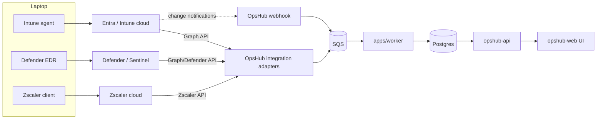

# OpsHub — Endpoint Data Flow (Laptop → Web)

> How the tracking/audit tools on a member laptop connect to OpsHub.
> Short version: **OpsHub never talks to the laptop directly.** It reads from the cloud
> services that the laptop's agents already report to (mainly Microsoft Graph), and writes
> back actions through those same APIs.

---

## 1. The key idea

You do **not** build or install an OpsHub agent on the laptop. The laptop already runs
enterprise agents (from `ENTERPRISE_LAPTOP_SETUP.md`). Those agents report to vendor clouds.
OpsHub integrates with the **vendor cloud APIs**, not the device.

```
[ Laptop agents ] --> [ Vendor cloud ] --> [ APIs ] --> [ OpsHub ] --> [ Web UI ]
```

Building a custom endpoint agent is a last resort (huge security + maintenance burden, and
it competes with EDR). 2026 best practice = consume Intune/Defender/Entra via Graph.

---

## 2. What runs on the laptop and what it tracks

| Agent on laptop | Tracks / audits | Reports to |
|-----------------|-----------------|------------|
| **Intune MDM agent** | Hardware inventory, OS/patch level, encryption (BitLocker/FileVault), compliance state, installed apps, config drift | Intune (Entra) |
| **Defender for Endpoint (EDR)** | Threats, ASR events, vulnerabilities, software inventory, risky processes | Microsoft Defender / Sentinel |
| **Entra sign-in / Conditional Access** | Logins, risky sign-ins, MFA, device trust | Entra ID |
| **PIM / LAPS** | Temp-admin elevation usage, local-admin password rotation | Entra ID / AD |
| **Zscaler Client Connector** | Web/proxy traffic, blocked categories, AI-tool usage | Zscaler cloud |
| **Windows audit policy / Sysmon** | Local security events (logon, privilege use, process) | SIEM (Sentinel) |
| *(optional)* CrowdStrike/SentinelOne | EDR telemetry | Vendor cloud |

> None of these are OpsHub. OpsHub is the **read/orchestrate/audit layer** on top.

---

## 3. How the data reaches OpsHub

Two complementary paths, both handled by `apps/worker`:

### A. Push — near-real-time (webhooks)
- **Microsoft Graph change notifications** subscribe to device/compliance/user changes.
- Graph posts to an OpsHub webhook endpoint → validated → enqueued to **SQS** → worker
  processes → upserts into Postgres → UI updates.

### B. Pull — scheduled reconciliation (delta sync)
- `@nestjs/schedule` cron in `apps/worker` calls Graph **delta queries** (e.g.
  `managedDevices`, `detectedApps`, `deviceCompliancePolicyStates`).
- Reconciles anything missed by webhooks; idempotent upserts.



---

## 4. What OpsHub reads (per module)

| OpsHub feature | Source object (Graph/API) |
|----------------|---------------------------|
| Device inventory & hardware | Intune `managedDevices` |
| Compliance (encryption, patch, MFA) | `deviceCompliancePolicyStates`, Defender |
| Installed / non-whitelisted apps | Intune `detectedApps`, Defender software inventory |
| Security events (ASR, threats) | Defender / Sentinel |
| Sign-ins / risky logins | Entra `signIns`, `riskyUsers` |
| Temp-admin usage | Entra **PIM** audit logs |
| Web / AI-tool usage | Zscaler API |
| Local security events | Sentinel (KQL) |

---

## 5. Write-back (actions OpsHub triggers)

All writes go through the same APIs, are **least-privilege**, **approval-gated**, and
**audited**:

| Action | API call |
|--------|----------|
| Force device sync / mark non-compliant | Intune (Graph) |
| Remote wipe / retire (offboarding) | Intune (Graph) |
| Revoke sessions / disable account | Entra (Graph) |
| Grant time-boxed admin | Entra PIM (Graph) |
| Remove from groups / licenses | Entra (Graph) |

---

## 6. Two different "audit logs" — don't confuse them

| Audit | What it records | Where it lives |
|-------|-----------------|----------------|
| **Endpoint/security audit** | What happened *on the device / in Entra* (logins, threats, elevation) | Intune/Defender/Sentinel — OpsHub **reads** it |
| **OpsHub audit** | What users did *in OpsHub* (who requested/approved a temp-admin, who reassigned a device) | OpsHub `core.audit` (Outbox) — OpsHub **owns** it, forwards to SIEM |

OpsHub's value is **correlating** the two: e.g. "temp-admin was approved in OpsHub at 14:02
→ Entra PIM elevation at 14:03 → Defender flagged a process at 14:20" — one timeline.

---

## 7. Do we ever build a custom agent?

Only if a needed signal is **not exposed** by Intune/Defender/Entra/Zscaler (rare). If so:
- Prefer an **Intune proactive remediation script** or a **Defender custom detection** over a
  standalone agent.
- A bespoke agent must itself be code-signed, WDAC-allowed, EDR-scanned, and audited — treat
  it as high-risk and justify it explicitly.

**Default: integrate, don't install.**
