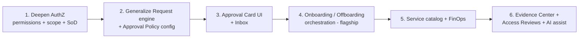

# OpsHub — Gap Analysis & Build Sequence

> Status: Draft · Date: 2026-06-24
> Grounds the next build phase. Reads the *actual* `opshub-api` codebase, not just the
> roadmap, and lists what separates the current "solid foundation" from an enterprise-grade
> internal product.

---

## 1. What actually exists today (codebase, not docs)

| Module (`libs/modules/*`) | Built | The shape it gives us |
|---------------------------|-------|-----------------------|
| `identity` | Auth (Entra + dev login, refresh, logout, `/me`) · Employee CRUD + status · refresh tokens | **The spine** — but RBAC is coarse (see §2) |
| `access-requests` | Generic approval engine (request → approve) | **The backbone** |
| `assets` | Hardware inventory | Domain module |
| `compliance` | Device compliance (read) | Domain module |
| `workforce` | Leave / OT / timesheet | Domain module |
| `audit` | Immutable audit log | **The ledger** |
| `notifications` | In-app + email + SSE + preferences (hardened) | **The nervous system** |

**Shared platform already in place** (`libs/platform/*`): `auth` (JWT + `RoleGuard`),
`outbox` (`AbstractOutboxRelay` with `wakeOnComplete`, post-commit tasks), `notifications`
(`NotificationPubSubService` SSE/pub-sub), `cache`, `config` (`AppConfigService`), `database`
(Drizzle), `resilience`, `errors`, `rate-limit`, `observability`.

> The four cross-cutting planes — **spine (identity), backbone (approvals), ledger (audit),
> nervous system (notifications)** — all exist. The gaps below are about *deepening* them and
> filling the domain modules on top.

---

## 2. Gap 1 — Authorization is role-only (highest priority)

`RoleGuard` today answers exactly one question: *"does the JWT contain one of these role
strings?"* — globally, with no resource scope. That is the coarsest model possible and the
one we *just* touched, so it is the natural next step. Enterprise needs five capabilities on
top. Full design in **[07_AUTHORIZATION_DESIGN.md](07_AUTHORIZATION_DESIGN.md)**.

| Missing capability | Why it's non-negotiable | Example it unblocks |
|--------------------|-------------------------|---------------------|
| **Fine-grained permissions** (`resource.action`) | Roles drift; need a catalog roles map to, editable without redeploy | `asset.reassign`, `tempadmin.approve`, `employee.offboard` |
| **Scoped / contextual authz** | A Manager may approve **only their team**; an IT-Admin only **their region's** assets | "owns / manages this resource" |
| **Segregation of Duties (SoD)** | Auditors require requester ≠ approver; nobody approves their own elevation | Block self-approval on temp-admin |
| **Delegation** | Approver on leave → authority passes to a deputy | Approvals don't stall |
| **Access reviews / recertification** | SOX / ISO 27001 *obligation*: periodically re-confirm access | "Quarterly manager re-attest" |

Plus **break-glass / step-up MFA** for the few truly privileged in-app actions.

---

## 3. Gap 2 — Identity & org model is thin

Approval routing and scoping need a richer employee record than name + status.

| Add to `identity` | Drives |
|-------------------|--------|
| **Org hierarchy** (manager chain, department, cost center) | Approval routing *up the tree* |
| **Employment type** (FTE vs contractor) | Different access + auto-expiry |
| **Teams / groups** | Bulk actions + scope |
| **Richer lifecycle** (active → on-leave → suspended → offboarding → terminated) | Access follows state automatically |
| **Location / legal entity** | Labor law + asset regionalization |

---

## 4. Gap 3 — The killer workflow isn't built: Onboarding / Offboarding

Roadmap Phase 3. It's the one workflow that touches **every** module at once (identity +
assets + access + compliance + licenses + audit) as a single one-click, SLA-timed, fully
audited fan-out. It is the proof that the platform is one system, not seven. **Build this as
the flagship once the Request engine is generalized** (see
[08_PLATFORM_INTEGRATION.md](08_PLATFORM_INTEGRATION.md)).

---

## 5. Gap 4 — Roadmap modules not yet coded

| Module | Phase | Note |
|--------|-------|------|
| Service catalog / Helpdesk | 4 | Tickets, SLAs, AI triage |
| Software / SaaS license + FinOps | 4 | Seats, renewals, unused-license flags |
| Procurement & stock | 4 | Reorder thresholds |
| Reporting & analytics | x-cut | Exec dashboards: compliance %, spend, OT |
| Compliance & Evidence Center | x-cut | Access-review campaigns, audit export |
| Guard-railed AI assistant | from P2 | NL queries, anomaly flag, draft-don't-execute |

---

## 6. Gap 5 — Enterprise cross-cutting concerns usually forgotten

| Concern | Gap today |
|---------|-----------|
| **Approval policy config** | Who-approves-what is likely hardcoded; needs admin-editable rules (multi-level, conditional) |
| **Global search + command palette** | Across people / devices / requests — table-stakes |
| **Bulk ops + CSV import/export** | Onboard 50 people, asset audits |
| **Data retention & GDPR** | PII of ex-employees, right-to-erasure, retention windows |
| **i18n + WCAG accessibility** | Enterprise procurement *requires* both |
| **Integration health / status page** | "Is the Graph sync healthy?" — ops must trust the data |
| **Admin / Settings module** | Org settings, integration config, SLA thresholds, feature flags per role |
| **Service accounts / API tokens / webhooks** | For integration layer + automation |

---

## 7. Recommended build sequence

Ordered by leverage, each step unblocking the next. Detailed engineering approach for every
item lives in [10_ENGINEERING_PLAYBOOK.md](10_ENGINEERING_PLAYBOOK.md).

| # | Step | Why first / here | Primary doc |
|---|------|------------------|-------------|
| 1 | **Fine-grained authorization** | We just added RBAC; correct routing & scoping depend on it | [07](07_AUTHORIZATION_DESIGN.md) |
| 2 | **Generalize the Request engine + policy config** | Make every future module "add a request type", not "build a workflow" | [08](08_PLATFORM_INTEGRATION.md) |
| 3 | **Universal Approval Card + Inbox UI** | The #1 daily-driver screen; reused by every request type | [09](09_UIUX_DESIGN.md) |
| 4 | **Onboarding / Offboarding orchestration** | The flagship that proves the platform is one system | [08](08_PLATFORM_INTEGRATION.md) |
| 5 | Service catalog + Software/SaaS FinOps | Self-service value + cost wins | roadmap P4 |
| 6 | Evidence Center + Access Reviews + AI assist | Compliance obligation + differentiation | roadmap x-cut |

---

## 8. Definition of "enterprise-grade" for this platform

Every item we build must satisfy all of these (enforced in
[10_ENGINEERING_PLAYBOOK.md](10_ENGINEERING_PLAYBOOK.md)):

- **DRY foundation** — new modules reuse the Request engine, Outbox, audit, notifications,
  authz guard. No copy-pasted workflow/audit code.
- **Resilient** — idempotent writes, Outbox for side effects, retries + circuit breakers on
  every external call, no lost events on crash.
- **No memory leaks** — every subscription / interval / SSE stream has a matching teardown.
- **Performant** — bounded queries, no N+1, indexed access paths, batched relays.
- **Scalable** — stateless API, horizontal workers with `SKIP LOCKED`, pub/sub wake signals.
- **Audited** — every privileged action writes an immutable event, forwarded to SIEM.
