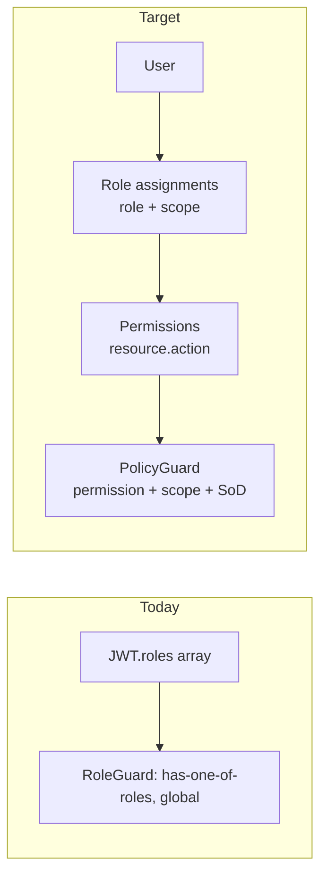
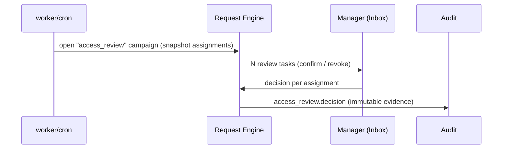

# OpsHub — Fine-Grained Authorization Design

> Status: Draft · Date: 2026-06-24
> Evolves the current coarse `RoleGuard` ("has one of these roles, globally") into a
> permission + scope + policy model with Segregation of Duties, delegation, and access
> reviews — without throwing away what exists.

---

## 1. Where we are vs where we go



**Principle: layer, don't rewrite.** `@Auth()` and `RoleGuard` stay as the *authentication +
quick role gate*. We add a `@RequirePermission()` decorator + `PolicyGuard` that runs *after*
`JwtAuthGuard`. Roles become **bundles of permissions**, resolved at login and cached.

---

## 2. The model (RBAC → PBAC + ABAC scope)

Three concepts, kept deliberately small:

| Concept | Definition | Example |
|---------|-----------|---------|
| **Permission** | `resource.action` string — the atomic right | `asset.reassign`, `tempadmin.approve` |
| **Role** | A named bundle of permissions | `IT_ADMIN` → `{ asset.*, device.sync, tempadmin.approve }` |
| **Scope** | The *boundary* a role assignment applies within | `region:apac`, `team:platform`, `self` |

A user holds **role assignments**: `(role, scope)`. Authorization = *"does any of the user's
assignments grant `permission` for a scope that contains this resource?"*

### Scope types (start with three, extensible)

| Scope | Means | Resolved by |
|-------|-------|-------------|
| `global` | Whole org | always matches |
| `self` | Only resources the user owns | `resource.ownerId === user.sub` |
| `team:{id}` / `dept:{id}` / `region:{code}` | Resources within an org unit | org tree / resource attributes |

> ABAC stays *minimal and declarative* — scope is data on the assignment, evaluated by a
> small set of pure functions. We do **not** adopt a full policy DSL until a real driver
> appears (YAGNI).

---

## 3. Schema (`core` / `identity` context, Drizzle)

```ts
// db/schema/authz.ts  (new — in the identity/foundation context)
export const permissions = pgTable('permissions', {
  key: text('key').primaryKey(),            // 'asset.reassign'  (resource.action)
  description: text('description').notNull(),
});

export const roles = pgTable('roles', {
  id: uuid('id').primaryKey().defaultRandom(),
  key: text('key').notNull().unique(),      // 'IT_ADMIN'
  name: text('name').notNull(),
  system: boolean('system').notNull().default(false), // seeded, non-deletable
  updatedAt: timestamp('updated_at', { withTimezone: true }).notNull().defaultNow(),
});

export const rolePermissions = pgTable('role_permissions', {
  roleId: uuid('role_id').notNull().references(() => roles.id, { onDelete: 'cascade' }),
  permissionKey: text('permission_key').notNull().references(() => permissions.key),
}, (t) => [primaryKey({ columns: [t.roleId, t.permissionKey] })]);

export const userRoleAssignments = pgTable('user_role_assignments', {
  id: uuid('id').primaryKey().defaultRandom(),
  userId: uuid('user_id').notNull(),        // employee id
  roleId: uuid('role_id').notNull().references(() => roles.id),
  scopeType: text('scope_type').notNull(),  // 'global' | 'self' | 'team' | 'dept' | 'region'
  scopeId: text('scope_id'),                // null for global/self; e.g. team uuid / 'apac'
  grantedBy: uuid('granted_by').notNull(),
  expiresAt: timestamp('expires_at', { withTimezone: true }), // time-boxed assignments
  createdAt: timestamp('created_at', { withTimezone: true }).notNull().defaultNow(),
}, (t) => [
  uniqueIndex('uq_user_role_scope').on(t.userId, t.roleId, t.scopeType, t.scopeId),
  index('ix_ura_user').on(t.userId),
]);
```

Delegation and SoD reuse this table — no new tables needed for v1:

```ts
export const approvalDelegations = pgTable('approval_delegations', {
  id: uuid('id').primaryKey().defaultRandom(),
  fromUserId: uuid('from_user_id').notNull(),
  toUserId: uuid('to_user_id').notNull(),
  startsAt: timestamp('starts_at', { withTimezone: true }).notNull(),
  endsAt: timestamp('ends_at', { withTimezone: true }).notNull(),
  reason: text('reason'),
}, (t) => [index('ix_deleg_from_active').on(t.fromUserId, t.endsAt)]);
```

---

## 4. The mechanism — resolve once, cache, enforce cheaply

### 4.1 Resolution at login (no per-request DB joins)

On Entra login the `AuthService` resolves the user's **effective permission set** (flattened
`permission → scopes[]`) and embeds a compact form in the access token + caches it in Valkey
keyed by `authz:perms:{userId}` with a short TTL.

```ts
// identity/application/authz-resolver.service.ts
export interface EffectivePermissions {
  // permissionKey -> list of scopes it is granted within
  [permission: string]: Array<{ type: ScopeType; id: string | null }>;
}

@Injectable()
export class AuthzResolverService {
  constructor(
    private readonly repo: IAuthzRepository,
    private readonly cache: CacheService,
  ) {}

  async resolve(userId: string): Promise<EffectivePermissions> {
    const cacheKey = `authz:perms:${userId}`;
    const cached = await this.cache.getJson<EffectivePermissions>(cacheKey);
    if (cached) return cached;

    // ONE query: assignments ⨝ role_permissions, grouped in memory.
    const rows = await this.repo.effectivePermissions(userId); // {permissionKey, scopeType, scopeId}[]
    const map: EffectivePermissions = {};
    for (const r of rows) {
      (map[r.permissionKey] ??= []).push({ type: r.scopeType, id: r.scopeId });
    }
    await this.cache.setJson(cacheKey, map, { ttlSeconds: 300 });
    return map;
  }

  /** Bust on any role/assignment change — publish via the same pub-sub used for notifications. */
  async invalidate(userId: string): Promise<void> {
    await this.cache.del(`authz:perms:${userId}`);
  }
}
```

> **Performance:** authorization becomes an in-memory map lookup per request, refreshed at
> most every 5 min, and busted immediately on change. No joins on the hot path.

### 4.2 The guard (layers after JwtAuthGuard)

```ts
// platform/auth/policy.guard.ts
@Injectable()
export class PolicyGuard implements CanActivate {
  constructor(
    private readonly reflector: Reflector,
    private readonly authz: AuthzResolverService,
    private readonly scopes: ScopeEvaluator,
  ) {}

  async canActivate(ctx: ExecutionContext): Promise<boolean> {
    const required = this.reflector.getAllAndOverride<PermissionReq>(PERMISSION_KEY, [
      ctx.getHandler(), ctx.getClass(),
    ]);
    if (!required) return true; // no permission declared → fall back to role gate only

    const req = ctx.switchToHttp().getRequest();
    const user: JwtPayload = req.user;

    const perms = await this.authz.resolve(user.sub);
    const grantedScopes = perms[required.permission];
    if (!grantedScopes?.length) {
      throw new PermissionDeniedException(`Missing permission: ${required.permission}`);
    }

    // Resource-scoped check (e.g. asset.reassign on a specific asset).
    if (required.scopeFrom) {
      const resource = await required.scopeFrom(req); // lazy-load minimal {ownerId, teamId, region}
      const ok = await this.scopes.anyMatches(grantedScopes, resource, user);
      if (!ok) throw new PermissionDeniedException('Out of scope for this resource');
    }
    return true;
  }
}
```

```ts
// platform/auth/scope-evaluator.ts — small pure strategy table
@Injectable()
export class ScopeEvaluator {
  private readonly matchers: Record<ScopeType, ScopeMatcher> = {
    global: () => true,
    self:   (_s, r, u) => r.ownerId === u.sub,
    team:   (s, r)     => r.teamId === s.id,
    dept:   (s, r)     => r.deptId === s.id,
    region: (s, r)     => r.region === s.id,
  };
  async anyMatches(granted: Scope[], resource: ResourceAttrs, user: JwtPayload) {
    return granted.some((s) => this.matchers[s.type](s, resource, user));
  }
}
```

### 4.3 Ergonomic decorator (DRY — one line on a route)

```ts
// platform/auth/decorators.ts  (extend existing file)
export const RequirePermission = (
  permission: string,
  scopeFrom?: (req: FastifyRequest) => Promise<ResourceAttrs>,
) => applyDecorators(
  UseGuards(JwtAuthGuard, PolicyGuard),
  SetMetadata(PERMISSION_KEY, { permission, scopeFrom }),
  ApiBearerAuth('access-token'),
);
```

Usage stays declarative and reads like policy:

```ts
@Patch(':id/assignment')
@RequirePermission('asset.reassign', (req) => assetScope(req.params.id))
reassign(@Param('id') id: string, @Body() dto: ReassignDto) { /* ... */ }
```

---

## 5. Segregation of Duties (SoD)

SoD is enforced **in the Request engine**, not the HTTP guard, because it's about the
*relationship between two actions* (request vs approve), not a single call. See
[08_PLATFORM_INTEGRATION.md](08_PLATFORM_INTEGRATION.md) §Request-engine.

Rules, declared per request type as data (Strategy pattern):

```ts
interface SoDPolicy {
  requesterCannotApprove: boolean;     // default true
  approverMustOutrankRequester: boolean;
  minApprovers: number;                // 1 or 2 (four-eyes)
  conflictingRoles?: [string, string]; // same person can't hold both for this request
}
```

The engine, before transitioning `Pending → Approved`, asserts:

- `approverId !== requesterId` (when `requesterCannotApprove`)
- approver holds `tempadmin.approve` **in a scope containing the requester** (manager chain)
- distinct approver count `>= minApprovers`

Violations are **blocked and audited** as `authz.sod_blocked`.

---

## 6. Delegation

When routing an approval, the engine expands the target approver set with any **active
delegation** (`approvalDelegations` where `now ∈ [startsAt, endsAt]`). Delegated approvals are
audited with both identities: `approvedBy: deputy, onBehalfOf: manager`.

---

## 7. Access reviews / recertification

A scheduled campaign (`apps/worker` cron) snapshots all active `userRoleAssignments` into a
review set; each manager gets an Inbox task to **confirm or revoke** each assignment. Output
is immutable evidence for SOX/ISO. Reuses the **Request engine** (a review item is just a
request type) and the **notifications** plane — no bespoke workflow.



---

## 8. Break-glass / step-up

A small set of high-blast-radius actions (offboard, remote-wipe, mass role grant) require a
fresh **step-up MFA** (Entra `acr`/`amr` claim re-check) within the last N minutes. The guard
checks token freshness; if stale, returns `412 Precondition Failed` → UI prompts re-auth.
Break-glass grants are time-boxed `userRoleAssignments` with `expiresAt` minutes out and a
mandatory reason, heavily audited.

---

## 9. Resilience, performance, memory, scaling

| Concern | Mechanism |
|---------|-----------|
| **Performance** | Effective permissions resolved once, cached in Valkey (TTL 300s); hot path = in-memory map lookup. Resource scope check lazy-loads only `{ownerId, teamId, deptId, region}`, never the full row. |
| **Cache correctness** | Invalidate `authz:perms:{userId}` on any assignment/role change; publish bust over existing pub-sub so all API replicas drop it. TTL is the safety net. |
| **Memory** | Cache entries are small + TTL-bounded; no unbounded in-process maps. No per-request subscriptions. |
| **Scaling** | Guard is stateless; works across N API replicas. Valkey is the only shared state. |
| **Resilience** | If Valkey is down, `resolve()` falls back to a direct single-query DB read (degraded but correct) behind a `cockatiel` circuit breaker. Never fail-open. |
| **Audit** | Every grant/revoke/SoD-block/break-glass writes an immutable `AuditEvent` via Outbox. |
| **Least privilege** | `system` roles seeded; custom roles editable in Admin UI; deny-by-default (no permission declared on a privileged route = it must use `@RequirePermission`, enforced by a lint/test). |

---

## 10. Migration path (no big-bang)

1. Add tables + seed `permissions` and `system` roles mapping 1:1 to today's role strings.
2. Ship `PolicyGuard` + `@RequirePermission` **alongside** `@Auth()`; both work.
3. Convert routes module-by-module from `@Auth('IT_ADMIN')` to
   `@RequirePermission('asset.reassign', ...)`.
4. Introduce scopes once org tree (Gap 2) lands — until then everything is `global`,
   behaviourally identical to today.
5. Turn on SoD + delegation + access reviews in the Request engine.

Each step is independently shippable and backward-compatible.
