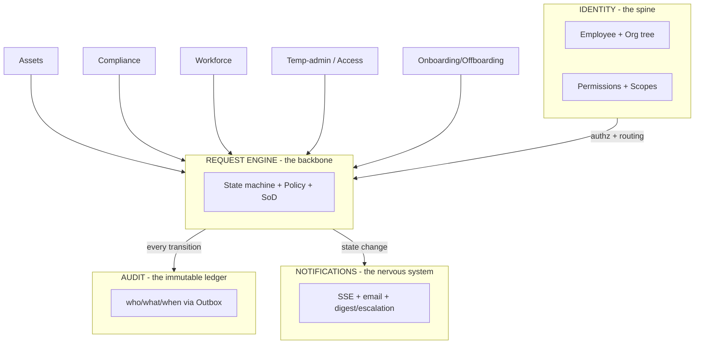
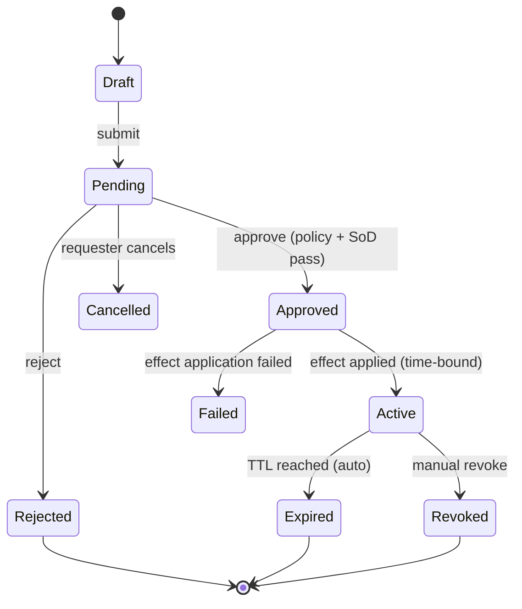
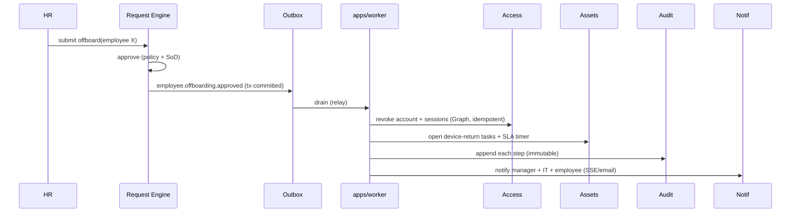

# OpsHub — Platform Integration & the Universal Request Engine

> Status: Draft · Date: 2026-06-24
> How the modules compose into one system, and the single most important reuse decision:
> **generalize the Request engine so every privileged/time-bound feature is "add a request
> type", not "build a workflow".**

---

## 1. The four shared planes

Every domain module (assets, compliance, workforce, access, future helpdesk/FinOps) plugs
into the same four cross-cutting planes that already exist in the codebase:



**Rules that keep it cohesive (already the project's convention):**

1. **Contexts never touch each other's tables.** Cross-context effects go through an **Outbox
   integration event** drained by `apps/worker`, or a published application-service interface
   from the owning module. (Per `04_TECH_STACK_AND_PATTERNS.md`.)
2. **Foundation is the only shared dependency.**
3. **The engine writes audit + fires notifications** — modules never hand-roll either.

---

## 2. The Universal Request engine (the central reuse)

`access-requests` already implements request → approve. Generalize it into a
`workflow`/`requests` foundation module that *any* feature parametrizes. This is the biggest
DRY win in the platform: leave, OT, temp-admin, asset reassignment, onboarding, offboarding,
access reviews, procurement — **all the same lifecycle**.

### 2.1 Canonical lifecycle (one state machine)



### 2.2 A request type is *data + three hooks* (Strategy pattern)

```ts
// foundation/requests/domain/request-type.ts
export interface RequestTypeDef<TPayload> {
  key: string;                       // 'temp_admin' | 'leave' | 'offboard' ...
  payloadSchema: ZodType<TPayload>;  // validates request.payload
  policy: ApprovalPolicy;            // who approves (see §3) + SoD rules
  ttl?: (p: TPayload) => number | null; // time-bound? auto-expire seconds

  // The three hooks every feature implements:
  onApproved(ctx: RequestCtx<TPayload>): Promise<PostCommitTask | void>; // apply effect
  onRevoke?(ctx: RequestCtx<TPayload>): Promise<PostCommitTask | void>;  // undo effect
  onExpire?(ctx: RequestCtx<TPayload>): Promise<PostCommitTask | void>;  // auto-undo
}
```

Registering a new feature = register a `RequestTypeDef`. The engine owns state transitions,
persistence, SoD, audit, notifications, timers. **Features own only their effect.**

```ts
// security-ops/temp-admin/temp-admin.request-type.ts
export const tempAdminRequestType: RequestTypeDef<TempAdminPayload> = {
  key: 'temp_admin',
  payloadSchema: TempAdminPayloadSchema,
  policy: managerChainPolicy({ minApprovers: 1, requesterCannotApprove: true }),
  ttl: (p) => p.durationMinutes * 60,
  async onApproved(ctx) {
    await ctx.graph.grantPimRole(ctx.payload.deviceId, ctx.requesterId);
    return () => ctx.notify(ctx.requesterId, 'temp_admin.activated', { ... }); // post-commit
  },
  async onExpire(ctx) {
    await ctx.graph.revokePimRole(ctx.payload.deviceId, ctx.requesterId);
  },
};
```

### 2.3 Persistence (one table, typed payload)

```ts
// db/schema/requests.ts  (foundation/core context)
export const requests = pgTable('requests', {
  id: uuid('id').primaryKey().defaultRandom(),
  type: text('type').notNull(),                  // request-type key
  status: text('status').notNull().default('draft'),
  requesterId: uuid('requester_id').notNull(),
  payload: jsonb('payload').notNull(),
  scopeRef: text('scope_ref'),                   // for authz scope checks
  expiresAt: timestamp('expires_at', { withTimezone: true }), // drives auto-expire relay
  idempotencyKey: text('idempotency_key'),
  attempts: integer('attempts').notNull().default(0),
  createdAt: timestamp('created_at', { withTimezone: true }).notNull().defaultNow(),
  updatedAt: timestamp('updated_at', { withTimezone: true }).notNull().defaultNow(),
}, (t) => [
  index('ix_requests_status_expires').on(t.status, t.expiresAt), // for expiry relay
  uniqueIndex('uq_requests_idem').on(t.idempotencyKey),
]);

export const requestApprovals = pgTable('request_approvals', {
  id: uuid('id').primaryKey().defaultRandom(),
  requestId: uuid('request_id').notNull().references(() => requests.id),
  approverId: uuid('approver_id').notNull(),
  onBehalfOf: uuid('on_behalf_of'),              // delegation
  decision: text('decision').notNull(),          // approve | reject
  comment: text('comment'),
  decidedAt: timestamp('decided_at', { withTimezone: true }).notNull().defaultNow(),
});
```

### 2.4 Auto-expire reuses the Outbox relay you already hardened

Time-bound grants (temp-admin, break-glass) auto-revoke via an `AbstractOutboxRelay`
subclass — the **same** pattern, `wakeOnComplete`, `SKIP LOCKED`, post-commit tasks, and
`lte(expiresAt, now())` filter just shipped for notifications/email.

```ts
@Injectable()
export class RequestExpiryRelay extends AbstractOutboxRelay<ExpiringRequestRow> {
  protected async fetchBatch(tx: DrizzleTx) {
    return tx.select({ id: requests.id, type: requests.type, payload: requests.payload,
                       attempts: requests.attempts })
      .from(requests)
      .where(and(eq(requests.status, 'active'), lte(requests.expiresAt, new Date())))
      .orderBy(asc(requests.expiresAt))
      .limit(this.batchSize)
      .for('update', { skipLocked: true });
  }
  protected async processRow(row) {
    const def = this.registry.get(row.type);
    return def.onExpire?.(this.buildCtx(row)); // returns optional post-commit task
  }
  // markSent => status 'expired'; markFailed => attempts++ / 'failed'
}
```

> **Why this matters:** auto-revoke is the highest-risk correctness path (a missed revoke =
> standing privilege). Reusing the proven relay means it inherits the same no-lost-events,
> no-double-fire, crash-safe guarantees for free.

---

## 3. Approval policy = config, not code

Who-approves-what becomes **data** (Strategy + Specification), editable in the Admin UI, so
new request types and org changes don't need a deploy.

```ts
interface ApprovalPolicy {
  steps: ApprovalStep[];   // sequential or parallel stages
  sod: SoDPolicy;          // see 07_AUTHORIZATION_DESIGN.md §5
}
interface ApprovalStep {
  resolver: 'manager_chain' | 'role' | 'named' | 'auto';
  param?: string;          // role key, level count, named user
  minApprovals: number;
}
```

The engine resolves the approver set per step using the **identity org tree** + **delegation**
(07 §6), and only transitions to `Approved` when every step's `minApprovals` is met and SoD
passes. `auto` resolver = policy auto-approve (e.g. low-risk catalog items).

---

## 4. Cross-module integration via Outbox events (no direct calls)

Offboarding spans identity + access + assets + compliance + licenses. The engine does **not**
call those modules synchronously. It emits **integration events** to the Outbox; each module
subscribes and applies its own effect idempotently. This keeps modules decoupled and the
fan-out crash-safe.



**Event contract** (versioned, in `libs/contracts`):

```ts
export interface EmployeeOffboardingApprovedV1 {
  v: 1;
  requestId: string;
  employeeId: string;
  effectiveAt: string;     // ISO
  sla: { accountDisable: '1h'; deviceReturn: '7d' };
  correlationId: string;   // ties the whole timeline together
}
```

`correlationId` is the thread that lets the UI render the single cross-system timeline
("approved 14:02 → Entra revoke 14:03 → device flagged 14:03") — OpsHub's core value.

---

## 5. Audit = automatic, never hand-rolled

The engine writes an `AuditEvent` on **every** state transition through the Outbox (same
table family as notifications/email). Modules applying effects also append via the shared
`AuditService`. The audit row carries `correlationId` so every entity's **Activity timeline**
(09 §key-screens) is a single indexed query.

```ts
interface AuditEvent {
  id: string; actorId: string; onBehalfOf?: string;
  action: string;            // 'request.approved', 'asset.reassigned', 'authz.sod_blocked'
  targetType: string; targetId: string;
  correlationId?: string;
  metadata: Record<string, unknown>;
  at: string;                // append-only; no updates/deletes
}
```

---

## 6. Notifications = the existing plane, triggered by transitions

The engine calls `NotificationSchedulerService` (which you wired to `wakeRelay()`), so every
approve/reject/expire produces in-app SSE + email per the user's preferences. Escalation
(approval pending > SLA) and digests are just scheduled request-engine checks emitting more
notifications — no new mechanism.

---

## 7. Why this is the right reuse architecture

| Benefit | How |
|---------|-----|
| **DRY** | One state machine, one persistence, one approval/SoD/audit/notify path. Features add a `RequestTypeDef` (~1 file). |
| **Consistency** | Every request behaves identically in UI + audit + notifications. |
| **Resilience** | Effects run post-commit / via Outbox → crash-safe, idempotent, retried. Auto-expire inherits the hardened relay. |
| **Extensibility** | New module = register a type + subscribe to its events. No engine changes. |
| **Auditability** | Impossible to perform a privileged action without an audit row — it's in the engine, not optional. |
| **Testability** | Engine tested once; features tested as pure `onApproved/onExpire` units. |

---

## 8. Build order for the engine

1. Extract `access-requests` → generic `foundation/requests` module + `RequestRegistry`.
2. Add `RequestExpiryRelay` (reuse `AbstractOutboxRelay`).
3. Port temp-admin + leave + OT to `RequestTypeDef`s (proves generality on 3 shapes).
4. Add Approval Policy config + Admin UI.
5. Build Onboarding/Offboarding as integration-event fan-out (the flagship).
