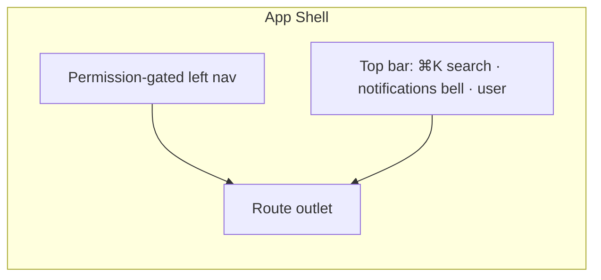
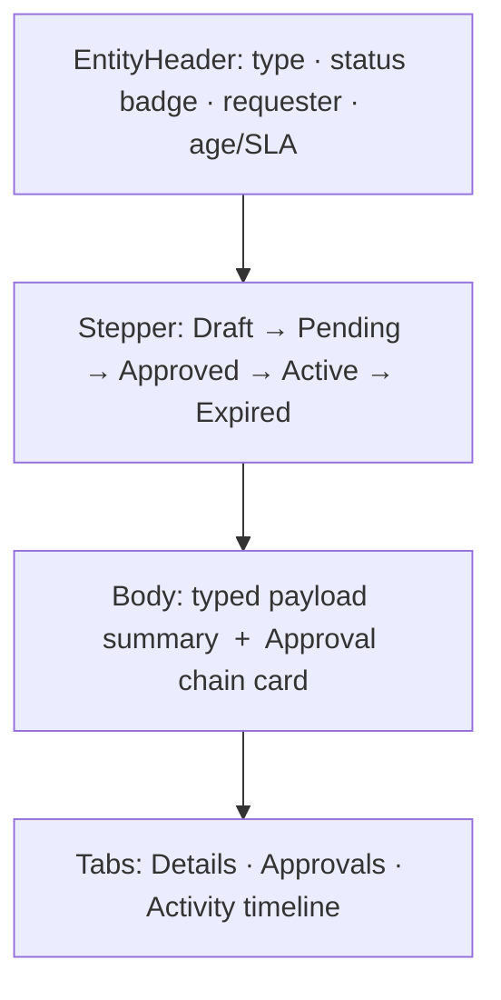

# OpsHub — UI/UX Design

> Status: Draft · Date: 2026-06-24
> One portal, role-aware, built from a small set of reusable primitives. Stack:
> React 19 · Vite 7 · React Router 7 · Tailwind 4 · shadcn/ui · TanStack Query/Table
> (reuse `03_Mockup Design/` + `rally-web` conventions).

---

## 1. Design principles

| Principle | Meaning |
|-----------|---------|
| **One portal, role-aware** | Single login; nav + actions appear only if the user's permissions allow. |
| **Density over decoration** | Enterprise ops users want information density — compact tables, not airy marketing whitespace. |
| **Build primitives once** | ~5 reusable patterns cover ~80% of screens (§3). New modules compose them. |
| **Status as a visual language** | One consistent badge system everywhere; never color-only (WCAG). |
| **Every entity has a timeline** | The audit `correlationId` surfaces as an Activity tab on people, devices, requests. |
| **Safe by default** | Destructive/privileged actions need typed confirmation or step-up MFA. |

---

## 2. Information architecture — grouped by *intent*, not backend module

```
🏠 Home        persona dashboard
📥 Inbox       approvals + tasks assigned to me        ← the #1 daily-driver
👤 People      directory · org chart · employee 360 · lifecycle
💻 Assets      inventory · assignments · device 360
🛡  Security    compliance · temp-admin · posture/drift
🎫 Requests    service catalog + my requests
🕘 Workforce   leave · OT · timesheet · shifts
📊 Insights    dashboards · FinOps · compliance %
🧾 Evidence    audit search · access reviews · exports
⚙️  Admin       RBAC console · approval policies · integrations · settings
```

Each nav item is gated by permission (07): an Employee sees Home / Inbox / Requests /
Workforce / their own Assets; an Auditor sees Evidence (read-only); Admin sees all.



---

## 3. The five reusable primitives (build once, reuse everywhere)

| # | Primitive | Reused by | Notes |
|---|-----------|-----------|-------|
| 1 | **List → Detail slide-over drawer** | every entity list | Click a row → drawer with detail + actions; keeps list context. TanStack Table + shadcn `Sheet`. |
| 2 | **Approval Card** | every request type | Summary · requester · approver chain · **inline SoD/conflict warning** · Approve / Reject / Delegate. One component, all request types (08 §2). |
| 3 | **Activity Timeline tab** | people · devices · requests | Single indexed query on audit `correlationId`; the cross-system story. |
| 4 | **Command palette (⌘K) + global search** | global | Jump to any person/device/request, run actions. Ops users live here. |
| 5 | **Notification center** | global | Bell fed by **SSE** (live, no refresh) + preferences you built; unread via SSE `connected`. |

> These five + a shared **DataTable**, **StatusBadge**, **EntityHeader**, and **ConfirmDialog**
> are the entire component budget for v1. Everything else composes them.

---

## 4. Persona home (useful in 2 seconds)

| Persona | Home shows |
|---------|-----------|
| **Employee** | My open requests · my devices · leave balance · "Request something" |
| **Manager** | Approvals waiting on me · team compliance % · team time-off calendar |
| **IT Admin** | Non-compliant devices · pending temp-admin · assets awaiting return · integration health |
| **Auditor** | Access-review campaigns due · evidence export |
| **Security** | Posture/drift · shadow-IT findings · privileged-access timeline |

Home is a **widget grid**; each widget is permission-gated and lazy-loaded via TanStack Query.

---

## 5. Key screens (design in this order)

1. **Inbox / Approvals** — the daily driver. Bulk approve, filters, **SLA countdowns**, SoD
   warnings, keyboard nav (`j/k`, `a` approve). Powered by the Approval Card primitive.
2. **Employee 360** — profile + org position + assigned devices + access grants + lifecycle +
   Activity timeline. The most-linked page in the app.
3. **Request detail** — state-machine **stepper** (Draft→Pending→Approved→Active→Expired) +
   approval chain + timeline. Same layout for every request type.
4. **Admin → RBAC console** — roles, permission catalog, scope assignment, **access-review
   campaigns** (serves 07 directly).
5. **Compliance dashboard** — device-health rollups → drill into Device 360.

### Request detail layout (one template, all types)



---

## 6. Design system specifics

| Element | Decision |
|---------|----------|
| **Components** | shadcn/ui (Radix), `components.json` like rally-web |
| **Tables** | TanStack Table v8 — sticky header, column visibility, saved views, server pagination, inline `StatusBadge`, row → drawer |
| **Status badges** | Single map `status → {label, color, icon}`; color **+** icon **+** text (never color alone) |
| **Forms** | React Hook Form + Zod 4; schema is the single source for validation + types (shared with API contracts) |
| **Server state** | TanStack Query v5 (cache, optimistic approve, background refetch) |
| **Local UI state** | Zustand (drawer open, table prefs) — not server data |
| **Live updates** | One SSE connection at app shell → fan out to Query cache invalidation + notification center |
| **Charts** | Recharts (compliance %, OT trends, license spend) |
| **Empty/loading/error** | Standard skeleton + empty-state + retry components, reused everywhere |

---

## 7. Role-aware rendering (mirror the backend guard)

The frontend never *enforces* authz (the API does), but it **hides what the user can't do** to
avoid dead ends. The generated API client exposes the user's effective permissions
(`/me` → permissions); a `<Can permission="asset.reassign" scope={asset}>` component and a
`useCan()` hook gate buttons and nav. Same permission keys as 07 → no drift.

```tsx
<Can permission="tempadmin.approve" scope={request}>
  <Button onClick={approve}>Approve</Button>
</Can>
```

---

## 8. Live updates & the notification center (reuse what's built)

- **One** `EventSource` opened at the app shell against `/notifications/stream`.
- `connected` event → seed unread count; `notification` event → push to the bell + toast +
  invalidate the relevant Query keys (e.g. Inbox).
- On unmount / logout → close the stream (no leaked connections — mirrors the server-side
  `raw.on('close')` cleanup).
- Respects the **notification preferences** already built (in-app vs email per type).

---

## 9. Accessibility & i18n (procurement gates)

- **WCAG 2.2 AA**: focus-visible, keyboard paths for every action, color-contrast, status
  never color-only, `aria-live` for toasts/SSE updates.
- **i18n** from day one (`react-i18next`): externalize strings; workforce/labor-law screens
  vary by locale/legal entity.
- **Density toggle** (comfortable/compact) for power users on data tables.

---

## 10. Mobile (responsive, not a separate app)

Make two flows first-class on phone; everything else is "best effort responsive":

- **Inbox** — approve/reject/delegate from phone (the highest mobile value).
- **Self-service** — submit requests / leave; view my devices.

No native app in v1 — responsive web covers ~90% of the mobile need per the roadmap.

---

## 11. Component inventory (v1 budget)

```
shell/        AppShell · LeftNav(permission-gated) · TopBar · CommandPalette · NotificationCenter
primitives/   DataTable · DetailDrawer · StatusBadge · EntityHeader · Timeline · ConfirmDialog · Can
requests/     ApprovalCard · RequestStepper · RequestDetail · RequestList
people/       EmployeeList · Employee360 · OrgChart
assets/       AssetList · Device360
dashboards/   WidgetGrid · Widget · ComplianceChart · FinOpsChart
admin/        RoleEditor · PermissionCatalog · ApprovalPolicyEditor · AccessReviewCampaign
```

Everything in `requests/`, `people/`, `assets/`, `dashboards/`, `admin/` is built from
`primitives/`. That is the DRY contract on the frontend.
