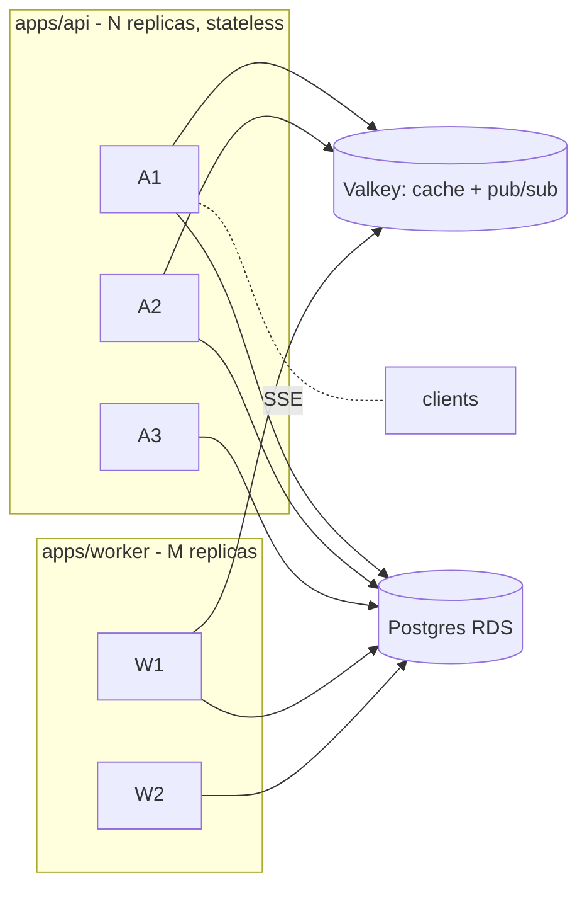

# OpsHub — Engineering Playbook

> Status: Draft · Date: 2026-06-24
> The non-negotiable engineering bar for every module. Codifies the patterns proven in
> `rally`/`opshub` (the `AbstractOutboxRelay`, SSE pub-sub, Result type) into rules so new
> code is DRY, resilient, leak-free, performant, and horizontally scalable by construction.

---

## 1. Module anatomy (every module looks the same)

Each `libs/modules/<context>` is hexagonal — copy this skeleton exactly so the codebase is
navigable and DRY:

```
<module>/src/
  domain/            entities, value objects, types, ports (interfaces), state machines
    ports/           I<X>Repository, I<X>Gateway  (pure interfaces, no Nest/Drizzle)
  application/       services (use-cases), command/query handlers — orchestrate domain
  infrastructure/    Drizzle repositories, external adapters (implement ports)
    persistence/
  interface/         http controllers + DTOs (Zod) — thin, no business logic
    http/
  <module>.module.ts providers + exports (only the public application services)
  index.ts           barrel — export ONLY the public surface
```

**Dependency rule (enforced):** `interface → application → domain ← infrastructure`. Domain
imports nothing from Nest/Drizzle/HTTP. Controllers contain zero business logic. Modules
import each other **only** via Foundation contracts or Outbox events (never another module's
repository).

---

## 2. DRY — what is built once and reused (never copied)

| Concern | Single source | Reused by |
|---------|---------------|-----------|
| Outbox draining + retry + post-commit + `wakeOnComplete` | `platform/outbox/AbstractOutboxRelay` | notifications, email, **request-expiry**, integration-event relays |
| Pub/sub wake + SSE fan-out | `platform/notifications/NotificationPubSubService` | every live update, every relay wake |
| Request → approve → time-bound → audit lifecycle | `foundation/requests` engine | leave, OT, temp-admin, onboarding, access review, procurement |
| AuthN + permission/scope enforcement | `platform/auth` (`@Auth`, `@RequirePermission`, guards) | every controller |
| Typed errors / control flow | `shared-kernel` `Result<T,E>` + exception filter | every handler |
| External-call resilience | `platform/resilience` (cockatiel policies) | Graph, Zscaler, payroll adapters |
| Config access | `platform/config` `AppConfigService` | everywhere — **no `process.env` in business code** |
| Audit append | `foundation/audit` `AuditService` (Outbox) | every privileged action |

**Rule:** if you're about to write a second relay loop, a second SSE handler, a second
approval flow, or a second `process.env.X` — stop and reuse the above. New features are
*parametrizations*, not new mechanisms.

---

## 3. Resilience (cover every failure mode)

### 3.1 Reliable side effects — Outbox + post-commit, always

Never perform an external write inside the request/response path or naked inside a DB
transaction. Pattern (already standardized in `AbstractOutboxRelay`):

1. Write intent + state change in **one DB transaction** (atomic).
2. Emit an **Outbox row** in the *same* transaction (no lost events on crash).
3. `apps/worker` drains the Outbox with `FOR UPDATE SKIP LOCKED`, applies the effect,
   marks the row sent — with per-row retry and `attempts`/`maxAttempts` → `failed`.
4. **Post-commit tasks** (notifications, SSE) run only *after* commit (fire-and-forget,
   non-critical) — already implemented in the relay base.

### 3.2 Idempotency everywhere a retry can happen

- Every write endpoint accepts an **idempotency key**; integration effects key off
  `idempotencyKey ?? row.id` (the email relay already does this).
- External effects (Graph grant/revoke, account disable) must be **idempotent or
  check-before-act** so a retried Outbox row can't double-apply.

### 3.3 External calls behind cockatiel

Wrap every Graph/Zscaler/payroll call in **retry (jittered backoff) + circuit breaker +
timeout**. On open circuit, **fail closed** for authz, **degrade-and-retry-later** (leave the
Outbox row pending) for effects. Never fail-open on a security decision.

### 3.4 Never fail-open on authorization

If the permission cache (Valkey) is unreachable, fall back to a single DB read behind a
breaker; if that also fails, **deny**. (07 §9.)

### 3.5 Auto-revoke is the critical path

Time-bound grants auto-expire via `RequestExpiryRelay` (08 §2.4). Treat a missed revoke as a
sev-1: the relay's crash-safety + `lte(expiresAt, now())` filter + retry guarantee it.

---

## 4. Memory-leak prevention (hard rules)

Every long-lived resource MUST have a matching teardown. This is checked in review.

| Resource | Create | Tear down |
|----------|--------|-----------|
| ioredis **subscriber** connection | `onModuleInit` | `onModuleDestroy` → `unsubscribe()` + `quit()` |
| Pub/sub **subscriptions** | `subscribeRelayWake()` etc. | store the returned unsubscribe; call it in `onModuleDestroy` (the relays already do) |
| **SSE** streams | on connect | `raw.on('close')` cleanup + heartbeat `clearInterval`; guard writes with `raw.writable` (just fixed) |
| `setInterval` / heartbeats | on start | `clearInterval` on close/destroy |
| `setImmediate` re-entry (`wakeOnComplete`) | on wake | self-resetting flag; **never** `setTimeout(0)` recursion (stack-safe) |
| TanStack Query subscriptions (FE) | component mount | auto on unmount; one shared `EventSource` closed on logout |

**Anti-patterns banned:** unbounded in-process `Map`/array caches (use Valkey + TTL);
per-request event-emitter listeners without removal; promises created in loops without
`await`/`catch`; growing arrays on a singleton service.

---

## 5. Performance

| Rule | Mechanism |
|------|-----------|
| **No N+1** | Batch reads; the preference check was collapsed `2n → n` via `findForCheck(type IN [type,'*'])` — apply the same "fetch the set in one query" discipline everywhere. |
| **Index every access path** | Composite indexes match the WHERE/order: `(status, scheduledAt)`, `(status, expiresAt)`, `ix_ura_user`, audit `(targetType, targetId)`, `correlationId`. |
| **Bounded queries** | Every list endpoint paginates (cursor/keyset for large tables); relays use `limit(batchSize)`. Never `SELECT *` an unbounded table. |
| **Cache hot, immutable-ish reads** | Effective permissions + org-tree lookups in Valkey with TTL + explicit bust. |
| **Push, don't poll** | Pub/sub wake signals (`wakeRelay`) give near-zero latency; the cron is only the catch-all fallback. SSE replaces FE polling. |
| **Keep transactions short** | Do external I/O *outside* the TX (post-commit). Long TX = lock contention. |
| **`SKIP LOCKED` for queue tables** | Multiple workers pull disjoint batches without blocking. |

---

## 6. Scaling (horizontal by construction)



| Property | How it scales |
|----------|---------------|
| **Stateless API** | No session/in-memory state → add replicas freely behind ALB. |
| **Workers compete safely** | `FOR UPDATE SKIP LOCKED` partitions the outbox across M workers; no double-processing. |
| **Wake fan-out** | Pub/sub wake reaches whichever worker replica; `wakeOnComplete` absorbs bursts without dropping signals. |
| **SSE across replicas** | A notification published to Valkey reaches the replica holding that user's stream (`notifications:user:{id}` channel). |
| **DB hot spots** | Queue tables use partial indexes on `status='pending'`; archive `sent`/`expired` rows on a retention job to keep them small. |
| **Cache** | Valkey is the single shared cache/bus; cluster mode when needed (key-tagged). |
| **Module extraction** | Clean seams (08) mean HR/FinOps can later become their own service — refactor, not rewrite. |

---

## 7. Data integrity & correctness

- **Atomic state transitions** — request status changes + approvals + outbox emit in one TX.
- **Optimistic concurrency** on mutable rows (`updatedAt`/version check) to avoid lost updates
  under concurrent approvals.
- **Append-only audit** — no UPDATE/DELETE on audit rows; enforced by grant + review.
- **Foreign keys + unique constraints** carry invariants the app must not duplicate-check
  (e.g. `uq_user_role_scope`, `uq_requests_idem`).
- **Migrations** are SQL-first (drizzle-kit), run as a gated ECS task; forward-only, reversible
  by new migration, never edited after merge (see repo memory `migrations.md`).

---

## 8. Observability (you can't operate what you can't see)

- **OpenTelemetry** spans across the whole flow; propagate `correlationId` from request →
  outbox event → worker effect → audit, so one trace tells the cross-system story.
- **pino** structured logs (`nestjs-pino`); every relay/effect logs `{rowId, err}` on failure
  (the relays already do).
- **Metrics that page someone**: outbox lag (oldest pending age), failed-row count,
  auto-revoke backlog, SSE connection count, Graph circuit-breaker state.
- **Integration health endpoint** surfaced in the Admin UI (09 §IT-Admin home).

---

## 9. Security baseline (dogfood the enterprise doc)

- Entra SSO + phishing-resistant MFA; step-up for high-blast-radius actions (07 §8).
- Least-privilege Graph scopes; secrets only in AWS Secrets Manager (no env files).
- Every privileged action → approval + immutable audit → SIEM (Outbox forward).
- Input validation with Zod at the boundary; output DTOs never leak internal fields.
- OWASP ASVS in CI; Sonar + Veracode + Gitleaks gates; SLSA provenance + SBOM (rally-gitops).

---

## 10. Testing strategy

| Layer | Tooling | What |
|-------|---------|------|
| Domain | Vitest (pure) | state machine transitions, SoD rules, scope matchers — fast, no I/O |
| Application | Vitest + in-memory ports | use-cases with faked repositories/gateways |
| Integration | Vitest + **Testcontainers** | real Postgres + Valkey: relays, `SKIP LOCKED`, idempotency, Outbox |
| Contract | generated OpenAPI client | FE/BE type drift caught at build |
| E2E | Playwright | Inbox approve flow, onboarding fan-out, SSE live update |

**Must-have tests for the risky paths:** auto-revoke fires exactly once; retried outbox row
doesn't double-apply; SoD blocks self-approval; permission cache bust on role change;
SSE/relay teardown leaves no open handles (leak guard).

---

## 11. The pre-merge checklist (every PR)

- [ ] Reuses Outbox/relay/engine/auth/audit — no copied mechanism.
- [ ] All external writes are idempotent and behind cockatiel.
- [ ] Every subscription/interval/stream has a teardown in `onModuleDestroy`/`close`.
- [ ] Queries are bounded, indexed, N+1-free.
- [ ] Privileged route uses `@RequirePermission`; action writes an audit event.
- [ ] No `process.env` in business code (use `AppConfigService`).
- [ ] Stateless (no singleton-held growing state); safe under N replicas.
- [ ] Tests cover the risky path (exactly-once, idempotent retry, authz deny).
- [ ] `correlationId` propagated for the cross-system timeline.
